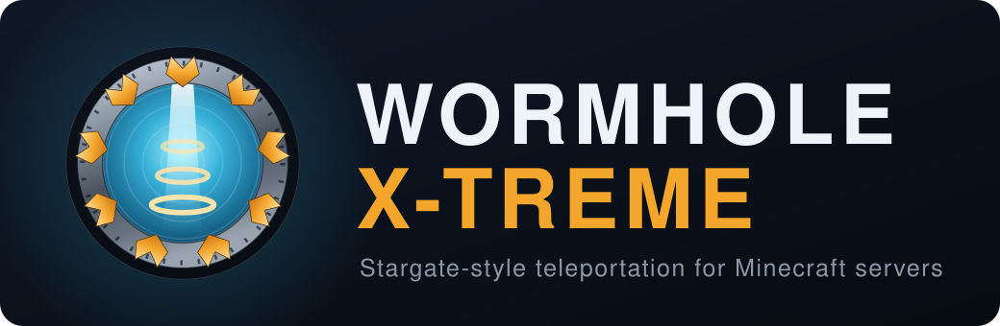

<p align="center">
  
</p>

[](https://github.com/khanjal/Wormhole-X-Treme/actions/workflows/ci.yml)
[](https://github.com/khanjal/Wormhole-X-Treme/actions/workflows/ci.yml)
[](https://sonarcloud.io/component_measures?id=khanjal_Wormhole-X-Treme&metric=coverage)
[](https://sonarcloud.io/summary/overall/?id=khanjal_Wormhole-X-Treme)
[](https://sonarcloud.io/summary/overall/?id=khanjal_Wormhole-X-Treme)
[](https://sonarcloud.io/summary/overall/?id=khanjal_Wormhole-X-Treme)

[](https://github.com/khanjal/Wormhole-X-Treme/releases/latest)
[](#server-compatibility)
[](#build)
[](LICENSE)

Wormhole X-Treme is a Bukkit/Spigot/Paper plugin that provides Stargate-style teleportation portals.

This README is for **server owners** — installing it, configuring it, building gates and
rings, and running them. If you are writing a plugin that hooks into gate or ring travel, see
**[docs/API.md](docs/API.md)** instead. Why any of it works the way it does is in
**[docs/GATES.md](docs/GATES.md)** and **[docs/RINGS.md](docs/RINGS.md)**.
Gates are fully configurable per shape — materials, iris, lighting, and sign type are all set in `.shape` files.
There are also **transport rings**: small paired pads set into a floor or ceiling that fire when you walk into them.
Runs on Minecraft 1.20 through 1.21.10. Built as Java 17 bytecode.

## Features

**Gates** — Stargate-style portals, dialled by [button or lever](#dhd-dial-home-device--button-and-lever-support),
by [sign](#signs) or by [redstone](#redstone-activation). A gate with a dial sign goes straight
to whatever the sign shows; one without asks the player to name a destination with `/dial`. [Eleven bundled shapes](#shapes) from
`Minimal` to `Massive`, each setting its own materials, lighting, sign type and
[iris](#iris-gate-shield-setup-and-troubleshooting). Gates work in
[the Nether and the End](#nether-and-end-dimension-support).

**Everything travels, not just players** — minecarts and boats carry their passengers through
and re-seat them on arrival, ridden animals go with their rider, arrows and ender pearls cross
mid-flight, and wandering mobs, dropped items and XP orbs are swept through an open gate once a
second. [The full table](#what-travels-through-a-gate) says which route each one takes, and what
that costs.

**Transport rings** — paired pads set into a floor or ceiling that fire when somebody walks in.
No frame to build and no dialling: step on, and the rings come down.
[Building](#building-a-ring-pair) · [using](#using-rings) · [settings](#ring-settings)

**Beaming** — point-to-point travel with no structure at all. Staff curate public destinations;
each player keeps their own private [places](#beaming).

**Quantum mirrors** — a banner you can walk up to and click, and you are in another world. No
structure at all, one-way by design, and cross-world by default. A corridor of them is a
practical way to line up doors into archived worlds. [Setting one up](#quantum-mirrors)

**Sound** — [fifteen sounds](#sounds) — seven for gates, five for rings, three for beaming — and
every one of them is a setting rather than a hardcoded choice. Each subsystem has its own
on/off switch and volume, so rings can be silent while gates are not.

**Configuration without a restart** — [seventy-five settings](#configuration), most of them
changeable in-game with `/wormhole config` rather than by editing a file and reloading. The
shipped `config.yml` is deliberately short; the rest have working defaults until you change them.

**Access control** — [seventeen permission nodes](#permissions), separating who may build, use,
remove and administer each subsystem. Soft-depends on LuckPerms or Permissions if you run one,
and works without either.

**Economy, optionally** — [charge for building or travelling](#economy) through Vault. Vault
absent simply means nothing is charged; there is no hard dependency.

**Hooks for other plugins** — [five events](docs/API.md#events), two of them cancellable, so another
plugin can watch travel or veto it.

**Storage you can read** — [one YAML file per gate](#storage), no database to install or migrate.
If you are coming from an old build that used SQLite, `/wormhole gate import` brings those gates
across; it is a command you run, not something that happens to your data on startup.

## Contents

**What it does** — [Features](#features)

**Setting up** — [Server Compatibility](#server-compatibility) · [Build](#build) · [Configuration](#configuration) · [Permissions](#permissions) · [Commands](#commands)

**Building gates** — [Shapes](#shapes) · [Material groups](#material-groups) · [DHD](#dhd-dial-home-device--button-and-lever-support) · [Signs](#signs) · [Iris](#iris-gate-shield-setup-and-troubleshooting)

**Using gates** — [Redstone activation](#redstone-activation) · [What travels through a gate](#what-travels-through-a-gate) · [Nether and End dimension support](#nether-and-end-dimension-support)

**Transport rings** — [Overview](#transport-rings) · [Building a ring pair](#building-a-ring-pair) · [Using rings](#using-rings) · [Ring settings](#ring-settings) · [Ring permissions](#ring-permissions)

**Beaming** — [Overview](#beaming) · [Beam commands](#beam-commands) · [Beam settings](#beam-settings) · [Beam sounds](#beam-sounds)

**Quantum mirrors** — [Overview](#quantum-mirrors) · [Setting one up](#setting-one-up) · [Making it look like where it goes](#making-it-look-like-where-it-goes)

**Sound** — [Gate and ring sounds](#sounds)

**Running a server** — [Storage](#storage) · [Economy](#economy) · [Troubleshooting](#troubleshooting)

**Writing a plugin against this one** — [docs/API.md](docs/API.md)

**How it works inside** — [docs/GATES.md](docs/GATES.md) · [docs/RINGS.md](docs/RINGS.md) · [docs/BEAMS.md](docs/BEAMS.md) · [docs/MIRRORS.md](docs/MIRRORS.md)

**Also** — [Developer notes](#developer-notes) · [Credits](#credits) · [Contributing](#contributing) · [Logo](docs/LOGO.md) · [Captures](docs/CAPTURES.md) · [Name and logo policy](TRADEMARK.md)

## Server Compatibility

### Which Minecraft versions this runs on

**Minecraft 1.20 through 1.21.10.** Both ends are measured rather than assumed — every
published `spigot-api` version was built against to find them.

| | Version | Why it is the boundary |
|---|---|---|
| **Floor** | 1.20 | `Material.CALIBRATED_SCULK_SENSOR` arrives here, and gate detection switches on it. 1.19.4 fails on that alone. |
| **Ceiling** | 1.21.10 | Newest published API. Nothing in the plugin stops it going further. |

The range spans a Spigot API move that no single import covers.
`EntityDismountEvent` lived in `org.spigotmc.event.entity` up to 1.20.4 and in
`org.bukkit.event.entity` from 1.20.4 on — **1.20.4 is the only version carrying both**, which
is why the plugin compiles against it. There is a small listener for each package, and only
the one the running server can actually load is registered. A server with neither loses the
ability to stop a rider dismounting mid-transit and says so in the log; everything else works.

| Minecraft | In CI | Note |
|---|---|---|
| 1.20 | yes | Floor; has only the `org.spigotmc` dismount event |
| 1.20.1 | yes | A commonly pinned version |
| 1.20.4 | yes | **Compile target** — the only version with both dismount events |
| 1.20.6 | yes | `org.spigotmc` dismount event removed here |
| 1.21.1 | yes | |
| 1.21.4 | yes | Boats split into one entity type per wood here |
| 1.21.10 | yes | Newest published API |

Each CI job leaves out whichever dismount listener cannot compile on that version — the
`legacy-api` and `modern-api` Maven profiles. **Neither profile is used for the shipped jar**,
which is built against 1.20.4 and therefore carries both listeners and chooses at runtime. The
profiles exist so CI can check the rest of the plugin against a server holding one class or
the other.

Versions between those points are expected to work and are not separately built; the matrix
covers the boundaries where the API actually moved.

**None of this has been runtime-verified on a live server.** CI proves the plugin compiles and
its tests pass against each API — not that a gate behaves correctly in game.

| Runtime Server | Base/API lineage | Support tier |
|---|---|---|
| CraftBukkit | Bukkit | Supported |
| Spigot | Spigot (Bukkit+) | Primary target — the API compiled against |
| Paper | Paper (Spigot+) | Supported |
| Purpur / Pufferfish | Paper fork | Best effort |
| Folia | Paper fork (region scheduler) | Not supported — different scheduler model |

Those server projects version their jars by the Minecraft version they implement, so "Paper
1.21.1" is Paper for Minecraft 1.21.1. There is no separate server versioning scheme to
match up.

### Three version numbers that are easy to confuse

| Where | Example | What it means |
|---|---|---|
| `pom.xml` `spigot.api.version` | `1.20.4-R0.1-SNAPSHOT` | The API this jar is **compiled** against. `R0.1` is Bukkit's API revision within that Minecraft version. |
| `plugin.yml` `api-version` | `1.20` | The **oldest** server that will load this plugin. Major-minor only; a patch version is not valid here. |
| The table above | `1.20` – `1.21.10` | The Minecraft versions actually built and tested against. |

The plugin is compiled against the **oldest** server it supports, not the newest. That is
deliberate and it is the wrong way round from most instincts: a plugin built against an old
API runs on newer servers, while one built against a new API can call something an older
server has never heard of — and nothing catches that until a player reports a crash.
Compiling against the floor makes the compiler enforce the floor.

That only guards one direction. It says nothing about a newer server having *removed*
something, so CI also builds and tests against every newer supported version. Both directions
have to hold and neither is checked by the other.

**Minecraft 1.20.5 and later require the server to run on Java 21.** That is the server's
requirement, not this plugin's — the jar is Java 17 bytecode and runs on either.

### Adding support for a new Minecraft version

1. Build against it locally: `mvn verify -Dspigot.api.version=<version>-R0.1-SNAPSHOT`.
2. If it passes, add it to the `server-api` matrix in `.github/workflows/ci.yml` and update
   the table above.
3. Leave `spigot.api.version` and `api-version` alone unless you are dropping old versions,
   which is the only thing that should raise the floor.

If a new version fails, the compiler names what was removed. That is worth reading before
assuming the version is unsupportable — both boundaries found so far were a single symbol,
and one of them was fixable in a line.

Java support policy:
- The plugin is built as Java 17 bytecode; CI compiles and tests it on Java 17, 21 and 25.
- The **server** needs Java 21 for Minecraft 1.20.5 and later.

## Build

Requirements:
- JDK 17
- Maven 3.6+

Build (skips tests):

```bash
mvn -DskipTests package
```

Output jar: `target/WormholeXTreme-<version>.jar` (~300KB), versioned from `pom.xml`.

Nothing is bundled into the jar and the plugin has no runtime dependencies. SnakeYAML
comes from the server — Spigot declares it and Bukkit's own config system uses it.

## Configuration

On first run the plugin creates `plugins/WormholeXTreme/config.yml`. If you update to a newer version that adds new config keys, **missing keys are automatically appended** to the bottom of your existing `config.yml` with their defaults and description comments — existing values are never overwritten.

Important keys (kebab-case in `config.yml`):

### Keeping gates from staying open

`shutdown_timeout` closes a wormhole a set time after it is dialled, and dialling restarts
that timer. `max-open-seconds` (default 300, 0 to disable) is a ceiling on the total time a
wormhole may stay open, measured from when it first formed and **not** reset by re-dialling.

It matters in two cases: anything that re-dials on a schedule, and `shutdown_timeout: 0`,
which means "stay open until something goes through" and can otherwise leave a gate open
indefinitely.

Gates are stored as one YAML file each under `plugins/WormholeXTreme/.../gates`. There is
no database to configure.

Permissions go through Bukkit's `player.hasPermission()`, so any permission plugin works —
LuckPerms, a Vault-bridged provider, or the server's own `ops.json`. There is no separate
permission system to configure, and Vault is not required for permissions (only for economy,
which is optional and detected at runtime).

**An operator may do anything with a gate**, with or without a permissions plugin. This
deliberately outranks a negated node: on a server where someone has been given op, that is
taken as the final word.

### What this costs a busy server

There is one repeating task per subsystem and no background threads. What they cost scales
with how much travelling is happening, not with how much has been built: a world holding
three thousand gates costs the same per tick as one holding three, as long as the same
number of wormholes are open. Building more gates does not make the server slower.

- **Entity sweep** — every `entity-scan-interval-ticks` (default 20), one entity query per
  *open* gate. Raise it if you have many wormholes open at once and would rather items and
  mobs took a moment longer to be carried through.
- **Projectile tracking** — per tick, but only for projectiles in flight while at least one
  wormhole is open, and only for the couple of seconds after they are fired. With nothing
  open it costs one check of an empty map.
- **Ambient hum** — every `gate-sound-ambient-ticks`, one sound per open gate. Setting
  `gate-sounds-enabled: false` removes it entirely.

Everything else is event-driven, and the events the plugin listens on are answered by a hash
lookup keyed on the block position — including `BlockPhysicsEvent`, which your server raises
for every water flow, falling block and redstone update in a loaded world. A world with no
gates in it stops at the first of two lookups, so gates in one world cost the others nothing.

## Permissions

The plugin uses permission nodes for feature access. Permissions are intended to be managed by a permissions plugin (Vault/LuckPerms recommended).

- `wormhole.use.sign` — allow using sign-based dialers and sign interactions.
- `wormhole.use.dialer` — allow using the dialer to initiate a gate dial.
- `wormhole.use.compass` — allow using the compass command to point to gates.
- `wormhole.remove.own` — allow removing gates you own.
- `wormhole.remove.all` — allow removing any gate (admin-level).
- `wormhole.build` — allow building gates using `/wormhole build`/`wxbuild` automation.
- `wormhole.config` — allow changing plugin configuration via commands, and everything
  under `gate edit`, `gate regenerate`, `gate validate`, `gate import`, and gate ownership. These were never
  actually gated before this release — any player able to run `/wormhole` at all could
  reconfigure or reassign any gate on the server. They now share this one node rather than
  each getting a separate admin-only node that would mean the same thing.
- `wormhole.list` — allow listing gates via `/wormhole list`.
- `wormhole.go` — allow teleporting to gates via command (`/wormhole go`).
- `wormhole.network.use.<networkName>` — prefix for network-specific use rights (e.g. `wormhole.network.use.staff`).
- `wormhole.network.build.<networkName>` — prefix for network-specific build rights.

Transport rings (also listed, with the same defaults, under [Ring permissions](#ring-permissions)):

- `wormhole.ring.build` — allow building and pairing rings. Default: op.
- `wormhole.ring.use` — allow travelling by a ring you are permitted on. Default: true.
- `wormhole.ring.admin` — allow using and managing any pair, whoever owns it. Default: op.
- `wormhole.ring.unlimited` — allow owning more pairs than the configured quota. Default: op.

Beaming:

- `wormhole.beam.use` — allow beaming to a public destination or one of your own places
  (`/wormhole beam to <name>`, `/wormhole beam list`). Default: true.
- `wormhole.beam.place` — allow creating and managing your own private places
  (`/wormhole beam place set|list|remove`). Default: true.
- `wormhole.beam.admin` — allow managing public destinations and anyone's places
  (`/wormhole beam admin set|remove|cost`), and bypass the beam cooldown and cost. Default: op.
- `wormhole.beam.admin.teleport` — allow beaming yourself or another player straight to a
  player or to raw coordinates (`/wormhole beam admin goto|send`), from a player, the console
  or a command block. Default: op. Deliberately not implied by `wormhole.beam.admin`: curating
  the destination list and relocating any player at will are different orders of power.

Notes:
- The player-facing subcommands — `beam`, `ring`, `go`, `list` and `compass` — answer to the
  nodes above on their own. Everything else under `/wormhole` still requires `wormhole.config`.
  **If you are upgrading from a release before this one**, `/wormhole` checked `wormhole.config`
  once up front, before it looked at which subcommand had been typed, which made every node in
  this section unreachable for anyone but an operator: a player granted `wormhole.beam.use` was
  refused at the door, in wording that read as though the beam node had not applied. If you
  worked around that by handing out `wormhole.config`, you can take it back now — it also
  carries gate editing, regeneration, import and ownership transfer.
- `wormhole.config` covers the settings command *and* gate management. If you have granted it
  narrowly (e.g. only to yourself), check that trusted builders who used to run
  `/wormhole portalmaterial`, `/wormhole custom`, or `/wormhole owner` freely still have it,
  since those commands now require it too.
- Nothing can be built inside a gate's opening -- the ring of portal cells the gate
  teleports through. Anyone who may take a gate's blocks apart may build in there anyway:
  operators, the gate's owner, and holders of `wormhole.config` or `wormhole.remove.all`.
  (`wormhole.remove.own` is in that set too, but it checks ownership as well as the node, and
  an owner is already through -- so it never grants this on its own.) `wormhole.build`
  deliberately does not carry it, since that node is
  for raising new gates and is commonly granted on the Public network. A block left in the
  opening this way is still not part of the gate, so anyone can break it back out.
- Per-group cooldown/build permission nodes (legacy `one`/`two`/`three`) have been removed. One cooldown applies to everyone, set with `use-cooldown-seconds` in `config.yml` or `/wormhole cooldown <seconds>`, and switched on with `use-cooldown-enabled`.
- The `HelpSupport` integration (attach to the external `Help` plugin) will register many of the above nodes with the help system when present.

### Permission backend & auto-fallback

The plugin prefers a Vault-compatible permissions provider (Vault + LuckPerms recommended). On first run the plugin will use the server's configured permission backend via the standard Bukkit `player.hasPermission(...)` API.

- `permissions-support-disable` (boolean): If `true`, the plugin will not attempt to attach to any external permission provider even if one is available. Default: `false`.
- `permissions-auto-fallback` (boolean): If `true` (default), and no Vault-compatible provider is detected at startup, the plugin will automatically enable a simple permission fallback mode so basic use actions continue to work; advanced actions remain restricted to operators or gate owners. Set this to `false` if you prefer to leave permission handling to server admins and not enable the fallback.

Behavior note:
- The `/wormhole go` command (teleport-to-gate) no longer grants access to all players by default. Use the `wormhole.go` permission node to grant command access to non-ops, or rely on operator/owner status. This ensures servers do not inadvertently expose teleport commands to all users when no permissions provider is present.


## Commands

Everything is a subcommand of `/wormhole` (aliased `/wx`). Run it with no arguments for the
list; tab completion offers subcommand names, then gate names, networks, backends or
booleans depending on where you are in the line.

Four names cover everything: two nouns that behave the same way, the settings, and the one
thing that is neither.

**Gates** — `gate build <shape>`, `gate complete <name> [idc=IDC] [net=NET]`,
`gate list [network]`, `gate remove <gate> [-all]`, `gate regenerate <gate|-all>`,
`gate validate <gate|-all>`, `gate refresh`, `gate go <gate>`, `gate force <gate>`, `gate import`,
`gate shapes <reload [name]|validate <name>>`

`gate edit <gate> <field> [value]` covers everything you set on a gate:

| Field | Value |
|---|---|
| `portal` | Material the wormhole is drawn as. |
| `iris` | Material the iris is built from. |
| `light` | Material the chevrons light as. |
| `group` | A whole material group at once, instead of the three above. |
| `woosh` | How far the woosh pushes out. |
| `redstone` | `true` or `false`. |
| `idc` | The iris deactivation code, or `-clear`. |
| `owner` | Hand the gate to somebody else. |
| `custom` | `true` or `false`. |

**Rings** — `ring create`, `ring cancel`, `ring list`, `ring remove [id]`,
`ring edit [id] <ring|light|flash|name|access|style|reset> [value]`,
`ring allow|deny <player> [id]`, `ring owner <player> [id]`

**Settings** — `config <setting>` shows one with its description,
`config <setting> <value>` changes it. Type part of a name to search. This reaches *every*
setting, not just the four that used to have commands of their own, and takes effect
immediately — there is nothing to reload and no restart.

Name a setting either way round: `gate-sound-kawoosh`, exactly as `config.yml` spells it, or
`gate_sound_kawoosh`, which is what the command and tab completion show you. Searching and
completion take either spelling too, so a key pasted out of the file does what you expect.

A setting with a fixed set of valid values is checked before it is written, and a bad value is
refused with the options named rather than accepted and quietly ignored later. That covers the
ring style and access modes, the ring material, light and flash materials, and the log level.
Sound names are deliberately not checked: a resource pack's own sound is a name this plugin
cannot know, and it still has to pass through.

**Other** — `compass` points your compass at the nearest gate, and `compass reset` puts it
back to world spawn, which is what an ordinary compass does on its own.

You do not need to be holding a compass for either to work — the heading is stored against you
and will be there when you pick one up. It tells you when nothing you are carrying will show
it, which covers having no compass at all and having only the kinds that ignore the heading:
a lodestone-bound compass points at its lodestone, a recovery compass at where you died.

`gate edit group` changes what the gate *draws* — its portal, lights and iris. It leaves the
frame blocks alone, because those are real blocks somebody built and rewriting them is not
what changing a gate's group should quietly mean.

### Coming from another Wormhole X-Treme

Every build descended from the 2011 original kept its gates in `WormholeXTremeDB/
WormholeXTreme.sqlite`, one binary blob per gate. This fork uses a file per gate instead, so
swapping the jar leaves you looking at a server full of gates the plugin cannot see.

**`/wormhole gate import`** brings them across. It reads that database, converts every gate,
and reports what came and what did not — a gate is skipped rather than guessed at if its world
is not loaded or its name is already taken.

Nothing is written back to the old database and nothing is deleted, so a failed import costs
nothing and running it twice does not duplicate anything. If gates are found on startup and
you have none of your own, the log says so once.

`WormholeXTremeDB/` keeps its name for exactly this reason. It is not ours to rename — it is
what every fork in that line calls the folder, and how the import finds a database at all. This
plugin's own files moved out of it into `data/`, and the database is deliberately left where it
is: renaming the folder would have taken it along and quietly stopped the import being offered,
with your old server's gates sitting in a file nothing looks at any more.

One requirement: your server needs a SQLite driver. It is not shipped here — thirteen
megabytes of native libraries for a one-time import would be a poor trade for every server
that never runs it — but any server that *wrote* one of these databases already has one,
because the plugin that wrote it needed the same driver.

`gate regenerate` also recomputes the arrival point. The exit is worked out once when a gate
is built and then stored, so a gate that landed travellers at its side kept doing it; this is
the command to reach for. It cannot fix a gate whose *facing* is wrong — if the woosh and the
sign are on the wrong face too, that one needs rebuilding.

**`gate regenerate <gate>` re-reads the gate's shape file.** A gate's markers — its redstone
hookup, its iris lever, its dial sign, its name sign — are worked out once when the gate is
built and then stored, and go stale for exactly the same reason the arrival point does: the
shape file they came from can change underneath them. A gate built before its shape gained a
`[RD]` marker has no dial-activation block recorded, and no amount of wiring will ever fire
it. Regenerating re-runs detection against the shape as it is now, moves whatever the file has
moved, saves the gate, and tells you what it changed.

Markers are only ever added or moved, never taken away: a shape that has *lost* a marker
leaves the block standing where it is rather than having it disappear without explanation. And
if the gate no longer matches its shape at all — somebody rebuilt the frame, or the shape file
is not in the folder any more — nothing is touched and the command says which of those it is.
This is the one thing `regenerate -all` deliberately does not do, since it reads the world and
an unattended sweep across every gate on the server is a different proposition.

**`gate regenerate -all`** does the same recompute across every gate in one pass, and reports
how many actually needed it — recomputing is deterministic, so a gate that was already correct
comes back unchanged and is not counted. It is narrower than running `regenerate` on a single
gate: it only touches the arrival point, not the dial lever, iris lever, redstone hookup or
sign that a single-gate regenerate also refreshes, since rewriting those for every gate on the
server at once is not something an unattended sweep should do on its own.

**`gate validate <gate|-all>`** checks whether a gate is actually still standing where it says
it is, without waiting for a click or a dial to find out. WorldEdit's `//set`, `//replace` and
`//cut` write blocks straight into the world and fire nothing this plugin protects itself
with, so a gate they take apart stays fully registered with nothing there — dialling already
refuses that gate and says why, and a redrawn dial sign already logs it, but this asks the
question on demand for a gate nobody has approached in a while. It reports missing frame
blocks and a dial sign that is no longer a sign; `-all` sweeps every gate and names only the
ones with something wrong. A gate in a chunk nobody has loaded reads as fine rather than being
checked — this never loads a chunk just to answer.

**`gate shapes validate <name>`** checks a `.shape` file in the `shapes/gate` directory for
problems that will not throw on their own: a row one cell short of the width its first layer
declared (every column after the gap silently lands one off), a skipped `Layer#N=` (a dead gap
in the woosh recession), a duplicate `:EP`/`:A`/`:N`/etc. (the second one silently wins), a gap
in `:L#`/`:W#` ordering, a material name that does not exist in this server's Minecraft
version, or redstone landing on the frame. Nothing loaded is changed either way.

**`gate shapes reload [name]`** runs the same checks and, if they pass, replaces that shape in
the running server — or reloads every shape in the directory if no name is given. This is the
way to try out an edit to a shape file without restarting: a failed reload reports what is
wrong and leaves whichever version already loaded in place.

<details>
<summary>The old flat commands still work</summary>

`list`, `build`, `complete`, `remove`, `regenerate`, `refresh`, `go`, `force`, `owner`,
`idc`, `redstone`, `custom`, `portalmaterial`, `irismaterial`, `lightmaterial`,
`wooshdepth`, `shutdown_timeout`, `activate_timeout`, `cooldown` and `restrict` all still
dispatch. They are no longer suggested or listed, because the point of the restructure was a
shorter list — but nothing in a command block, a script, or your fingers has broken.

Two of them answer differently now, because they used to answer dishonestly.
`/wormhole cooldown` takes a plain number of seconds rather than a group name — the three
groups were never registered as settings, so setting one reported success and changed
nothing. `/wormhole restrict` reports that build restriction was removed rather than
appearing to set it; gate building is governed by the `wormhole.build` permission.

</details>

### Clearing snapshotted material overrides

Older versions of `/wormhole custom <gate> true` copied the shape's materials into the
gate's own override fields. Those copies pin a gate to the materials that were current at
the time and stop it following its [material group](#material-groups).

`/wormhole custom -clean` reports which gates are affected. `/wormhole custom -clean confirm`
clears them, after which those gates follow their palette again.

Only a gate whose *whole set* of four overrides matches the built-in defaults is treated as
a snapshot — someone who deliberately set an iris to stone meant stone, and a coincidental
match on one material is not evidence of anything. Gates you genuinely customised are left
alone.

## Shapes

Shapes live under:

```
plugins/WormholeXTreme/shapes/gate/      the shapes gates are built from
plugins/WormholeXTreme/shapes/mirror/    the looks a mirror's banner can wear
```

Split by what the shape describes, not by its geometry — which is why a mirror's looks got
`shapes/mirror/` when they arrived rather than sharing a folder named for gates. Both folders
work the same way: the shipped files are written out on first run, a deleted one comes back on
the next startup, an edited one is left alone, and anything you add beside them is loaded.

Two earlier layouts are migrated on startup, and nothing is deleted from either:

```
GateShapes/3d/*.shape ─┐
GateShapes/2d/*.shape ─┴─> GateShapes/*.shape ─> shapes/gate/*.shape
```

A shape already at the destination wins, because that is the one that has been loading. If you
are upgrading from far enough back that both moves apply, both happen in the same startup.

Default shapes are extracted from the jar on first run only — they will **not** overwrite user-customized files.

`MinimalSignDialRedstone` is no longer shipped. Its reason for existing was that
`MinimalSignDial` could not be dialled by redstone; now every sign-dial shape can, so a
separate redstone-flavoured file has nothing left to offer. Because defaults are only ever
written when missing, an existing server keeps the copy already in its folder and any gate
built from it keeps working — nothing is deleted from an install. New installs simply do not
get it.

### Shape material parameters

Shapes describe geometry. Appearance comes from the gate's [material group](#material-groups),
chosen by the material the frame is actually built from — so the shipped shapes set no
materials at all, and one shape file can be built as a Standard, Atlantis or Universe gate.

The keys below still exist for a shape that genuinely must look a particular way whatever
palette it resolves to. An explicit value outranks the material group, so setting one opts
that material out of palettes entirely; leave it unset unless the geometry needs it.

| Key | Default | Description |
|---|---|---|
| `STARGATE_MATERIAL=` | `OBSIDIAN` | The block type used for the gate frame (`[S]` blocks). |
| `PORTAL_MATERIAL=` | `WATER` | The block type filling the open portal (`[P]` blocks when active). |
| `IRIS_MATERIAL=` | `STONE` | The block type filling the portal when the iris is closed. |
| `ACTIVE_MATERIAL=` | `GLOWSTONE` | The block type used for light blocks (`:L` markers) when the gate is active. |
| `CHEVRON_MATERIAL=` | *(none)* | The block type an **unlit** chevron may be built from, so the gate shows where its chevrons are before it dials. See [unlit chevrons](#unlit-chevrons). Unset means chevrons are ordinary frame blocks. |
| `SIGN_MATERIAL=` | `OAK_WALL_SIGN` | The wall-sign type used for the gate's **name sign**. Any `*_WALL_SIGN` material is valid (e.g. `CRIMSON_WALL_SIGN`, `WARPED_WALL_SIGN`). The dial sign is placed by a player on the `[D]` block, and the plugin accepts whatever wall sign it finds there — but converts it to match this material when the gate is completed or regenerated, keeping its text and facing. Set `sign-dial-match-material: false` in config.yml to leave a player's own sign alone. |

Example — a Nether-themed gate using crimson materials:

```
STARGATE_MATERIAL=BLACKSTONE
PORTAL_MATERIAL=LAVA
IRIS_MATERIAL=NETHERRACK
ACTIVE_MATERIAL=SHROOMLIGHT
SIGN_MATERIAL=CRIMSON_WALL_SIGN
```

### Creating a new shape

1. Copy an existing `.shape` file as a starting point.
2. Edit the block grid and material keys. Keep the filename unique with the `.shape` extension.
3. Place it in `plugins/WormholeXTreme/shapes/gate/` and restart the server.
4. Use `/wormhole custom <gate> true` to assign the shape to a gate if needed.

## Material groups

A gate's **shape** is its geometry; its **material group** is what that geometry is built
from. The two are independent, so one shape file can be built in any palette.

Groups are defined in `config.yml` under `gate-material-groups`. The first listed is the
default:

```yaml
gate-material-groups:
  Standard:
    structure: OBSIDIAN
    portal: WATER
    iris: STONE
    light: GLOWSTONE
    chevron: REDSTONE_LAMP
  Atlantis:
    structure: LAPIS_BLOCK
    portal: WATER
    iris: YELLOW_STAINED_GLASS
    light: SEA_LANTERN
    sign: WARPED_WALL_SIGN
```

`sign` sets the wall-sign type used for the gate's name sign — any `*_WALL_SIGN`
material. The dial sign is placed by the player, so its type is whatever they used.

`chevron` is optional and covered below. Every other key falls back to a built-in when
it is missing; that one does not, because it changes what a player has to build.

### Unlit chevrons

A chevron is a frame block that also carries a `:L` marker, so by default it is made of the
same block as the rest of the ring and you cannot tell where the chevrons are until the gate
dials. Give a palette a `chevron` material and those positions may be built from it instead:

```yaml
    chevron: REDSTONE_LAMP
```

**Either block is accepted there.** Building a chevron position out of the frame material
still works and is still the same gate, so nothing already standing is affected and you can
convert a gate one chevron at a time. Leave `chevron` out and behaviour is exactly as before.

When the gate dials, a chevron built from the chevron material is shown as that same block
**switched on** — a redstone lamp lights up rather than turning into glowstone. That needs a
block with an off and an on state (`REDSTONE_LAMP`, or `COPPER_BULB` on Minecraft 1.21+);
anything else, such as a `GOLD_BLOCK` chevron, lights as the palette's `light` material
instead, since drawing it as itself would mean it never appeared to light at all.

Shape authors who want to *require* the distinct block have a `[C]` cell, which is `[S]` built
from the chevron material rather than the frame material. None of the shipped shapes use it: a
`[C]` in `Standard` would make lamps mandatory and every obsidian Standard gate undetectable.

A gate's palette is identified by the material of its **frame**, so every group must use a
different `structure` material — build the Standard shape in obsidian and you get a
Standard gate, build the same shape in lapis and you get an Atlantis one. A group that
reuses a frame material already claimed by another is rejected at load with a warning,
since it would make detection ambiguous.

Material resolution order for any gate is:

1. An explicit per-gate override (`/wormhole portalmaterial` and friends).
2. A material named outright in the shape file. `Horizontal.shape` asks for a `GLASS`
   iris because a horizontal gate is meant to be seen through, and the palette does not
   overrule that.
3. The gate's material group, for anything the shape left unsaid.
4. The built-in defaults, for a shape with no palette match at all.

A shape may also restrict which palettes it accepts with `MATERIAL_GROUPS=Standard,Atlantis`
in the `.shape` file; with no such line, every group is accepted.

### Shapes whose materials are not in any group

Nothing breaks. A shape framed in a material no group declares — a custom blackstone gate,
say — is still detected, and gates built from it keep the materials named in their own
`.shape` file. The plugin logs those materials once at startup so you know a
`gate-material-groups` entry would let you reuse that palette across other shapes.

When a shape's palette is unambiguous, the plugin adds it to `config.yml` for you, the
same way missing scalar keys are appended. A lone diamond gate with gold chevrons becomes:

```yaml
  # Added automatically from a gate shape using this frame material.
  Diamond:
    structure: DIAMOND_BLOCK
    portal: WATER
    iris: GLASS
    light: GOLD_BLOCK
```

It takes effect immediately, not just after the next restart, and you can then apply that
palette to any other geometry.

"Unambiguous" is doing real work there. A group is identified by its frame material, so a
frame material can name exactly one palette — and shapes do not necessarily agree. The
stock shapes are the illustration: all seven are framed in obsidian but ask for three
different irises (`GLASS`, `STONE`, `BEDROCK`). There is no single obsidian palette to
derive, so none is offered and the plugin says so in the log. Guessing one would silently
restyle whichever shapes lost the vote.

Set `gate-material-groups-autodiscover: false` to curate the list by hand. With it off,
discovered palettes are only logged — and a group you delete stays deleted instead of
reappearing on the next restart.

### Why this is not just a config convenience

Gate detection scans every registered shape in turn, running a full geometry-and-material
check on each. Before material groups, a palette variant meant a whole extra `.shape`
file — `StandardAtlantis.shape` was `Standard.shape` with four lines changed — so each
palette added a complete extra scan to every detection attempt.

That matters more than it looks, because detection is not rare. Right-clicking a
directional block that is not a gate falls back to probing 26 surrounding blocks against 6
faces, which is 156 detection calls for one click. At nine shapes that is over 1,400 full
geometry scans; each extra palette-as-shape would add another 156.

With groups, the frame material is read from the world once and looked up in a map, so
palettes cost nothing per detection. A server can offer twenty palettes and detection is
exactly as fast as with one.

The `StandardAtlantis.shape` and `StandardUniverse.shape` files have been removed: they
were `Standard.shape` with different materials, which is exactly what a palette is now.
Build `Standard.shape` in lapis for an Atlantis gate or polished blackstone for a Universe
one.

## Signs

A gate has up to two signs, and they are not the same thing.

- The **name sign** is placed by the plugin on the shape's `:N` block. It shows the gate's
  name, its network, and its owner.
- The **dial sign** is placed by *you*, on the shape's `[D]` block, and it is what makes a
  gate a sign gate. Write the gate's name on it when you build. Afterwards the plugin writes
  it: the gate's name, the destination currently selected, and the one either side of it.
  Right-clicking cycles through them.

```
      NAME SIGN                    DIAL SIGN

      -Helios-                     -Helios-
      N:Public                     Abydos          <- previous
      O:Justin                   » Chulak «        <- selected, and what a dial will use
                                   Dakara          <- next
```

The selected destination is coloured and wrapped in `»` `«`. Both are deliberate: the colour
carries it at a glance, and the markers carry it for a colourblind player or a server that has
turned the colours off.

### Appearance

Every colour is a Bukkit colour name — `AQUA`, `GRAY`, `DARK_GREEN`, `GOLD` and so on. A name
that is not recognised, or a formatting code that is not a colour such as `MAGIC`, falls back
to the default rather than putting a stray control character on a sign.

| Setting | Default | What it colours |
|---|---|---|
| `sign-color-gate-name` | `DARK_AQUA` | the gate's own name, on both signs |
| `sign-color-network` | `GRAY` | the network line on the name sign |
| `sign-color-owner` | `GRAY` | the owner line on the name sign |
| `sign-color-selected` | `DARK_GREEN` | the destination a dial will use |
| `sign-color-neighbour` | `GRAY` | the destinations either side of it |
| `sign-glowing-text` | `false` | whether the text glows |
| `sign-dial-match-material` | `true` | whether a player's dial sign is converted to the gate's sign material |

Glow is off by default, and it is worth knowing why before turning it on. Glowing text draws a
bright outline around every character, which on top of an already-coloured line reads as a halo
— it makes a sign carry further and read *worse*. It is genuinely useful on a very dark gate
room, and unhelpful anywhere else.

`sign-dial-match-material` is what stops a themed gate ending up with an oak dial sign on a
crimson frame: the sign a player put up is converted to the gate's own sign material when the
gate is completed or regenerated, keeping its text and which way it faces. Set it false to
leave a player's own sign exactly as they placed it.

### Changing them

All of these can be set while the server runs, and take effect on the next repaint:

```
/wormhole config sign-glowing-text false
/wormhole config sign-color-selected GOLD
```

`/wormhole config sign` lists them all, and `/wormhole config <name>` on its own shows the
current value and what it does.

**Signs repaint when they are next written, not on restart.** A dial sign repaints on the next
click; a name sign repaints on `/wormhole regenerate <gate>`.

**Editing `config.yml` while the server is running does not work.** The plugin writes the file
back from memory when it shuts down, so an edit made underneath it is overwritten. Either use
the command above, or edit the file with the server stopped.

## DHD (dial-home device) — button and lever support

The DHD block that a player clicks to activate a gate can be any button type or a lever. All of the following are recognised:

- All wood buttons: `OAK_BUTTON`, `SPRUCE_BUTTON`, `BIRCH_BUTTON`, `JUNGLE_BUTTON`, `ACACIA_BUTTON`, `DARK_OAK_BUTTON`, `MANGROVE_BUTTON`, `CHERRY_BUTTON`, `BAMBOO_BUTTON`
- Nether buttons: `CRIMSON_BUTTON`, `WARPED_BUTTON`
- Stone buttons: `STONE_BUTTON`, `POLISHED_BLACKSTONE_BUTTON`
- `LEVER`

When a gate is activated via a button, the button is automatically replaced with a lever so the gate can be held open. Shutting down the gate restores a lever in its place.

## Iris (gate shield) setup and troubleshooting

An iris closes over the portal to block travel. When a remote gate's iris is active, players who walk into the portal are bounced back with the message "Remote Iris is locked!".

### Setup

- Build a gate from a shape that includes an `:IA` marker (most do; see `shapes/gate/Standard.shape`).
- Set an IDC (iris deactivation code) to allow callers to unlock the iris remotely:
  - `/wormhole complete <GateName> idc=<code>` — set IDC while completing.
  - `/wormhole idc <GateName> <code>` — set or change the IDC later.
  - `/wormhole idc <GateName> -clear` — remove the IDC.
- The plugin places an iris activation lever at the `:IA` block position when the gate is built.

### Common issue: clicking the iris lever activates the gate instead

- Cause: older logic treated any adjacent block as the same control; an iris lever next to the dial lever could be misclassified.
- Fix applied in this branch: the click handler now matches the exact lever block against the gate's stored `IrisLever` and `DialLever` positions, eliminating the misclassification.
- If you still see unexpected behavior, check the server log for the gate's lever positions or use `/wormhole list` to inspect gate state.

## Redstone activation

Redstone activation is controlled by blocks registered to the gate at build time.

**A redstone-dialled gate needs a dial sign.** The signal fires the gate; the sign is what
names the destination, and there is nothing else for redstone to read one from. Building a
gate on a shape with no `:D` and wiring redstone to it gives you a trigger that does nothing.

### Redstone direct dial

A gate can be activated directly by a redstone signal on the `gateRedstoneDialActivationBlock`. When the signal goes high the gate dials its current sign target; when the signal drops the gate shuts down (if `shutdown_timeout` is `0`). Enable this mode per gate with `/wormhole redstone <gate> true`.

### Redstone sign cycling (custom shapes only)

A shape can also mark an `[RS]` block, which advances the dial sign to the next network
target on each pulse. **No shipped shape carries one**, deliberately —
[why](docs/GATES.md#why-no-shipped-shape-carries-an-rs).

The support stays for custom shapes. If you add an `[RS]`, keep it more than a block from
`[RD]`: a signal counts anywhere within a block of a marker, so placing them together gives one
pulse two meanings. The plugin drops an `[RS]` that lands adjacent to `[RD]` rather than let
that happen.

Both work via `BlockRedstoneEvent` and are fully compatible with all Bukkit-based servers.

A signal counts when it lands **on** the activation block or on any redstone component **touching** it — dust, a repeater, a comparator, a lever, a button, a pressure plate, an observer, a redstone block or torch, or a detector/powered/activator rail. You do not have to place dust exactly on the activation block.

### Building a redstone gate

A redstone gate is a **sign gate with a redstone input**. Redstone does not choose a
destination — the dial sign does, exactly as if a player were clicking it. Redstone just
presses the button.

Every sign gate takes redstone. A gate becomes redstone-dialable the moment its shape has an
`[RD]` block, and all four shipped sign-dial shapes carry one: `StandardSignDial`,
`EvenSignDial`, `MinimalSignDial` and `HorizontalSignDial`. There is no separate
redstone-flavoured shape to know to pick at build time — build the sign gate whose size and
layout you want, then wire it up.

The shapes with no `[D]` dial sign — `Standard`, `Minimal`, `Horizontal`, `Even`, `Large`,
`Grand` and `Massive` — carry no markers, deliberately. With no sign to leave preset there
would be nothing for a pulse to dial, so those stay `/dial`-only.

Each shape marks two cells:

- **`[RD]`, the dial trigger** — run redstone dust to it. A pulse dials whatever the dial
  sign is currently showing. On every shipped shape this is the block **directly above the
  activation block** (the one the button or lever is mounted on).
- **`[RA]`, the gate-is-open output** — put a lever here. The plugin switches it on itself
  when the gate opens, so it can drive doors, lamps or anything else that should react.

Neither is a frame block: do not build gate material at them, and nothing about the frame
itself changed — the cells these markers use were already empty.

**An existing gate does not pick this up on its own.** A gate records where its redstone
blocks are once, when it is first detected, and stores those positions with the gate. Nothing
re-reads the shape afterwards, so a sign gate built before its shape gained `[RD]` has no
dial-activation block stored and will not respond to a signal however it is wired —
`/wormhole redstone <gate> true` sets the flag but cannot invent the position.

Run `/wormhole refresh` and click the gate's DHD button. That re-detects the geometry from
the shape as it is now and re-registers the gate with it, keeping the name, owner, IDC and
network, and without touching a single block of what you built. The gate comes back with its
markers and the wiring then works.

Put the dial sign up and pick a destination before testing: `[RD]` dials whatever the sign is
showing, so with no target selected a pulse does nothing.

A signal counts when it lands on the marked block **or on any redstone component touching
it**, so you can run dust up to it rather than having to land exactly on the cell.

The same is true of the DHD itself: any redstone component touching the block the button is
mounted on will dial the gate, including one directly underneath it. On a gate sunk into the
ground that is usually the easiest place to wire, since the `[RD]` cell ends up above head
height while the block below the button is at hand level. The gate's own `[RA]` output lever
is the one exception — it is ignored as a trigger however close it sits, so a gate cannot
re-dial itself when it opens.

### What actually counts as a trigger

This is the part that catches people out, so it is worth being precise. The gate listens for a
redstone **change** with a rising edge, and that change is reported on the block whose own
power level changed.

**A constant source does nothing on its own.** A redstone block placed beside the marker never
changes — it is simply always on — so no change is ever reported for it and the gate never
hears anything. The same is true of a torch that just sits there lit. What works is something
that *switches*:

- a **lever**, **button** or **pressure plate**
- a **detector rail** a cart rolls over
- dust whose power changes because one of the above fed it
- a **repeater** or **comparator** carrying such a change along

A redstone block is still useful, but as the thing a piston or observer moves in and out to
*create* a change, not as the trigger itself.

**You usually do not need to place the dust.** When a redstone-capable gate is set up the
plugin puts redstone dust on the `[RD]` cell for you, and on `[RS]` if the shape has one. So
the normal job is to run your circuit up to that dust and switch it, not to build the marker
cell yourself.

**One circuit is one trigger.** Every dust block along a run reports its own change as the
signal travels, so a single lever can produce several changes a tick apart, all of them within
reach of the gate. The gate acts once and then ignores further triggers for a quarter of a
second, which is far longer than a signal takes to cross a DHD and far shorter than anyone can
deliberately pulse a gate twice.

**The wiring is yours.** Dust, levers and repeaters on the marker cells can be broken and
replaced freely, even though the gate knows where they are. Only the frame refuses a pickaxe.

### Where the markers are on each shape

On `StandardSignDial` and `EvenSignDial` the DHD sits on its own layer behind the ring, and
the two markers are placed like this:

```
   y=2   .  .  R          #  gate frame block   .  leave empty
   y=1   .  A  D          A  activation block   D  dial sign holder
   y=0   V  #  #          R  [RD]  dial       -> redstone dust
                          V  [RA]  gate open  -> lever
```

`R` goes on top of the activation block; `V` hangs on the side of the pillar below it. The
frame block under the activation block is the iris holder — it carries the shape's `:IA`, and
the iris lever goes on its face toward the player.

`MinimalSignDial` has the same two-block DHD pillar in a much smaller footprint. `[RD]` sits
on top of the activation block exactly as above; `[RA]` goes on the ground row at the foot of
that pillar, directly below it, next to the minecart exit — three blocks clear of `[RD]`
rather than the two the larger shapes leave.

`HorizontalSignDial` lies flat, and its DHD is a single row of three blocks — activation,
dial sign, iris — with open space above. Both markers go in the row directly above that one:
`[RD]` on top of the activation block, `[RA]` on top of the iris block, two clear blocks
apart.

`[RA]` is always kept out of `[RD]`'s reach rather than placed beside it. The plugin switches
that lever on itself when the gate opens, and a signal counts anywhere within a block of a
marker, so putting the two together would feed the gate's own output straight back into its
dial input.

### Wiring a gate that is sunk into the ground

Gates are commonly built one block low so the entrance is flush with the ground rather than a
step up. That moves the markers down with everything else, and how far the dust has to climb
depends on how tall the shape's DHD is. Measured from the surrounding ground:

| Shape | Button | `[RD]` — run the dust here | `[RA]` |
|---|---|---|---|
| `HorizontalSignDial` | ground level | **ground level** | ground level |
| `StandardSignDial`, `EvenSignDial` | ground level | **one block up**, on top of the button block | below ground |
| `MinimalSignDial` | one block up | **two blocks up**, on top of the pillar | below ground |

`HorizontalSignDial` is the easiest to wire of the three, since the whole gate lies flat and
dust can run along the ground straight to the marker. `MinimalSignDial` is the most awkward:
its DHD pillar stands two blocks tall above an empty row, so sinking the gate puts `[RD]` at
head height and the dust has to be brought up to it.

`[RA]` ends up underground on the three upright shapes. Nothing about triggering a gate needs
it — it is only the gate-is-open output — so it can simply be left unused. To wire it, dig
out the block it occupies and put the lever in the pocket. On `StandardSignDial` and
`EvenSignDial` that cell sits beside the DHD pillar and is easy to reach; on `MinimalSignDial`
it is directly beneath the pillar.

### Driving a gate with a minecart

Run the track past the gate and put a **detector rail** in the line, then wire it to the
`[RD]` block. A cart rolling over the detector rail dials whatever the dial sign is
currently showing, so the cart can ride straight through.

Use a detector rail, not a powered rail. A powered rail is already energised by whatever is
switching it, so a cart passing over it changes nothing and produces no event. A detector
rail emits a pulse only while a cart is on it, which is exactly the trigger you want.

A trigger on an already-open gate pushes its shutdown back rather than closing or re-dialling
it, so a cart every few seconds keeps the gate open while traffic is flowing. It cannot be held
open indefinitely: the limit is `max_open_seconds`, measured from when the wormhole first
opened. `redstone-extend-open-time: false` goes back to a trigger on an open gate doing
nothing. [Why it works that way](docs/GATES.md#a-trigger-on-an-open-gate-extends-it).

A trigger on a gate that is lit but never dialled still deactivates it, which is the only
way to clear a gate somebody activated and walked away from.

## What travels through a gate

| | How it travels |
|---|---|
| Players | Their own move event |
| Minecarts, boats | `VehicleMoveEvent`, with passengers re-seated on arrival |
| Ridden animals (horse, camel, pig, donkey, llama, strider) | The rider's move event; the animal goes first and the rider is re-seated |
| Arrows, tridents, snowballs, ender pearls, potions, fireballs | Followed from launch, crossing the tick they reach a portal |
| Mobs, animals, dropped items, XP orbs, armour stands | A periodic sweep of open gates |
| Item frames, paintings | Never — they hang on a block and stay put |

So yes — a zombie or skeleton that wanders into an open wormhole comes out the other
side, as does a dropped item or a wandering cow. The sweep runs every
`entity-scan-interval-ticks` (default 20, i.e. once a second) and only looks at gates that
are currently open.

Because it polls rather than reacting to an event, a fast-moving entity can cross the
portal between two sweeps and carry on through without travelling. Dropped items usually
come to rest in the ring and get picked up on the next pass, but arrows and similar are
hit-and-miss by nature. Lower the interval if you want it caught more reliably, at the cost
of more frequent scanning.

Projectiles are handled differently from everything else. An arrow cannot be moved through
a gate: teleporting one leaves it flagged as having landed, so it arrives at the far end
already stuck and drops out of the air. Instead the original is consumed at the source and
an identical one is fired out of the destination gate — same speed, same shooter, and for
arrows the same damage, crit, knockback, pierce and pickup rules, so a kill through a gate
is still credited correctly. Splash potions keep their effect.

This covers every projectile: arrows, tridents, snowballs, eggs, ender pearls, potions and
fireballs.

Projectiles are not found by the periodic sweep at all. Portal blocks are air, so an arrow
passes through the ring and keeps going. Each one is instead followed individually from the
moment it is launched, and every tick the plugin checks the *path* it travelled since the
last tick rather than where it currently is — a drawn bow moves an arrow about three blocks
per tick and a portal is one block thick, so checking its position alone steps straight over
the gate. Cost scales with how many projectiles are in flight, not with how many gates
exist.

If one does arrive already stopped, it is relaunched at a bow's speed rather than trickling
out of the destination.

One consequence is worth knowing: an ender pearl thrown through a gate teleports its owner
to wherever it lands — across the wormhole — which sidesteps the permission and cooldown
checks a player walking through would face.

Anything riding something else travels with its carrier rather than separately, and
anything that just came through is ignored for a moment so it is not bounced straight back.

### A wormhole runs one way

Dialling leaves the origin gate holding a target and the destination gate holding none,
and every path that moves something through a gate keys off having a target. The
destination end is therefore an exit, not an entrance: nothing travels back up an open
wormhole, and a player who walks into the destination ring is pushed back out rather than
sent anywhere.

That means a gate dialled out of your base is not a door mobs can wander in through. Things
standing in *your* gate are sent to the far end, never the reverse. Gates do not filter by
mob type, so a creeper in your own gate room will happily be sent along with you — but
nothing arrives from the other side on its own.

## Nether and End dimension support

Gates work correctly in the Nether and End. In those dimensions Minecraft uses `CAVE_AIR` (Nether) and `VOID_AIR` (End) for empty space instead of the normal `AIR` used in the Overworld. All portal-detection and teleport-exit-position searches use `Material.isAir()`, which covers all three air types, so gates build and activate correctly regardless of which dimension they are placed in.

## Transport rings

Rings are the short-range counterpart to a gate. Where a gate is a named, dialable structure
you build once and address by name, a ring is an invisible pad set into a floor or ceiling
that fires when you walk into it, counts down, and swaps everything at both ends in the same
instant.

| | Stargate | Ring |
|---|---|---|
| Addressing | Dial any gate by name | Fixed pair, no addressing |
| Orientation | Vertical | Horizontal — floor or ceiling |
| Activation | Button, sign, redstone, `/dial` | Walk into it |
| Direction | One way per dial | Both ends fire together |
| Appearance | Permanent structure | Invisible until it fires |
| Range | Cross-world, config permitting | Same world, always |

Because both ends fire at once, two people standing at opposite ends swap places in one trip.

Rings are deliberately short-range: 256 blocks apart on the ground, but the full height of
the world vertically. Going straight down is what they are for — a mine to the hall above it,
a cellar to a tower — while anything that spans a map is a stargate's job. Both limits are
configurable, and either can be lifted.

The full design and the reasoning behind each decision is in [docs/RINGS.md](docs/RINGS.md).

### Building a ring pair

Lay a circle of slabs, stand inside it, and run `/wormhole ring create`. Do the same
somewhere else in the same world and the two are paired. Only then are both sets of slabs
consumed and both surfaces returned to how they looked — an unpaired ring does nothing, so its
slabs stay put until there is a pair to show for them, and a restart in between costs nothing.

`/wormhole ring remove` lays both circles back out again, so a pair can be picked up and moved
without re-mining anything.

There are two shapes. The odd one is the Standard gate's own ring lying flat; the even one is
a size down for tighter rooms.

```
ODD — 7 across, 16 slabs          EVEN — 6 across, 12 slabs

    . . # # # . .                     . . # # . .
    . # : : : # .                     . # : : # .
    # : : : : : #                     # : + : : #
    # : : + : : #                     # : : : : #
    # : : : : : #                     . # : : # .
    . # : : : # .                     . . # # . .
    . . # # # . .

  # = lay a slab    : = stand anywhere in here    + = anchor
```

Rules for the template:

- **Lay only the ring**, not a filled disc. The middle is where people stand.
- **One kind of slab.** Whichever you pick becomes the ring's material, so a circle of
  deepslate slabs rises in deepslate. No command needed.
- **All facing the same way.** Bottom slabs resting on a floor make a floor ring; top slabs
  hung under a ceiling make a ceiling ring. Double slabs are not accepted, because a full
  block cannot say which surface it was laid against.
- **Four blocks of headroom** above a floor ring for its stack.
- A **ceiling ring needs a room four to ten blocks tall** — its rings fall to the floor and
  stack up from there, so it needs a floor near enough to reach and far enough for the stack
  to form. At four the top ring rests against the ceiling, which is fine.
- The footprint may not overlap another ring or any gate.
- **Within reach of its partner** — 256 blocks on the ground, 384 in height.

Each refusal says what is actually wrong — mixed slabs, mixed halves, a filled-in circle,
overlapping something — rather than a generic failure.

Creation is two-step, so the first ring is remembered until you build its partner.
`/wormhole ring cancel` gives up on a half-built pair and puts its slabs back.

### Using rings

Walk in. The floor opens along the ring's pattern with light showing from beneath it, and
counts down; step clear before it commits and it stands down. The opening is a picture, not a
hole -- you can walk over a ring that is waking up without falling into it. Once the rings start rising the trip is committed.

Four rings then rise out of the pad a block apart, closing to half a block as each one stops,
settling at 0.5, 1.5, 2.5 and 3.5 blocks up. A **ceiling ring** works the other way round: its
rings fall from the ceiling all the way to the floor and stack up from there, so you end up
standing inside them rather than under them. The stack stands a second, then the light runs
down through the rings you are standing in as you are taken, and back up through the ones at
the far end as you arrive — the near rings draw you in, the far ones put you out. Then the
rings return nearest-first, and the pad stays lit until a second after the last one is home.

Everything in the ring travels — players, mobs, dropped items, vehicles. Only players are
subject to access rules; everything else rides along.

If somebody builds inside a ring, or digs out its floor, the rings **refuse to engage** and
tell you which end is at fault and which of the two problems it is. The standard is strict:
every square inside the ring must be clear, and every one must have solid ground directly
beneath it — one block built in, or one block missing from the floor, is enough. Water and
lava count as no ground.

Only the inside matters. What is built *around* a ring is your own business, and arriving
next to it is no trouble since you can step back in and go home.

A refused trip costs you nothing: no cycle runs, and the pair is ready to try again the
moment the ring is cleared.

Ride in on a horse or a camel and you arrive still on it. The mount is what travels and you
are re-seated on it once you land, rather than the two of you being sent separately, which
would drop you on the floor beside it.

A pair will not fire again for a minute after carrying somebody — though a cycle that
carried nobody, because everyone stepped out, leaves it ready straight away. Walking onto a pad that is recharging
tells you how long is left and briefly lights the pattern so you can see where the ring is,
since an idle one is invisible. Walking onto one that is already running just says so — its
pad is lit already, so there is nothing to point out.

Naming an end makes the messages useful: `/wormhole ring edit name Tower`, standing in the
ring you mean, and its partner then tells travellers they are heading for Tower.

Nothing in a cycle changes the world: the lights and rings are drawn to nearby clients and the
real blocks are never touched, exactly as a gate draws its portal. One consequence is worth
knowing before you pick materials — a "light" material looks lit but does not actually
illuminate anything. [Why it works that way](docs/RINGS.md#rings-are-drawn-not-built).

### Ring settings

All under `rings:` in `config.yml`.

| Setting | Default | What it does |
|---|---|---|
| `countdown` | 60 | Ticks before the rings commit. Floored at 30 so stepping clear stays possible. |
| `cycle-cooldown` | 1200 | Ticks before a pair will fire again. Shared by both ends. |
| `deploy-ticks` | 2 | Ticks between animation frames. |
| `settle-ticks` | 20 | How long the finished stack stands before the transport. |
| `flash-ticks` | 3 | How long each ring stays lit as the light passes. |
| `hold-ticks` | 20 | How long the stack stands after the light finishes. |
| `lights-linger-ticks` | 20 | How long the pad stays lit after the last ring is home. |
| `reach` | 4 | Block layers of passenger volume, from the pad into the room. |
| `min-separation` | 8 | Required distance between ring anchors. Overlap is refused regardless. |
| `max-link-distance` | 256 | Furthest two ends may be **on the ground**. 16 chunks. `0` is unlimited. |
| `max-link-height` | 384 | Furthest two ends may be **in height**. The full world. `0` is unlimited. |
| `max-ceiling-drop` | 10 | How far below its plane a ceiling ring looks for the floor. |
| `max-pairs-per-player` | 10 | Quota. `0` is unlimited. |
| `default-access` | `PRIVATE` | What a newly built pair starts as. |
| `default-style` | `CONCURRENT` | How the stack deploys. |
| `default-light-material` | `REDSTONE_LAMP` | What the pad lights up as. |
| `default-flash-material` | `REDSTONE_LAMP` | What a ring turns to as the transport light passes. |
| `default-ring-material` | `SMOOTH_STONE_SLAB` | Fallback only; normally read from the template, and not what `reset` uses. This is the plain stone slab, not `STONE_SLAB`, which is the rougher raw-stone one. |
| `outline-on-refusal` | `true` | Briefly show the pattern to somebody a ring turns away. |
| `outline-ticks` | 40 | How long that outline stays up. |

See [Sounds](#sounds) for the ring sound settings and how to change them.

Per-pair and per-end settings are changed with `/wormhole ring edit`. Standing in a ring
edits that end; naming a pair by id edits both.

| Field | Scope | Values |
|---|---|---|
| `ring` | per end | Any slab, read from the game's own `minecraft:slabs` tag. |
| `light` | per end | The pad, lit while the ring works. Completion suggests blocks that read as lights. |
| `flash` | per end | The transport light running through the stack. Same list. |
| `name` | per end | Free text. Refused with an id — stand in the ring you mean. |
| `access` | per pair | `public` or `private` |
| `style` | per end | `fast` or `slow` (`concurrent` and `sequential` also work) |
| `reset` | per end | Takes no value. Rings go back to the slab that end was laid in; lights and style to the server's defaults. |

`reset` restores how a ring looks and moves — slabs, both lights, deploy style — and leaves
ownership, access, the allow list and names alone, since those are the things you would be
annoyed to lose by undoing an experiment with colours.

The rings go back to **the slab that end was actually laid in**, not to a configured default.
Build in quartz, try a colour you do not like, reset, and you get your quartz back. The
lights and the deploy style have no such history — nobody builds those, they are chosen — so
those do take the server defaults.

Tab completion on `light` and `flash` suggests glowstone, sea lanterns, shroomlight, redstone
lamps, froglights and copper bulbs — things that read as a *light fixture*. That is a
different bar from "emits light", which would let in jack o'lanterns, magma, crying obsidian
and beacons: blocks that glow but that nobody picks when they are trying to build a lamp.
Suggestions only, though — set any block you like, and the completion list is just there to
save typing.

Redstone lamps and copper bulbs are drawn **switched on**. Both are lights that default to
off, so drawing one straight would have shown a dark lamp in a ring that was supposed to be
lit.

`style` decides how many rings are climbing at once, not how fast they move — `deploy-ticks`
is the speed knob. `fast` sends several up together; `slow` sends one at a time.

The ring material is checked against `minecraft:slabs`, so a data pack that adds a slab gets
a ring material without anything here being updated. Lights have no equivalent: Minecraft has
no light-emitting tag and Bukkit cannot read a light level from a material at all, so that
list is written out by hand. It only has to look right, since a drawn ring emits nothing
whatever it is made of.

Access is per pair rather than per end because both ends fire together, so there is no way to
authorise half of a swap. Materials, names and style are per end, because nobody watches both
ends at once.

A private pair is usable by its owner and whoever they have named with
`/wormhole ring allow <player>`. That governs being carried as well as setting a ring off, so
standing in somebody's private ring when they use it is not a free ride.

### Ring permissions

```
wormhole.ring.build       create and pair rings                  default: op
wormhole.ring.use         travel by a ring you are allowed on    default: true
wormhole.ring.admin       use and manage any pair                default: op
wormhole.ring.unlimited   bypass the per-player quota            default: op
```

Being named on a private pair's allow list lets somebody travel by it. It does not let them
recolour, rename, give away or delete it — managing a pair stays with its owner and with
staff.

## Beaming

Beaming is the third way to travel, and the only one with nothing to build. A **beam
destination** is a single named point somebody stood on once — no blocks, no partner, nothing
to walk into. You go there with a command, a column of light takes you, and there is no way
back except another beam.

There are two kinds, and the difference is only who can reach them:

- **Public destinations** are curated by staff and reachable by anyone.
- **Places** are private. Each player has their own set, and nobody else can use them.

A name is resolved against your own places first, then the public list, so a place named after
a public destination gets you yours.

Beams cross worlds freely — that is the point of them beside rings, which never do. A
destination whose world is not loaded says so rather than loading it.

### Beam commands

```
/wormhole beam to <name>                  travel; your own places first, then public
/wormhole beam list                       list public destinations
/wormhole beam place list                 list your own places
/wormhole beam place set <name>           save where you are standing as a place
/wormhole beam place remove <name>        remove one of your own places

  staff:
/wormhole beam admin set <name>           register a public destination where you stand
/wormhole beam admin remove <name>        remove a public destination
/wormhole beam admin cost <name> <amount> what it costs to use
/wormhole beam admin cost <name> default  clear the override; use the configured default
/wormhole beam admin goto <player|destination|x y z [world]>
/wormhole beam admin send <target> <player|destination|x y z [world]>
```

`/wormhole go <name>` reaches the same places. It tries a gate name first and a beam
destination second, so a gate always wins a collision — and either way you arrive through the
beam sequence rather than walking through a ring.

Facing is stored with a destination, so you arrive looking the way whoever saved it was
looking. If the ground has since been dug out or built over, the arrival is corrected to the
nearest safe spot rather than dropping you into it.

Only a public destination can have its own cost. A place is reachable only by the player who
made it, so setting a price on one would just be them choosing what to pay themselves.

### Beam settings

| Setting | Default | What it does |
|---|---|---|
| `beam-envelop-ticks` | 12 | How long the glow gathers before the column opens. You can still move during this. |
| `beam-vanish-at-step` | 6 | How far into that you disappear. Clamped inside the envelope. |
| `beam-rise-ticks` | 18 | How long the column rises and departs. |
| `beam-teleport-at-step` | 12 | How far into the rise you are actually moved. Clamped inside the rise. |
| `beam-descend-ticks` | 20 | How long the column takes to arrive and settle at the far end. |
| `beam-fade-ticks` | 8 | How long it takes to collapse once you are deposited. |
| `beam-use-cooldown-enabled` | `false` | Whether beaming has a per-player cooldown at all. |
| `beam-use-cooldown-seconds` | 120 | How long that cooldown is. |
| `beam-economy-use-cost` | 0 | What a beam costs by default. A public destination may override it. |

The two `-at-step` settings are clamped strictly inside the phase they sit in, whatever you
write. Setting `beam-teleport-at-step` at or past `beam-rise-ticks` would otherwise mean the
teleport never fires and the traveller is left frozen and invisible until a restart.

Durations are read when a beam starts, not every tick, so changing them will not disturb a beam
already in flight.

### Beam sounds

| Setting | Default | When it plays |
|---|---|---|
| `beam-sounds-enabled` | `true` | Everything below is ignored when this is off. |
| `beam-sound-volume` | 1.0 | About sixteen blocks. |
| `beam-sound-charge` | `block.respawn_anchor.charge` | As the glow begins to gather. |
| `beam-sound-depart` | `entity.enderman.teleport` | Where the traveller leaves. |
| `beam-sound-arrive` | `entity.shulker.teleport` | Where they land. |

The defaults are deliberately unlike the ring palette so the two do not sound alike, and they
are vanilla teleport sounds rather than anything invented.

The full design and the reasoning behind each decision is in [docs/BEAMS.md](docs/BEAMS.md).

## Quantum mirrors

A **quantum mirror** is the fourth way to travel, and the only one you can see coming. It is a
banner. You walk up to it, right-click, and you are somewhere else.

Nothing is built. No ring of blocks, no pad to pair, no command to type — one banner, which is
why a corridor lined with them is practical in a way a corridor of gates is not.

Mirrors are **one-way by design**. A mirror sends you to a place; that place does not know a
mirror points at it. If you want to come back, put a second mirror at the far end and point it
home. That is what lets a mirror open onto a world you would rather not build in at all — an
archived snapshot needs nothing added to it to be somewhere a mirror can reach.

They are also **cross-world by default, and refuse otherwise**. A mirror is the bridge between
two worlds; that is what separates it from a beam place, which is how you name a point in the
world you are already standing in. If you want one anyway, set `mirror-allow-same-world` to
`true`.

One world can hold as many mirrors as you like, each opening onto a different one. The rule is
about a single mirror's own two ends, not a limit per world.

### Setting one up

Binding takes two steps, because the two pieces of information are in two places — you have to
be looking at the banner to say which one it is, and standing where arrivals should land to say
where it goes.

```
/wormhole mirror set museum        # while looking at the banner
/wormhole mirror target museum     # while standing where people should arrive
```

Two banners that go to each other take two commands. Name the first, walk to the other world,
look at a banner there, and join it:

```
/wormhole mirror set nether      # looking at the banner in the overworld
/wormhole mirror link nether     # looking at the banner in the nether
```

That is the whole job. The second banner is bound for you — called `nether-return` unless you
give it a name of your own (`/wormhole mirror link nether home`) — and the two are pointed at
each other, so you can walk back the way you came.

**You arrive at the far banner itself**, standing where somebody who had just reached out and
touched it would be, looking out into the room. Not a block in front: that is a block the
builder did not choose, and it can be a wall, a drop, or the far side of a doorway. The banner's
own block is the one place somebody deliberately put something.

`target` is still there for the one-way case — pointing a mirror at a place with no banner in
it, which is how you open onto an archived world you would rather not build in.

`link` is a snapshot, not a subscription. Move either banner afterwards and the other still
opens onto where it used to be — run `link` again to follow it.

| Command | What it does |
| --- | --- |
| `mirror set <name>` | Makes the banner you are looking at a mirror by that name |
| `mirror target <name>` | Points that mirror at where you are standing |
| `mirror link <other> [name]` | Joins the banner you are looking at to that mirror, both ways |
| `mirror stamp <name> [look]` | Makes the banner look like where it goes |
| `mirror display <name> <always\|proximity>` | Whether it shows its look always, or only up close |
| `mirror mode <name> <static\|dynamic>` | Whether the look stays put, or re-reads the far side |
| `mirror remove <name>` | Forgets it; the banner becomes an ordinary banner again |
| `mirror list` | Every mirror and where it opens onto |

All of them need the same permission as gate and ring management — a mirror moves players
between worlds, which is not something to leave open to anyone who can run `/wormhole`.

Either kind of banner works: wall-mounted or freestanding on a post. A mirror whose far side is
in an unloaded world says so when you click it, the same way a beam destination does.

Click a mirror you have named but not yet pointed and it tells you how to point it, with its own
name already filled in — the two commands above, ready to type. Only if you could run them: a
visitor is told `'museum' does not open onto anywhere yet` and nothing more, rather than
instructions they have no permission for.

### Making it look like where it goes

A corridor of plain white banners tells you nothing. `stamp` fixes that, and the interesting
form is the one with no look named:

```
/wormhole mirror stamp museum
```

That goes and reads the destination. The biome there picks the frame — black and rising flame
for the Nether, white crests over blue for an ocean — and the blocks around the arrival point
become three coarse squares in whatever colours dominate, laid underneath it. A lava field
comes back orange whatever biome it sits in.

If the far side turns out to be **indoors**, the biome is beside the point: it describes the
ground the roof stands on. So a room reads by its contents instead, and the commonest block in
it becomes the banner's own colour. A library comes back the brown of its shelves, with the
grey of its walls beside them.

It is not a live window — a banner cannot render one. It is a snapshot, taken when you stamp
and not again, the same bargain `link` makes. Rebuild the far side and stamp it again.

Or name a look and get exactly that, with nothing sampled:

```
/wormhole mirror stamp museum cavern
```

Ten ship with the plugin — `nether`, `end`, `ocean`, `forest`, `desert`, `frozen`, `cavern`,
`mountain`, `overworld` and `indoors` — and they are plain text files in `shapes/mirror/`,
beside the gate shapes. Edit one and it stays edited; delete one and it comes back on the next
startup. Add your own and `stamp` offers it. The format and the reasoning behind all of this
are in [MIRRORS.md](docs/MIRRORS.md).

### Going dark, and keeping up

A corridor of lit banners is just a corridor of lit banners. Two settings change that:

```
/wormhole mirror display museum proximity   # dark until somebody walks up to it
/wormhole mirror mode museum dynamic        # re-reads the far side when they do
```

**`proximity`** makes the mirror appear off until a player is within `mirror-proximity-radius`
blocks. Nothing is taken off the banner to do it: the block in the world stays stamped, and the
*blank* is what gets sent to people who are too far away. That matters — banner patterns are
vanilla data, so if you ever disable this plugin your corridor is still there, stamped, rather
than reverting to plain white cloth. On plain 1.20 the mirror just stays visible, because the
per-player call this needs arrived in 1.20.1; the setting starts working when you upgrade.

**`dynamic`** re-reads the destination when somebody walks up, at most once every
`mirror-dynamic-resample-seconds`. Rebuild the far side and the mirror follows it. A mirror
nobody visits is never re-read at all, which is what keeps it cheap. This one writes to the
banner itself, so it works on every supported version — 1.20 included — and on a mirror that
never hides.

The two are independent — a mirror can be proximity and static, always and dynamic, or both.
An `always` + `dynamic` mirror is one that is permanently visible and quietly keeps itself up
to date.

### Saying what it is

A stamped banner still looks like scenery. Walk within `mirror-proximity-radius` blocks of a
mirror that goes somewhere and it names itself above the hotbar, along with the world on the
far side — the one thing you cannot see from standing in front of it:

```
:: museum -- click to travel to nether.
```

Above the hotbar rather than in chat, like the transport rings: it replaces itself and then
goes, instead of leaving a line behind for every banner you walked past. Only on arriving in
range, so standing in front of one is silent, and only for mirrors that actually go somewhere —
announcing a half-built one would be nagging about unfinished work in front of everybody who
walked past.

Set `mirror-approach-message: false` to turn it off. Doing so also puts back the older and
cheaper sweep, which never looked at an ordinary mirror at all.

## Sounds

Gates and rings make noise, and both are configured the same way. Everything below is
optional: `gate-sounds-enabled: false` or `ring-sounds-enabled: false` turns off a whole
subsystem, and any single sound set to `none` goes quiet on its own. Beaming has three sounds
of its own, listed with the rest of its settings under [Beam sounds](#beam-sounds); everything
on this page about naming, volume and `none` applies to those too.

**Sounds are named, not chosen from a list.** Anything the client already knows works, which
means a resource pack's own sounds can be named here with no code involved. A name the client
does not recognise is simply silent — exactly what setting it to `none` would have done — so a
typo costs you that sound and nothing else.

Volume doubles as range: Bukkit ties the two together, so `1.0` carries about sixteen blocks
and `1.5` about twenty-four. Turning a volume down makes a sound more local, not just quieter.

### Gates

| Setting | Default | When it plays |
|---|---|---|
| `gate-sounds-enabled` | `true` | Everything below is ignored when this is off. |
| `gate-sound-volume` | 1.5 | Louder than rings on purpose — a gate is a landmark you walk towards. |
| `gate-sound-activate` | `block.conduit.activate` | As the gate begins to dial. |
| `gate-sound-chevron` | `block.iron_trapdoor.close` | Once per chevron, pitch climbing through the sequence. |
| `gate-sound-kawoosh` | `entity.player.splash.high_speed` | Once, as the wormhole establishes. The heavy splash, played at pitch 0.7 rather than its own. |
| `gate-sound-ambient` | `ambient.underwater.loop` | On repeat, while the wormhole stands open — running water, as in the show. |
| `gate-sound-ambient-ticks` | 70 | How often it repeats. A little under the length of the default sound, so it runs rather than gasps. |
| `gate-sound-close` | `block.conduit.deactivate` | As the wormhole closes. |
| `gate-sound-iris-close` | `block.iron_door.close` | As the iris seals the gate. Pitched down — it is a shield, not a door. |
| `gate-sound-iris-open` | `block.iron_door.open` | As the iris opens. |

The chevron pitch is spread across however many lighting steps the *shape* has, not an assumed
seven — a three-chevron gate starts and ends on the same notes as a seven-chevron one, in
bigger steps.

The kawoosh is a surge of water thrown out of the ring, so it is played as one — the
splash a body hitting water at speed makes, pitched down until it reads as a much larger
volume of it. It was `block.end_portal.spawn` in 1.4.0, which is both one of the loudest
samples the client owns and a low resonant boom; at a gate volume set high on purpose, an
opening gate was the loudest thing on the server and sounded like nothing a gate does.
Changing the default does not change a `config.yml` that already has the old value written
into it — set `gate-sound-kawoosh` yourself, or delete the line and let it be rewritten.

The water plays at 40% of `gate-sound-volume`, because an open wormhole is a background
rather than an event, and that keeps it something you hear near the gate rather than across a
base. `gate-sound-ambient-ticks` is set a little *under* the length of the sound on purpose,
so it runs continuously instead of in gasps; shorten it further and it layers on itself, which
is one way to make a gate sound busier.

### Coming out of a gate

| Setting | Default | What it does |
|---|---|---|
| `gate-arrival-splash-ticks` | 20 | How long a traveller sees water on arrival, as though surfacing from the event horizon. `0` turns it off. |

Drawn to that one player at eye height — nobody else sees anything and nothing is written to
the world.

The setting is both how long the water shows and how long it keeps being redrawn. Arriving
hands the client a fresh copy of the chunk, and a fresh copy erases anything drawn into the
old one — so a single block change lands *before* the chunk does on any trip long enough to
need loading, and is wiped by it. If you travel far and see nothing, raise this: the window
has to outlast the load.

Do not raise it far, though. Water is physics to the client, not decoration: for as long as it
believes it is submerged it predicts swimming, the server disagrees, and eventually that
argument is felt as a stumble on landing.

### Rings

| Setting | Default | When it plays |
|---|---|---|
| `ring-sounds-enabled` | `true` | Everything below is ignored when this is off. |
| `ring-sound-volume` | 1.0 | About sixteen blocks. |
| `ring-sound-open` | `block.beacon.activate` | At both ends, as the pad opens. |
| `ring-sound-ring` | `block.piston.extend` | Once per ring, pitch climbing as the stack builds. |
| `ring-sound-flash` | `block.beacon.power_select` | At both ends, at the moment of transport. |
| `ring-sound-close` | `block.beacon.deactivate` | At both ends, as the pad closes. |
| `ring-sound-refused` | `block.note_block.bass` | To a turned-away player alone, not to the room. |

The pitch on `ring-sound-ring` is what makes a deploy sound like a machine rather than four
identical clicks: each ring leaves a step higher than the one before, and the retract replays
the same notes in reverse, so it falls on the way home without being told to.

### Sounds worth trying

| Instead of | Try | For |
|---|---|---|
| `gate-sound-kawoosh` | `item.trident.riptide_3` | A longer rush instead of a single burst. |
| `gate-sound-chevron` | `block.piston.contract` | A heavier clunk, if the trapdoor reads as a trapdoor. |
| `gate-sound-ambient` | `block.conduit.ambient` | A resonant hum instead of open water. |
| `ring-sound-ring` | `block.amethyst_block.chime` | Crystalline rather than mechanical. |

## Storage

Everything this plugin stores lives under `data/` in its own folder:

```
plugins/WormholeXTreme/
├── config.yml
├── shapes/gate/*.shape
└── data/
    ├── gates/<name>.yml
    ├── rings/<world>.yml
    ├── beam.yml
    └── mirror.yml
```

Back it up by copying `data/`; edit anything in it by hand if you need to.

This used to sit in `WormholeXTremeDB/`, which is the folder *other* forks keep their SQLite
database in — so one directory was both their database and our files. Your files are moved into
`data/` on the first startup after upgrading, and nothing is deleted. See
[Coming from another Wormhole X-Treme](#coming-from-another-wormhole-x-treme) for what stays
behind and why.

Gates are one YAML file each. Rings are one file per *world*, with every pair in that world
inside it.
Per world rather than per pair because a pair can never span two — so the layout enforces
the rule — and because it cuts startup to one read per world instead of one per pair. A pair
that will not parse is logged and skipped, and the rest of the world still loads.

There is no database backend and nothing to configure. Earlier versions offered HSQLDB and
SQLite; both are gone. A few thousand small records read once at startup and written one at
a time gains nothing from a database engine, and the drivers were over 95% of the plugin's
download size. If you are coming from an install that used one of them, migrate with a
build from before their removal, or rebuild the gates.

## For developers

Other plugins can listen to gate and ring travel, cancel it, and read where somebody is going.
That is its own document: **[docs/API.md](docs/API.md)** — the events, what each one carries,
when it fires relative to the move, and worked examples.

## Economy

Economy integration is optional and requires **[Vault](https://www.spigotmc.org/resources/vault.34315/)** and an economy provider plugin (e.g. [EssentialsX](https://essentialsx.net/), CMI, iConomy, etc.) to be installed.

| Config key | Default | Description |
|---|---|---|
| `economy-enabled` | `false` | Set `true` to enable all economy features. When `false`, no charges are ever applied. |
| `economy-use-cost` | `0.0` | Amount charged to a player each time they walk through a gate. Set `0.0` to disable. |
| `economy-build-cost` | `0.0` | Amount charged to a player when they successfully complete a new gate. Set `0.0` to disable. |

**Behaviour:**
- If Vault is absent or no economy provider is registered, all charges are silently skipped (fail-open).
- If the player cannot afford the use cost, they are blocked from teleporting and informed.
- If the player cannot afford the build cost, the gate is still built but they are notified — no charge is taken.
- Currency names are taken from the active economy plugin (singular/plural).

## Troubleshooting

- If gates disappear after restart: check for the per-gate YAML files under `plugins/WormholeXTreme/data/gates/`.
- Check logs for storage initialization errors; increased logging was added for storage backend diagnostics.
- If a gate name, owner name or iris deactivation code came back with a `?` in place of an accented character, that is a pre-1.5.0 bug: files were written in the host's default charset and read back as UTF-8, which only differ on a server whose locale is not UTF-8 (a minimal container with a POSIX/C locale, typically). 1.5.0 writes UTF-8 everywhere, but it cannot undo damage already on disk -- the original character is not in the file to recover. A gate already carrying a `?` has to be rebuilt under the name you want, and an iris code that stopped being accepted has to be set again.

## Developer notes

The design of each subsystem is written up in [docs/GATES.md](docs/GATES.md) and
[docs/RINGS.md](docs/RINGS.md), and the plugin-facing events in
[docs/API.md](docs/API.md). A few conventions that run through all of it:

- `MaterialUtils.isWallSign(Material)` and `MaterialUtils.isButton(Material)` cover every wood, stone and Nether variant, so nothing tests for those block types one at a time.
- Air-type checks use `MaterialUtils.isAirMaterial(Material)` (covers `AIR`, `CAVE_AIR`, `VOID_AIR`) rather than a direct `== Material.AIR` comparison. It compares the three constants rather than calling `Material.isAir()`, which resolves through `org.bukkit.Registry` from 1.20.6 on and therefore throws under test.
- Sign material for each gate is read from the shape's `SIGN_MATERIAL=` key and stored on `StargateShape` / `Stargate3DShape`; placement and detection code reads from the shape object rather than hardcoding `OAK_WALL_SIGN`.
- `StargateYamlManager` handles per-gate YAML read/write, `RingYamlManager` one file per world for ring pairs. There is no database backend; `LegacyDatabaseImporter` reads an old SQLite one in.
- Every file read and write names `StandardCharsets.UTF_8` explicitly. `FileWriter`, `FileReader`, `InputStreamReader` and `OutputStreamWriter` fall back to the platform charset when not given one, and the readers around them (SnakeYAML, `Files.readAllLines`) assume UTF-8 unconditionally, so a charset-less constructor is a mismatch waiting for a non-UTF-8 host. `PlatformCharsetIsNeverUsedTest` reads the sources and fails on any that reappears.

## Credits

Wormhole X-Treme was written by **Lologarithm** (Ben Echols) and **alron** (Dean Bailey), with
contributions from **lirelent** (Ryan Metzger) and **Jeremy Wood**. alron wrote most of it —
309 of the commits in this repository are his, and the gate detection, shape format and
storage layer this fork still runs on are his design.

**lycano** carried the plugin on after the original went quiet, maintaining it through the
[WolfNetDevelopment fork](https://github.com/WolfNetDevelopment/Wormhole-X-Treme) until 2015.
That work is not in this tree — this fork descends from the original repository rather than
from theirs — but it kept Wormhole X-Treme alive for three years after it would otherwise have
stopped, and the plugin's history does not make sense without it.

This fork picks the original up for modern Minecraft: Java 17, 1.20 through 1.21.10, and
transport rings.

**The logo is a placeholder, and not the work of a designer.** Its SVG was hand-authored — written
as markup, shape by shape — but written with Claude Code at the maintainer's direction, as a
reference to hand a real artist rather than a finished identity. Its three elements are the three
ways to travel: a chevron ring for gates, a column of light for beams, and a stack of four rings
for transport rings. [docs/LOGO.md](docs/LOGO.md) is the brief that goes with it, and
[issue #187](https://github.com/khanjal/Wormhole-X-Treme/issues/187) tracks replacing it.

That provenance is worth stating rather than leaving to be assumed, because it bears on
[TRADEMARK.md](TRADEMARK.md): a carve-out is only as strong as the copyright behind it, and
copyright in machine-generated work is on far shakier ground than in a commissioned drawing. No
designer is owed credit here yet, and that is the gap #187 exists to close.

## Contributing

Submit PRs against the `main` branch. Keep changes modular and add unit/integration tests where possible.
