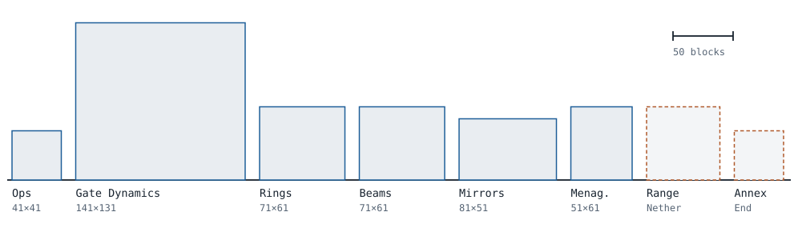
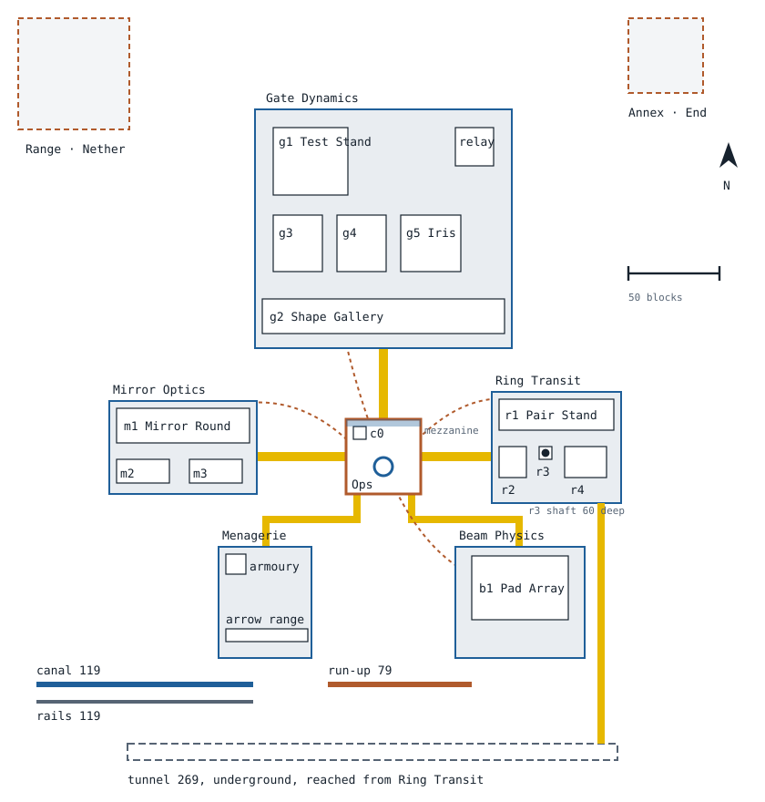

# Research Facility map

Wormhole X-Treme is a Bukkit/Paper plugin for stargates, transport rings, beam pads and
quantum mirrors. The **Research Facility** is a world its test scripts generate from scratch: a
bot joins, travels between wings using the plugin's own gates, rings, beams and mirrors, builds
test machines in sealed chambers, and checks that each one behaves. Human testers walk the same
campus.

The campus works, but it is plain white boxes. This job is the look, the sense of place and the
wayfinding. The bot still has to find every chamber at the size and position it expects, so
the space rules below are firm.

Target: **Minecraft Java 1.21.11** (Paper). Sizes are interior air volumes in blocks,
width (x) × depth (z) × height (y).

## Two ways to work

**Route A, recommended: dress the generated campus.** You run the facility in design mode (below;
planned, not built yet). Every test volume is a marked placeholder you must not touch; you build around it: walls,
facades, corridors, lighting, props, exteriors. Positions are already fixed, so nothing you build
can move a test. The footprints below stay where they are.

**Route B: build a whole map from scratch.** You design the floor plan. Every required space in
the tables below must exist somewhere, at no less than its minimum size, and you mark each one
(see *Marking your spaces*). Full freedom over layout, scale and story. On our side the scripts
need a marker reader (planned, not built yet) before they can run on your map; allow about a
week after your massing milestone for that.

## Run it yourself

> **Planned, not built yet.** Everything in this section (the `-Design` and `-Export` options,
> and the `check` and `export` chat commands) describes how design mode will work; the commands
> below do not run today. Until it lands, ask the maintainer for a world download of the
> template, and send the world folder back the same way.

You will need Windows, macOS or Linux, Java 25 (WorldEdit 7.4 needs it), a current Node.js LTS
release, and a clone of this repository. The script downloads Paper and the plugin, and installs
its own Node modules the first time.

```bash
# Windows (planned)
scripts/facility/lab.ps1 -Design -Op YourName
# macOS / Linux (planned)
scripts/facility/lab.sh -d -o YourName
```

Design mode will generate the campus once on Minecraft 1.21.11, and then leaves it alone:

- You are in creative mode with WorldEdit, and the bot does not run.
- Test volumes are filled with a marked placeholder block, so you can see them. They go back to
  air when the tests run.
- Your world is kept between sessions. Say `stop` in chat to save and shut down; run the same
  command to carry on.
- Say `check` in chat at any time. It lists every block of yours inside a test volume or its
  2-block skin, with coordinates and the wing it belongs to.

### Sending your work back (planned)

Say `export` in chat, or run `scripts/facility/lab.ps1 -Design -Export` with the server stopped.
It writes one file to `.local-server/exports/facility-design-<date>.zip` holding:

- your world (Overworld, Nether and End),
- `manifest.json`: the facility version it was generated from, the Minecraft version, your name,
- `check.txt`: the `check` report at the time of export.

Send the zip to the maintainer, or attach it to the job's issue if it is under GitHub's size
limit. We load it, run the full self-test on it, and send back screenshots and results.

## Hard rules

1. **Blocks up to Minecraft 1.21.11.** Copper bulbs, tuff bricks, trial-chamber blocks and
   the rest of 1.21 are all fine; nothing newer, no mods, no resource packs. Design mode
   will enforce this by running 1.21.11. Your build is the facility's decoration on 1.21.11 and
   later, where every block exists; test runs on 1.20.4 use the plain campus without it, so
   nothing about the tests may depend on your build. Players on older clients who join through
   ViaVersion still see it, with each newer block drawn as an older lookalike.
2. **Test volumes stay empty air.** Nothing of yours goes inside one, including light blocks,
   barriers, carpet or water.
3. **Keep a 2-block skin around every test volume free of active parts.** No redstone, rails,
   signs, buttons, levers, pressure plates, item frames, banners, hoppers, pistons, observers or
   command blocks within 2 blocks of a chamber. The plugin reacts to many of these, and the
   tests would pick up your props. Decorative versions belong in corridors and offices.
4. **Chamber walls are at least 1 block thick and solid,** with door and gallery openings where
   the table says. A gallery is a viewing window into the chamber: glass or glass panes, at least
   5 wide and 3 high, centred on that wall.
5. **Mirror walls stay at player height.** Facility mirrors sit with their bottom edge at floor
   level and are 2 blocks tall. Do not raise the floor in front of them.
6. **No mobs or entities,** except item frames and armour stands outside the 2-block skin. The
   bot counts entities in its tests.
7. **No third-party schematics** unless the author has given written permission to include them
   in an open-source project. [INSPIRATION.md](INSPIRATION.md) lists references for ideas only.

## Massing



Width × depth of each wing's interior, to one scale. Dashed outlines are the far sites in the
Nether and the End.

### A mock campus plan

One idea for Route B, not a requirement, and **not the generated layout**: in the campus you
dress on Route A, Gate Dynamics is north of Ops, Ring Transit east, Beam Physics west and Mirror
Optics south, the tunnel running east, and the Menagerie north-east, with its three lanes
running west from the Motor Pool into Gate Dynamics. In this mock, Ops is in the middle, each wing reached through its own transport
(gate north, rings east, beam south-east, mirror west), lanes and the underground tunnel along
the south edge. Every box is drawn at its real size, north at the top. The Overworld part fits
in roughly 400 × 420 blocks.



## Required spaces

Every row is a minimum interior air volume. A room may be bigger, but a chamber's test volume is
exact: build its walls on the line. A wing must hold its chambers plus walkways at least 3 wide
and 4 high between them.

| ID | Space | Interior W × D × H | Door | Gallery | Notes |
|---|---|---|---|---|---|
| **ops** | **Operations** | **41 × 41 × 16** | | | The hub. One arrival point per wing (gate, ring pad, beam pad, mirror) and the Systems mezzanine. |
| c0 | Calibration Cell | 7 × 7 × 4 | w | s | |
| s1, map, regions, perms | Systems desks | desks | | | On a mezzanine 6 blocks above the Ops floor along one wall: the console, map, region and permission desks. |
| **gates** | **Gate Dynamics** | **141 × 131 × 36** | | | The biggest wing. Stargates are built and dialled here. |
| g1 | Test Stand | 41 × 37 × 30 | s | w | The tallest chamber. |
| relay | Relay Gate | 21 × 21 × 24 | s | e | Holds the far end of dialled gates. |
| g2 | Shape Gallery | 133 × 19 × 30 | w | s | One long hall of gate shapes side by side. |
| g3 | Automation Bay | 27 × 31 × 16 | w | s | Redstone inputs; the 2-block skin matters most here. |
| g4 | Build Bench | 27 × 31 × 16 | e | s | |
| g5 | Iris Chamber | 33 × 31 × 16 | e | s | |
| **rings** | **Ring Transit** | **71 × 61 × 14** | | | |
| r1 | Pair Stand | 63 × 17 × 12 | s | n | Two ring platforms far apart. |
| r2 | Ceiling Room | 15 × 17 × 12 | n | e | Tests rings under a low ceiling; keep the ceiling as given. |
| r3 | Shaft | 7 × 7 × 12 | n | s | Plus a 7 × 7 shaft 60 deep below it. A window onto it is welcome. |
| r4 | Build Bench | 23 × 17 × 12 | n | w | |
| tunnel | Range Tunnel | 269 × 9 × 6 | | | Straight and enclosed; can run underground. |
| r5 | Edit Desk | desk | | | |
| **beams** | **Beam Physics** | **71 × 61 × 12** | | | |
| b1 | Pad Array | 53 × 35 × 10 | e | s | A grid of beam pads. |
| b2 | Dispatch Desk | desk | | | Ideally overlooks the pad array. |
| **mirrors** | **Mirror Optics** | **81 × 51 × 12** | | | |
| m1 | Mirror Round | 73 × 19 × 10 | n | s | A hall of mirrors at player height. |
| m2 | Wall Bench | 29 × 13 × 8 | n | e | |
| m3 | Capture Desk | 29 × 13 × 8 | n | w | A sealed chamber despite its name. |
| **menagerie** | **Menagerie and Motor Pool** | **51 × 61 × 10** | | | Animals, vehicles and projectiles through gates. |
| **range** | **The Range** | **61 × 61 × 20** | | | In the Nether, on solid ground, away from lava lakes. |
| **annex** | **The Annex** | **41 × 41 × 20** | | | In the End; off the main island is fine, reachable on foot from its gate. |

Door and gallery give the wall (n, e, s or w) that has the chamber's door and its viewing
window; on Route A they are fixed, on Route B keep them too.

Rows marked "desk" are workstations, not sealed volumes: a 3 × 2 floor area with a console where
a player stands.

### Fixed fixtures

Besides the chambers, the bot uses a set of transit fixtures every run: the gates, ring pads,
beam pads and mirrors that carry it from Ops to each wing, and the teleport plates that work when
the plugin is down. They are built by the facility's scripts, so on Route A they keep their
positions, and on Route B each needs the same space around it, marked like a chamber. Where a
fixture stands, **the floor stays at the campus floor level** (y 0 in the tables, y 64 in the
Nether, y 60 in the End). Coordinates are campus blocks with Ops centred on x 0, z 0; north is −z.

| Fixture | Where | Keep |
|---|---|---|
| Ops gate | Opening centred on x 0 at z −13, facing south | The gate itself, its button, the floor 2 blocks down under it, a flat 3-wide runway from z −8 to −3, and the dial console at x −5, z −8 |
| Gate hall gate | Opening centred on x 0 at z −53, facing south | As the Ops gate: runway z −48 to −45, console at x −3, z −48 |
| Ops ring pad | x 13, z −6 | A 7 × 7 square centred on it, clear from the floor to 4 blocks above, with nothing standing in it |
| Ring lab pad | x 52, z −4 | As the Ops pad |
| Atrium beam pad | x −13, z −6, with its button at x −17 | A 5 × 5 square centred on it, clear from the floor to 3 blocks above |
| Beam lab pad | x −46, z 0, with its button at z −4 | As the Atrium pad |
| Ops mirror | On the Ops room's south wall at x −10, z 20, facing north | The wall solid one block out all round the 1 × 2 opening, and the floor in front at y 0 |
| Optics mirror | x −10, z 40, facing south | As the Ops mirror |
| Range and Annex mirrors | Nether x −15, z −24; End x 1012, z 1016 | On a free-standing pier the facility builds; leave the pier and the floor in front of it |
| Teleport plates | A row of eight under the mezzanine, x −16 to 16 every 4 blocks at z −18 | The service corridor x −20 to 20, z −20 to −15, flat and clear |
| Boards | The Ops wall, the fault counter, the welcome board, and one per wing lobby | Left where they are; design mode will mark them |

Design mode will mark these as it marks the chambers, and the facility's check covers them too.

### Lanes and the Menagerie

| Space | Size | Notes |
|---|---|---|
| Canal | 119 long | Water lane for boats, ending at a gate. Straight. |
| Rail line | 119 long | Minecarts into a gate. Straight, level, nothing on the track bed. |
| Run-up stripe | 79 long | A clear straight run for players and mobs at speed. |
| Lava trough | 27 wide | Enclosed, with a viewing window. |
| Boathouse | 10 × 6 | |
| Rail loop | 29 × 11 | Closed loop. |
| Armoury | 11 × 11 × 4 | Arrows, tridents, snowballs and fire charges are handed out here. |
| Arrow range | 45 × 7 | Projectiles fired down it into a gate; nothing in the flight path. |

## Marking your spaces (Route B)

Place one structure block in **Data** mode at the bottom north-west corner of each space, one
block outside the interior (inside the wall, under the floor line), with its ID and sides in the
custom data string. Wings get one at their bottom north-west corner, lanes one at each end, desks
one under the spot where a player stands.

```
wx:g1 door=s gallery=w
wx:r3 shaft=60
wx:canal end=a        wx:canal end=b
wx:wing=gates
wx:desk=b2 facing=n
```

Sides are n, e, s or w, as in the table.

## Direction

A working research base in the spirit of a military gate programme: a clean white shell, dark
machined steel around anything dangerous, copper on the parts people operate, and procedure at
every threshold. Make it your own; [INSPIRATION.md](INSPIRATION.md) has the full survey and
[CREATIVE.md](CREATIVE.md) the earlier look-and-transit pass.

The moments and systems below are ideas for the look. Where one meets a fixture or a chamber
(a raised gate plinth, a room set lower, panelling round a mirror), the fixture's rules win: build
the plinth around the Ops gate's flat runway, not under it.

Moments we want:

- The gate in Ops on a raised plinth with a dark ramp up the centreline; the rest of the room
  sits lower.
- A control room one floor up, facing the gate through a long window, with a parked shutter.
- Opposing blast doors with hazard bands, and the same door detail at every lab entrance.
- The 60-deep ring shaft banded light and dark every 4 blocks, so the fall is countable.
- The End Annex as a contrast: oxidised copper, purpur, obsidian spines, a geometric
  stained-glass window behind the gate.
- The Nether Range as a repaired fortress outpost lit only by soul fire.

Systems we want:

- One corridor module repeated everywhere: a recessed band at eye height, a dark rib with a
  vent every 6 blocks, a light channel in the ceiling.
- A floor line in each wing's colour leading from Ops to that wing.
- Hidden light sources; visible lamps only as props, in four colours: cool white for labs, warm
  for workshops, blue for the wormhole, red for alarms.
- Three wall tones by zone, so you know roughly where you are without a sign.

## Milestones

1. **Massing.** Blocked-out walls and floors for every wing, no detail. Route B: markers placed.
   Export it; we run the checks and send back what fails.
2. **One wing finished.** Ops is the best first choice. The palette and corridor module are
   agreed on it before you repeat them.
3. **Everything finished.** All wings and both far sites.
4. **Fixes.** One round for anything the tests catch.

A milestone passes when the facility's keep-clear check reports nothing, and the bot's full self-test passes on your
world at the same count as on the plain campus. Rights and credit are in the
[design README](../README.md).
