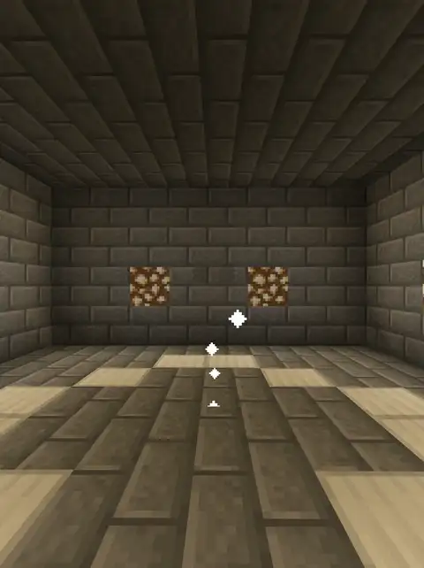
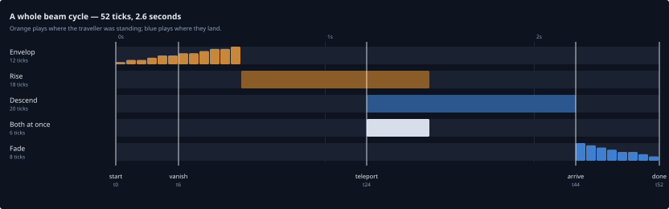

# Beaming — Design

Why beaming is built the way it is. The [beaming guide](guide/BEAMS.md) says what it does.
The other two ways to travel have their own documents, [GATES.md](GATES.md) and
[RINGS.md](RINGS.md).

**In short.** A beam destination is a single named point somebody stood on once — no blocks, no
partner, nothing to walk into. Travel is a 52-tick particle sequence in four phases, and almost
every decision below comes from one of three things: making a person appear to dissolve into a
column of light, keeping them from getting stuck if anything goes wrong, and keeping the
arithmetic that drives it somewhere a test can reach.

| | Stargate | Ring | Beam |
|---|---|---|---|
| What exists in the world | A built frame | Two invisible pads | Nothing |
| Unit | One gate, dialled to another | A permanent pair | A single point |
| Started by | Button, sign, redstone, `/dial` | Walking into it | A command |
| Direction | One way per dial | Both ends together | One way, no return |
| Range | Cross-world, config permitting | Same world, always | Cross-world, always |
| Who can go | Network and node | Owner and allow list | Public list, or your own places |

## Contents

- [Destinations and storage](#destinations-and-storage)
- [Resolving a name](#resolving-a-name)
- [The sequence](#the-sequence)
- [Making somebody disappear](#making-somebody-disappear)
- [Active and frozen are two states](#active-and-frozen-are-two-states)
- [Mounts](#mounts)
- [Nothing can strand a traveller](#nothing-can-strand-a-traveller)
- [The pure half and the dull half](#the-pure-half-and-the-dull-half)
- [Cost and cooldown](#cost-and-cooldown)
- [Sound](#sound) · [Permissions](#permissions) · [Commands](#commands) · [Config](#config)
- [Layout](#layout) · [What the tests guard](#what-the-tests-guard)

## Destinations and storage

Two kinds, and the difference is only which registry holds them: **public destinations**,
curated with `/wormhole beam admin set` and reachable by anyone with `wormhole.beam.use`, and
**places**, one private set per player. `BeamDestination` carries no access field of its own —
which map it lives in is what makes it public or private, so there is no third state to keep
consistent with the other two.

**Only a public destination can have its own cost.** A place is reachable only by the player who
made it, so a cost on one would be them choosing what to pay themselves. The field still lives
on the shared type, so `BeamManager` and `BeamYamlManager` never have to know which kind they
are holding.

Everything is in one file, `plugins/WormholeXTreme/data/beam.yml`:

```yaml
Public:
  Spawn:   {World: world, X: 128.5, Y: 64.0, Z: -310.5, Yaw: 90.0, Pitch: 0.0}
  Market:  {World: world, X: 40.5, Y: 71.0, Z: 12.5, Yaw: 0.0, Pitch: 0.0, Cost: 25.0}
Places:
  069a79f4-44e9-4726-a5be-fca90e38aaf5:
    Mine:  {World: world_nether, X: -88.5, Y: 31.0, Z: 204.5, Yaw: 180.0, Pitch: 0.0}
```

**One file, not one per world** — the opposite of what rings do, for the reason rings did it. A
ring pair is same-world by design, so sharding by world made the layout enforce the rule.
Beaming is deliberately cross-world, so there is no equivalent rule to enforce.

Yaw and pitch are stored, so a destination faces the way its author was facing. Writes go
through a temp file and `ATOMIC_MOVE`, like gates and rings. `Cost` is written only when a
destination overrides it, and read back as **null rather than zero** when absent: "inherit the
default" and "explicitly free" are different things and both are expressible.

## Resolving a name

One method, `BeamTravel.travelTo`, shared by `/wormhole beam to` and `/wormhole go`, so the two
cannot quietly disagree about what a name means. **Your own places are checked first, then the
public list**, so a place named after a public destination wins for its owner.

The return value is **true when the name resolved to something**, whether the trip started or
was refused, and **false only when nothing anywhere is named this**. That is what lets
`/wormhole go` fall through to a gate without this method's refusals getting in the way, and
what stops a permission problem being reported as a typo.

`/wormhole go` tries a gate first, so a gate name always wins — and `go` to a gate beams you to
its arrival point rather than walking you through the ring. A destination whose world is not
loaded says so, rather than loading a world because somebody typed a name.

## The sequence



**This is the departure only** — the glow gathering, the traveller vanishing, and the column
rising away. The arrival half is not captured yet, and cannot be filmed by the traveller: you
vanish six steps into a twelve-tick envelop, long before there is time to reach the far end and
watch. It needs a second player at the destination. Until then the phase table below is the
record of what the other half does.

Four phases, matched beat for beat against the reference footage: a glow gathers and appears to
absorb the traveller; they and the light leave in a column; the column arrives at the far end
and deposits them; it fades.

| Phase | Default | What happens |
|---|---|---|
| **Envelop** | 12 ticks | A dense `END_ROD` burst at body height, brightening, **tracking the traveller** — they can still walk, turn and react. They vanish partway through, at tick 6. |
| **Rise** | 18 ticks | The envelope opens into the full-height column, rooted where they stood when they vanished, climbing away. The real teleport fires at tick 12 — mid-rise. |
| **Descend** | 20 ticks | The same column arrives from above at the destination and settles. The traveller is already physically there. |
| **Fade** | 8 ticks | The instant the column settles the traveller is revealed, standing inside the light, and the column collapses on a deliberately quick tail. |

Two things about that are worth stating plainly, because they are what the sequence is built
around. **The traveller is not frozen during the envelope** — somebody in the reference footage
is free to move right up until they are taken, so this is too, and the vanish tick is when that
changes: the freeze, the hide and the column's fixed root all take hold on that one tick. And
**the real teleport fires mid-rise**, so most of the departure is seen before leaving and the
remainder plays out at the origin with nobody there.

Delivery reads as an arrival rather than a second build-up, hence the short fade. One asymmetry
does not come from mirroring the two ends: the destination track could be staged independently
of the player, but the origin track cannot — the teleport has to wait on it.

### The phases overlap

<!-- timing:start -->



The four phases do not simply follow one another, which is the one thing the table above cannot
show. The descend column starts at the teleport tick, and the teleport fires 12 ticks into an
18-tick rise, so for 6 ticks the origin column is still climbing while the destination column is
already falling. The two are at opposite ends of the journey, so nobody sees both.

That is why the whole cycle is **52 ticks, 2.6 seconds** rather than the 58 that adding the four
durations together gives. 52 ticks is the number to cut a capture to.

<!-- timing:end -->

## Making somebody disappear

The whole "dissolve into a beam, reappear out of one" read rests on one API property: **hiding
is observer-relative.** A hidden player still sees their own surroundings and any particles
normally; they are only withheld from *other* players' clients. So the traveller is never
removed from the world — they stay physically present, hidden and frozen, and the teleport moves
a player who is standing right there the whole time.

**`hideEntity` rather than invisibility, because invisibility does not do the job.** It hides a
player's *body* and nothing else, so a held sword, worn armour, a shield and an elytra all keep
rendering exactly where they were: a traveller carrying anything never dissolved into the column
at all, leaving their equipment standing in it in the shape of a person.
`Player#hideEntity(Plugin, Entity)` stops the entity being sent to that client, so equipment,
nameplate and hitbox go with it. Plain Spigot API across 1.20–26.2, and not deprecated the
way one-argument `hidePlayer` is.

**Invisibility is still applied on top, for a different audience.** Hiding deliberately skips
the traveller themselves, and a client always renders its own player, so without it somebody in
third person watches themselves stand solid in a column everyone else sees as empty. It is a
partial answer by nature — their own equipment keeps rendering for them regardless — and that is
the trade, taken knowingly, for the unarmoured case looking right. It is applied only when the
traveller does not already have it, which is the whole guard against the sequence cancelling an
invisibility potion somebody drank themselves.

**Blindness alone did not stop them seeing the destination early.** Nothing about hiding stops
the *traveller* looking around the instant they physically arrive, well before the descend
column has settled; the freeze only ever locked position, and camera look cannot be locked
server-side at all. Blindness turned out to be mostly a render-distance fog rather than a
blackout, with nearby terrain, daylight, torches and the beam's own particles showing through.
`DARKNESS` stacked on top — the vignette a warden applies — is what actually blocks it. Both go
on when the teleport fires and come off when the column settles, the same two ticks the hide and
the reveal already key off.

Two consequences of per-observer hiding are named rather than fixed: somebody logging in
mid-beam sees the traveller for the remaining tick or so, and Bukkit reference-counts hiding per
plugin, so another plugin hiding the same entity keeps it hidden after this one reveals it —
correct, rather than a leak. Revealing is forgiving by design: `showEntity` on an entity that
was never hidden is a no-op, so the failure path can just call it without knowing how far the
sequence got.

## Active and frozen are two states

Two sets, not one flag:

- **Active** covers the whole sequence, envelope included, while the traveller is still free to
  walk about. This is what refuses a second beam stacking onto a first.
- **Frozen** is the narrower, later state: position-locked, starting at the vanish tick.

Collapsing them breaks one or the other, with no third option — either the already-beaming guard
stops working during the envelope, or the traveller is locked from the first tick again, which
defeats the point of letting them move.

The freeze reverts x/y/z on a `PlayerMoveEvent` and **keeps the new yaw and pitch**, so looking
around still works. Camera look is purely client-rendered; there is nothing to lock.

## Mounts

Bukkit dismounts a rider before teleporting them, unchanged across the supported range, so the
single `player.teleport(...)` this used to make tipped the traveller off their horse and beamed
them alone. Gates already solved it and beaming borrows the answer: move the mount, then put the
rider back through the shared `PassengerReattach` retry loop. Paper's
`TeleportFlag.EntityState.RETAIN_VEHICLE` would be the one-call version, but it is not in plain
Spigot at any version here, and this plugin ships one jar for Spigot, Paper and Purpur alike.

**Holding the mount still is the other half, and less obvious.** The freeze works by reverting
`PlayerMoveEvent`, which a rider never raises — their position comes from the vehicle — so a
frozen player on a horse could steer clean out of the departure column during an eighteen-tick
rise. Rather than fight that, the rider is dismounted at the vanish tick so the existing freeze
does exactly what it was written to do, and the mount's AI is switched off so it does not wander.
Neither is visible: both are already hidden on that tick.

A mount somebody else is also sitting on is left alone. An unmounted traveller gets an absent
mount whose every method is a no-op, so the sequence never branches on null.

## Nothing can strand a traveller

Three separate guards, because a stuck beam leaves somebody frozen and invisible and no amount
of reconnecting fixes it.

**The timings are clamped, once.** Six durations come from config and two must sit strictly
inside a third: the vanish before the envelope ends, the teleport before the rise ends. Set
`beam-teleport-at-step` at or past `beam-rise-ticks` and the teleport condition is never reached
while the rise is still active — the traveller is left frozen and invisible with no way out
short of a restart. Resolving all six together in one place is what makes that impossible
whatever a config file says. They are read once per sequence rather than per tick, so a config
change mid-flight cannot desync a beam already running.

**Terrain drifts.** A destination's coordinates were recorded once and nothing re-checks them,
so somewhere standable when it was saved can be dug out or built over. The safe-ground
correction runs once, in `BeamAnimation.start`, for every beam rather than in each caller —
every caller was already doing it identically, which made it a convention the fifth caller could
forget. It is idempotent, preferring the exact stored spot whenever that spot is standable, so a
caller that still snaps its own location first loses nothing. Doing it once also means the
teleport and the descend column share the corrected point, so **the effect cannot land somewhere
the player does not**.

**A sequence that throws frees the traveller** rather than leaving them stuck: effects removed,
mount released, freeze cleared, and a message saying so. Each step is guarded on its own,
because clearing the freeze is the one that actually matters and must not be skipped because
something earlier failed.

## The pure half and the dull half

`BeamFrame` computes what a tick should do, purely, from the tick number and the resolved
timings: no Bukkit types, no side effects, nothing needing a running server. The sequence asks
it what should happen and then does exactly that, with no arithmetic of its own left to get
wrong. Three quantities cover all four phases — `height` separates the envelope from the full
column, `yOffset` is what rising and descending both are, and `density` is what brightening and
fading both are.

This mirrors the split the ring subsystem grew (`RingCycle` for the decisions, `RingTransit` for
touching a live world), for the same reason: an off-by-one at a phase boundary reads as a
stutter or a column starting a tick late, and none of it needs a server to get right. It was
worth doing *after* the shape had survived play-testing rather than before. Every quantity is
the value the un-split sequence computed inline; the split relocated the computation, not what
it computes.

## Cost and cooldown

Both are **checked in `BeamTravel` before the sequence starts, and applied from the depart
hook** — once the real teleport has fired, not at the point of merely starting. The same split
gate travel makes, and for the same reason: applying either at the check spends it on a trip
that has not happened and, if the player disconnects mid-sequence, may never happen.

A non-zero cost is **said up front** rather than only discovered once charged. Cost resolves as
the destination's override, else the global default, else **zero when economy is disabled or
Vault is absent** — that last check was missed when per-destination cost was added, and without
it the player was told "this will cost X" for a charge that never happened.

`wormhole.beam.admin` **bypasses both entirely**, a deliberate departure from gate travel. Staff
testing destinations or handling a support request are the case it is for, and it reuses the
node that already gates managing public destinations rather than inventing a second one meaning
the same thing.

The cooldown is a single duration per player. Gates' `StargateRestrictions` still carries a
multi-group system beaming has no equivalent concept for. Both refusal messages are written for
beaming rather than reused from the gate strings, whose wording names a stargate specifically.

## Sound

A power-up as the sequence begins, a departure where the traveller leaves, an arrival where they
land.

| Setting | Default |
|---|---|
| `beam-sound-charge` | `block.respawn_anchor.charge` |
| `beam-sound-depart` | `entity.enderman.teleport` |
| `beam-sound-arrive` | `entity.shulker.teleport` |

Read live, so an admin can retune or silence beaming without a restart. The defaults are
deliberately distinct from the ring palette so the two mechanics do not sound alike, and taken
from vanilla's own teleport sounds so nothing had to be invented. Played through the shared
`Sounds` helper, which never throws — a sound is not worth failing a beam over.

## Permissions

Four nodes, checked by `BeamPermissions` rather than `WXPermissions` — the same separation rings
make, and for the same reason.

```
wormhole.beam.use             travel to a public destination or your own place   default: true
wormhole.beam.place           create and manage your own places                  default: true
wormhole.beam.admin           manage public destinations; bypass cost/cooldown   default: op
wormhole.beam.admin.teleport  beam anybody to a player or to raw coordinates     default: op
```

**`admin.teleport` is deliberately not implied by `admin`.** Curating a destination list and
relocating any player at will are different orders of power. The check takes a `CommandSender`
rather than a `Player`, because `admin goto` and `admin send` have to work from console and
command blocks.

## Commands

```
/wormhole beam to <name>                  travel; your own places first, then public
/wormhole beam list                       list public destinations
/wormhole beam place list                 list your own places
/wormhole beam place set <name>           save your current location as a place
/wormhole beam place remove <name>        remove one of your own places
/wormhole beam admin set <name>           register a public destination where you stand
/wormhole beam admin remove <name>        remove a public destination
/wormhole beam admin cost <name> <amount> what it costs to use
/wormhole beam admin cost <name> -default clear the override; use the configured default
/wormhole beam admin goto <player|destination|x y z [world]>
/wormhole beam admin send <target> <player|destination|x y z [world]>
```

**Travel goes through one verb, `to`.** It used to take a bare name, which sat in the same
argument slot as `list`, `admin` and `place` and read as one more subcommand rather than as the
thing you are travelling to.

`goto` and `send` are the one place a non-player sender is accepted. Console and command blocks
have no location to beam *from*, so only `send` makes sense for either.

## Config

```yaml
beam-envelop-ticks: 12       # glow gathers at body height
beam-vanish-at-step: 6       # how far into the envelope the traveller vanishes
beam-rise-ticks: 18          # column rises and departs
beam-teleport-at-step: 12    # how far into the rise the real teleport fires
beam-descend-ticks: 20       # column arrives and settles
beam-fade-ticks: 8           # column collapses once the traveller is deposited

beam-sounds-enabled: true
beam-sound-volume: 1.0
beam-sound-charge: block.respawn_anchor.charge
beam-sound-depart: entity.enderman.teleport
beam-sound-arrive: entity.shulker.teleport

beam-use-cooldown-enabled: false
beam-use-cooldown-seconds: 120
beam-economy-use-cost: 0     # 0 = free; a public destination may override it
```

The two `at-step` settings are clamped strictly inside the phases they sit in — see
[Nothing can strand a traveller](#nothing-can-strand-a-traveller). These values are what the
plugin falls back to when a setting is absent, so a config that has never mentioned beaming
still gets the tuned sequence.

## Layout

```
model/beam/BeamDestination.java    one named point: where it is, and an optional cost
model/beam/BeamPoint.java          a spot in a named world, resolved only when asked
model/beam/BeamManager.java        the public map and one place map per player
model/beam/BeamYamlManager.java    load and save beam.yml
model/beam/BeamTravel.java         resolve a name, check cost and cooldown, start a beam
model/beam/BeamAnimation.java      the sequence, and the only class that touches Bukkit
model/beam/BeamFrame.java          what a tick should do, computed purely
model/beam/BeamTiming.java         six durations, clamped into consistency
model/beam/BeamVisibility.java     hiding the traveller, and putting them back
model/beam/BeamFreeze.java         active and frozen, as two sets
model/beam/BeamFreezeListener.java holds position, leaves the camera alone
model/beam/BeamMount.java          what they were riding, and what to do about it
model/beam/BeamCooldown.java       one duration per player
model/beam/BeamSounds.java         charge, depart, arrive
model/beam/BeamPermissions.java    the four nodes
command/handlers/BeamCommand.java  /wormhole beam <verb>
command/Go.java                    /wormhole go: a gate first, then a beam destination
```

The split that matters is `BeamFrame` against `BeamAnimation.Sequence`: everything about *when*
a thing happens is pure and testable with no server running, and everything that touches a live
world is left with no decisions in it.

## What the tests guard

- **Every phase boundary lands with no gap and no overlap**, and each one-shot event fires
  exactly once (`BeamFrameTest`).
- **The rise is still active on the teleport tick**, so the origin column keeps playing after
  the traveller has gone (`BeamFrameTest`).
- **A config that would strand a traveller frozen and invisible is clamped into one that
  cannot** (`BeamTimingTest`).
- **Active and frozen stay independent**, and two players never share either (`BeamFreezeTest`).
- **A mount is captured, held and released correctly**, including that a mount somebody else is
  riding is left alone (`BeamMountTest`).
- **Cost is zero whenever economy is off or Vault is absent**, whatever the destination says
  (`BeamTravelTest`); a destination with no cost reads back as null and one explicitly free as
  zero, and a malformed cost field is ignored rather than failing the entry
  (`BeamYamlManagerTest`).
- **The timing strip above is the sequence the animator actually runs**, tick for tick, and
  `docs/CAPTURES.md` still agrees on how long a beam is (`BeamGalleryTest`).
