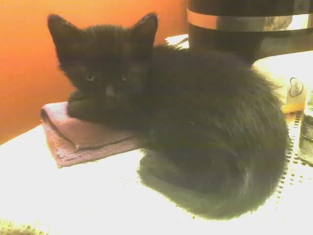
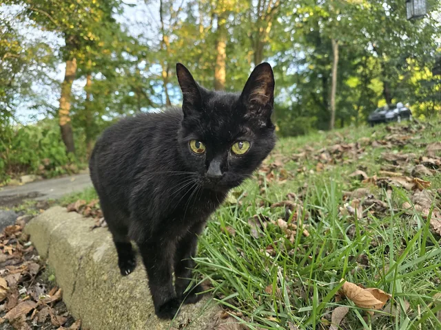

# Freya

| | |
|---|---|
|  |  |

**2005 – 2025**

A black cat who lived twenty years and spent them following people from room to room. She died
in December 2025. `/wormhole freya` is the smallest possible version of that -- one cat, for one
person, who walks after them through every gate, ring, beam and mirror in the plugin -- and it is
in here because somebody who worked on this plugin missed her.

This page exists so that nobody has to read the source to find out what the command does, and so
that an operator who finds `freya.yml` in their data folder knows what it is. The command itself
stays unadvertised: it is hidden from help and from tab completion, and the plugin deliberately
logs nothing about it at startup.

## Who she was

Twenty years old and entirely herself right to the end: stubborn, curious, affectionate on her
own terms. She kept to her own places -- waiting on top of the oven for her food, up in the
bathroom drinking from the water dispenser, down in the basement curled on somebody for warmth.
She had habits none of the other cats ever picked up. She spun her treat containers until the
treats came out, while the rest watched and hoped one would roll their way. She waited on the
kitchen counter for the fridge to open and tapped insistently until a piece of cheese came out
of it. In the car she rode on a lap, watching out of the window or just lying there quietly.

The last of it had a shape to it as well: the pills at night, her own meals through the day, the
vet every month for her B12 and her arthritis. She was let go peacefully, at three in the
morning, in December 2025 -- twenty years old, having got her cheese fries, and knowing she was
deeply loved.

## The command

```
/wormhole freya [on|off]
```

`on` and `off` say so. A bare `/wormhole freya`, or any word it does not recognise, flips the
setting rather than refusing -- somebody who has just found the command should not have to get
the argument right as well.

Turning her on spawns her and says so. Turning her off removes her and says *She curls up
somewhere else*. The setting persists across restarts, so she is there again at the next login.

## What she is

A real tamed cat, all black, named **Freya** above her head, and shown to exactly one client:
her owner's. She is hidden by default rather than hidden per-observer, so a player who joins
later cannot see her either.

Everything else about her is a deliberate subtraction, so that she is company and nothing more:

- **Invulnerable, and damage is cancelled outright.** `setInvulnerable` alone would not stop a
  creative-mode player, who cannot see her to begin with.
- **Silent**, because cat sounds are positional -- an unsilenced cat nobody else can see is one
  everybody else can hear.
- **Non-collidable**, so she cannot push her owner off anything.
- **Uninteractable.** Every right-click on her is cancelled, so she cannot be sat, leashed,
  renamed or bred.
- **Not persistent**, and never saved to a world. Nothing about the cat is stored anywhere; the
  only thing written down is who asked for one.
- **Replaced, never added.** A second `/wormhole freya on` removes the first cat before spawning
  another, which is what stops an open command from filling a world with cats.

Her own spawn is let through region plugins that refuse plugin spawning -- WorldGuard's
`block-plugin-spawning` among them -- and only her own spawn, for the one tick it takes. If
something past that still refuses, she simply does not appear and the command says so.

## Travelling

She follows on vanilla tamed-cat AI, and she travels the way any pet does: every transport in
the plugin gathers a traveller's pets before it moves them and brings them along a second later,
through `PetEscort`. Gates, rings, beams and mirrors are all covered by that, and none of it is
special to her.

What *is* special to her is the fallback. The plugin checks whether she is still within sixteen
blocks of her owner and re-summons her if she is not: a tick after they join, respawn or get out
of bed, and two seconds after a trip or a world change, which is late enough that the pet escort
has already had its turn and the check only covers a miss. It logs at `FINE` when it has to fire,
so a transport that quietly drops pets shows up in a log rather than as a missing cat.

## What she does not give you

A real tamed cat is worth something in Minecraft, and none of that is on offer here:

- **She steps away while a creeper or phantom is hunting her owner**, and comes back when the
  hunt is over, checked every five seconds. A cat in the room makes both of them shy off, and
  that would be an advantage rather than company.
- **She is away while her owner sleeps**, so there is never a morning gift on the bed.
- **She stands up when a chest under her is opened**, before vanilla can decide that a sitting
  cat is blocking it. An invisible cat that stopped a chest from opening would be a bug report
  nobody could diagnose.
- **A mirror never veils her.** Quantum mirrors hide the entities behind their view from the
  viewer; doing that to her would take her away from her owner and hand her to a stranger on the
  way back.

## For operators

| | |
|---|---|
| Permission | `wormhole.freya`, default `true` |
| Data file | `<data folder>/data/freya.yml` |
| Help and tab completion | Hidden from both |
| Startup log | Deliberately silent |

The permission defaults to true, and the command is self-permissioned rather than sitting behind
`wormhole.config` -- an easter egg only operators could find is not much of one. Negating
`wormhole.freya` is how a server takes her away, and it applies to operators too, which is why
the handler has no `isOp` shortcut.

`freya.yml` is a list of the player ids who have her turned on, and nothing else. It is written
the moment somebody toggles the command, and deleted again when the last person turns her off --
so a server where nobody has found the command has nothing in its data folder to wonder about.
An unreadable id in it is logged and skipped rather than failing everybody else's load.

On enable, the file is read and any owner already online gets her back. On disable, every
companion is removed.

## The photographs

Both are personal photographs rather than captures from the game, so the format and weight rules
in [CAPTURES.md](CAPTURES.md) do not apply to them -- but the reason behind those rules does.
They are resized to 640px and encoded as WebP at quality 82, which comes to 13 KB and 83 KB, and
the originals are kept outside the repository. The left is from September 2005, not long after
she arrived. The right is from October 2024, her last autumn but one.
