# Stargates — Design

Why stargates are built the way they are. The [gate guide](guide/GATES.md) says what they do.
Rings have [RINGS.md](RINGS.md), beaming has [BEAMS.md](BEAMS.md), mirrors have
[MIRRORS.md](MIRRORS.md).

**In short.** A gate is a ring of blocks somebody builds, detected by clicking its DHD and
matched against every shape the server has loaded. Its geometry comes from a `.shape` file; what
it is made of comes from a palette in `config.yml`; the two are deliberately independent. The
portal is drawn to clients rather than built, which is what lets a water gate not drown anyone.
Most of the hard-won detail below is about three things: telling two shapes apart when both
match, surviving nine save formats, and animating something a client can be shown but the server
cannot ask about.

## Contents

- [Anatomy](#anatomy) · [Shapes](#shapes) · [The shapes that ship](#the-shapes-that-ship)
- [What a sign dial adds](#what-a-sign-dial-adds)
- [Palettes are separate from shapes](#palettes-are-separate-from-shapes)
- [Detection](#detection) · [Building](#building) · [Storage](#storage) · [Networks](#networks)
- [Dialling](#dialling) · [Why no shipped shape carries an `[RS]`](#why-no-shipped-shape-carries-an-rs)
- [Timers, and what may extend them](#timers-and-what-may-extend-them)
- [The iris](#the-iris) · [The portal is drawn, not built](#the-portal-is-drawn-not-built)
- [Animation](#animation) · [Sound](#sound)
- [Travelling](#travelling) · [Everything that is not a player](#everything-that-is-not-a-player)
- [Permissions](#permissions) · [Commands and config](#commands-and-config)
- [Layout](#layout) · [What the tests guard](#what-the-tests-guard)

## Anatomy

A gate is one `Stargate` object holding the world positions of everything the shape marked:

| Part | Marker | What it is |
|---|---|---|
| Frame | `[S]` | The ring itself, and what the palette is identified by |
| Chevrons | `[C]` | Frame blocks built from a second material, so they read as chevrons before they light |
| Portal | `[P]` | Air until the gate opens, then the drawn event horizon |
| Name sign | `:N` | Always placed; shows the gate's name, network and owner |
| Dial sign | `:D` | Optional; makes the button dial what the sign shows, rather than wait for `/dial` |
| DHD | `:A` | The button or lever that activates it |
| Iris lever | `:IA` | Optional; without it the gate cannot take an iris |
| Player arrival | `:EP` | Where a traveller's feet land |
| Minecart arrival | `:EM` | Where a cart's wheels land |
| Lights | `:L#n` | What lights during the dialling sequence, in order |
| Woosh | `:W#n` | The wave layers of the opening animation |
| Redstone | `:RA` `:RD` `:RS` | Where the redstone components for activation, dialling and sign cycling go |

Everything else about a gate — name, owner, network, iris code, target — is state on the object
rather than something built.

## Shapes

Shapes live in `plugins/WormholeXTreme/shapes/gate/` as `.shape` files: nine shipped, which
are six rings and three of those rings again carrying a dial sign. A shape is a stack of
numbered layers, each a grid of bracketed cells, plus a handful of `KEY=value` lines. The
user-facing format is in the [gate guide](guide/GATES.md#shapes).

**Layers rather than one grid**, because a gate is a 3D object even when it looks flat: the DHD
stands off the frame, redstone sits behind it, the woosh pushes out in front. One layer is the
degenerate case, not the model.

**An unrecognised `KEY=` line is ignored, not an error.** Shape files outlive the plugin version
they were written for, in both directions — and the same goes for a `*_MATERIAL=` line naming a
block this server does not know, where the setting is left alone and the palette default stands
rather than the whole shape failing to load.

**A shape may pin its own materials.** `PORTAL_MATERIAL`, `IRIS_MATERIAL`, `STARGATE_MATERIAL`,
`LIGHT_MATERIAL`, `SIGN_MATERIAL` and `CHEVRON_MATERIAL` override the palette.
`CHEVRON_MATERIAL` defaults to null rather than to the frame material, because every gate
standing today has frame material in its chevron cells — a shape that does not ask for distinct
chevrons has to go on accepting exactly what it accepted before.

**The redstone markers accept two conventions and both are right.** Written bare, `[RA]`, the
cell is empty space above a frame block and the redstone goes in it; written `[S:RA]` the cell
*is* the frame block, so the redstone belongs one higher. Every shipped shape uses the bare
form. Both exist to land the component on a cell nothing is built in.

### The shapes that ship

Six shapes, each drawn from its own `.shape` file by `scripts/render_gate_sheets.py`, in the
default `Standard` palette, at ten units to the block. Each is shown twice: standing idle, and
dialled. Click one for the full-size drawing.

Nine files ship. The three `SignDial` ones are not here, because each is its twin's ring with a
different DHD corner — the geometry is identical — and drawing them would be the same gate three
more times. What they actually differ by is [below](#what-a-sign-dial-adds).

A gate that stands up is flattened along its depth, layer 1 nearest — what you see walking up to
it, and what makes `Grand` and `Massive` legible at all, since their rings are three layers
thick with the frame in one and the portal behind it. `Horizontal` lies flat, so
flattening would leave a single row; it is drawn in plan instead.

The lettered cells are the markers that name one block rather than collecting many. Flattening
hides some of them — every shape puts its DHD in its furthest layer — so the **Markers** column
names them all, with the layer each is in. Idle, the `[P]` cells are open air ([the portal is
drawn, not built](#the-portal-is-drawn-not-built)) and the `:L` cells wear the palette's unlit
`chevron` block; dialled, the portal fills and the chevrons come on in `:L#` order.

These are flat colour keyed to each block, not Minecraft's textures — those are Mojang's, and a
screenshot is the licensed way to show the real thing. See [CAPTURES.md](CAPTURES.md).

<!-- shapes:start -->

| Idle | Dialled | Shape | Grid | What it is | Markers |
|---|---|---|---|---|---|
| <a href="images/gates/grand-idle.svg">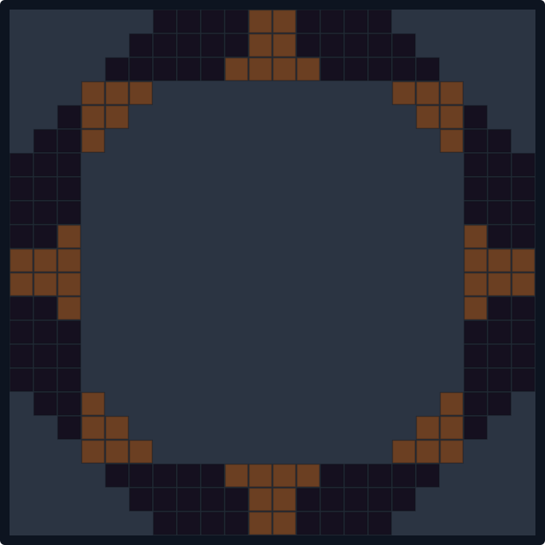</a> | <a href="images/gates/grand-dialled.svg">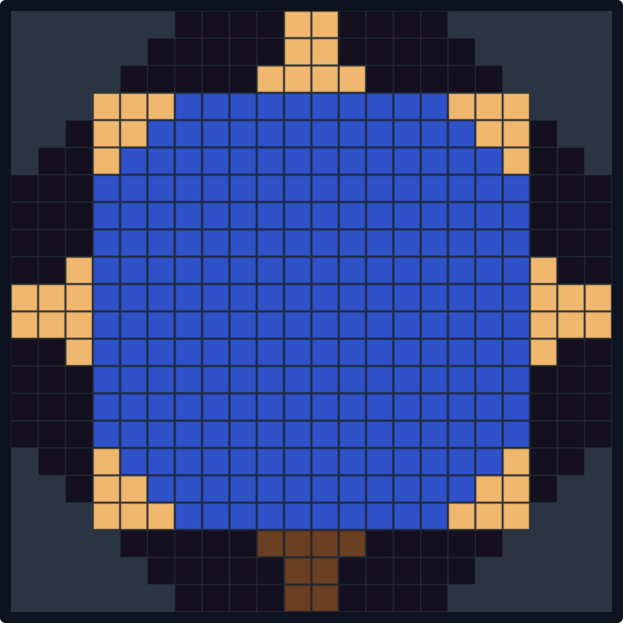</a> | `Grand` | 22 x 22 | Twenty-two wide, and a build in its own right. 11 layers, woosh in 9 steps, 7 chevrons light 2 ticks apart, and an eighth for another world. | `EP` (layer 2), `N` (layer 3), `EM` (layer 4), `A` (layer 11), `IA` (layer 11) |
| <a href="images/gates/horizontal-idle.svg">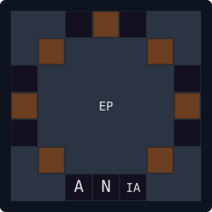</a> | <a href="images/gates/horizontal-dialled.svg">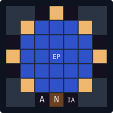</a> | `Horizontal` | 7 x 7, in plan | Lies flat in the floor, and is dropped into rather than walked through. 7 layers, woosh in 3 steps, 7 chevrons light 3 ticks apart, and an eighth for another world. | `EP` (layer 4), `A` (layer 7), `N` (layer 7), `IA` (layer 7) |
| <a href="images/gates/large-idle.svg">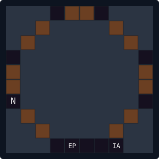</a> | <a href="images/gates/large-dialled.svg">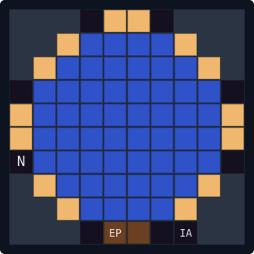</a> | `Large` | 10 x 10 | Ten wide, for a gate meant to be seen across a valley. 5 layers, woosh in 4 steps, 7 chevrons light 2 ticks apart, and an eighth for another world. | `N` (layer 1), `EP` (layer 1), `EM` (layer 2), `A` (layer 5), `IA` (layer 5) |
| <a href="images/gates/massive-idle.svg">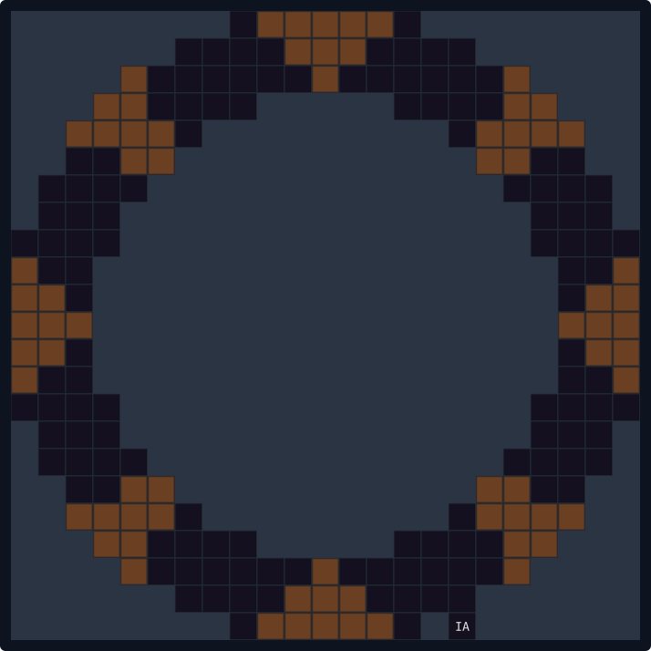</a> | <a href="images/gates/massive-dialled.svg">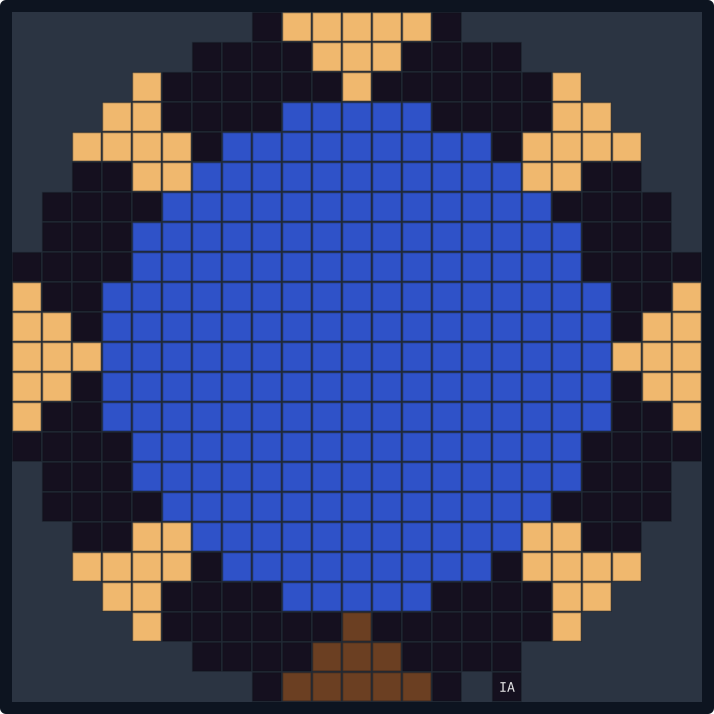</a> | `Massive` | 23 x 23 | Twenty-three wide and fifteen deep — the largest that ships. 15 layers, woosh in 13 steps, 7 chevrons light 2 ticks apart, and an eighth for another world. | `N` (layer 1), `EP` (layer 4), `EM` (layer 5), `A` (layer 9), `IA` (layer 9) |
| <a href="images/gates/minimal-idle.svg">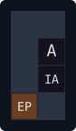</a> | <a href="images/gates/minimal-dialled.svg">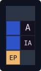</a> | `Minimal` | 2 x 4 | One block wide — the smallest gate that works. 2 layers, woosh in 3 steps, 1 chevron, so no sequence to light in. | `EP` (layer 1), `A` (layer 2), `IA` (layer 2), `EM` (layer 2) |
| <a href="images/gates/standard-idle.svg">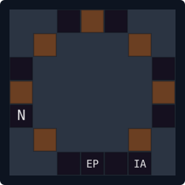</a> | <a href="images/gates/standard-dialled.svg">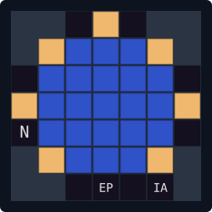</a> | `Standard` | 7 x 7 | The seven-wide ring, and what most servers build. 4 layers, woosh in 3 steps, 7 chevrons light 2 ticks apart, and an eighth for another world. | `N` (layer 1), `EP` (layer 1), `EM` (layer 2), `A` (layer 4), `IA` (layer 4) |

<!-- shapes:end -->

And the same six in game, in the `Standard` palette — idle, then dialled. The camera does not
move between panels, so the size differences are honest: `Minimal` really is that small beside
`Massive`.


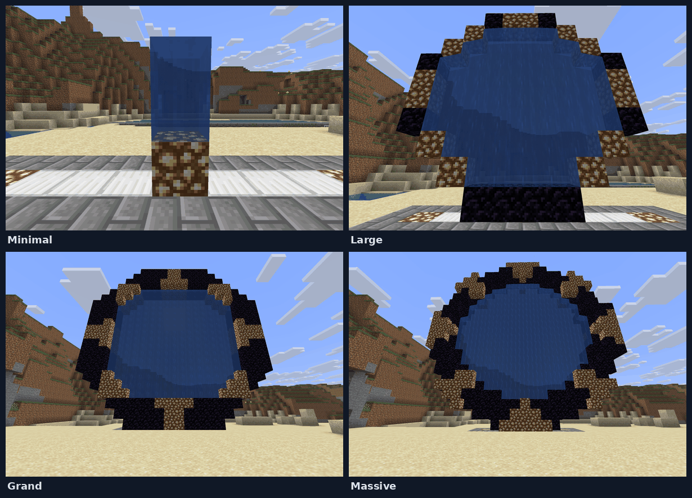

`Horizontal` is the one the grid above cannot show, because it lies flat and is dropped into
rather than walked through:


### What a sign dial adds


`Standard` against `StandardSignDial`, in the layer the DHD sits in, cropped to the corner that
differs. Outlined cells are what the sign dial adds: `D`, the wall sign you right-click to pick
a destination, and the two redstone cells that come with it — `RD` to dial and `RA` to report
that the gate is open. Everything else in both files is the same ring.

All three pairs differ this way. `Minimal` is the only one where it is more than a corner, and
only because it is two blocks wide, so its DHD needs a column of its own.

**This is why sign-dialling should not be a shape at all.** Six files encode three rings, and
the three largest shapes — `Large`, `Grand`, `Massive` — cannot be sign gates for no reason
except that nobody wrote the second file.
[#46](https://github.com/khanjal/Wormhole-X-Treme/issues/46) is the plan to make the DHD a type
a gate has rather than geometry welded into its ring, after which this drawing becomes the whole
story and the three files can go.

## Palettes are separate from shapes

A shape describes geometry. A `MaterialGroup` describes what that geometry is made of — the
Standard obsidian gate, the Atlantis lapis one — and they are separate on purpose.

Before the split, every material variant needed its own `.shape` file duplicating the whole
layout, and detection scans every registered shape in turn, so a server offering twenty palettes
paid for twenty geometry scans per click. Groups are now resolved with one map lookup keyed on
the frame material actually found, so twenty palettes cost nothing per detection. The first
group declared in `config.yml` is the default, and the maps are replaced wholesale on reload
behind volatile references, so readers never lock.

Chevron cells are held apart from frame cells for the same reason: the palette is identified by
the first frame block found, and a chevron in that list would have a gate fronted with lamps
resolve to the lamp palette, or to none at all.

The four that ship, block by block. `chevron` is the only optional key, and a palette without
one has no unlit chevron at all — its `:L` cells are ordinary frame blocks, invisible until they
light.

<!-- palettes:start -->

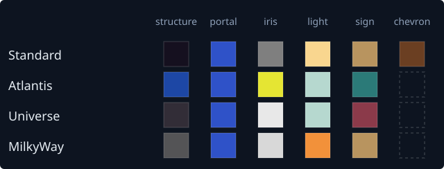

| Palette | Structure | Portal | Iris | Light | Sign | Chevron |
|---|---|---|---|---|---|---|
| `Standard` | `OBSIDIAN` | `WATER` | `STONE` | `GLOWSTONE` | `OAK_WALL_SIGN` | `REDSTONE_LAMP` |
| `Atlantis` | `LAPIS_BLOCK` | `WATER` | `YELLOW_STAINED_GLASS` | `SEA_LANTERN` | `WARPED_WALL_SIGN` | *(none)* |
| `Universe` | `POLISHED_BLACKSTONE` | `WATER` | `WHITE_STAINED_GLASS` | `SEA_LANTERN` | `CRIMSON_WALL_SIGN` | *(none)* |
| `MilkyWay` | `DEEPSLATE` | `WATER` | `IRON_BLOCK` | `SHROOMLIGHT` | `OAK_WALL_SIGN` | *(none)* |

<!-- palettes:end -->

The same `Standard` gate in each of the four, in game. Only the blocks change — the shape file is
identical across all of them.


Dialled, where the chevrons are what separates them: each palette lights its own block, and a
palette with no `chevron` key has no unlit chevron to light at all.

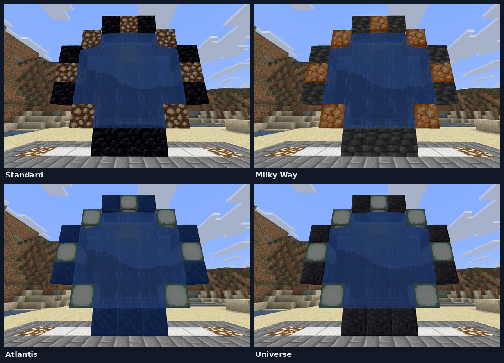

And with the iris closed, which is a fifth block per palette:


## Detection

A player clicks a button or lever. Every loaded 3D shape is tried against that position, and the
best match wins. **The cheap test runs first**: `isPossibleGateFrameMaterial` asks two O(1) sets
— the materials any loaded shape builds frames from, and the materials any configured group is
keyed on — and rules the position out before any geometry scan is paid for.

**More than one shape routinely matches the same build.** Detection reads only frame and portal
cells, and a sign-dial shape puts its DHD where its plain twin writes `[I]`, so anything built as
`StandardSignDial` also satisfies `Standard`. `beatsBestMatch` ranks them, most significant test
first:

1. **A dial sign was actually found.** Only a shape carrying `:D` looks for one, and finding one
   proves the player built a sign gate. Without this, `HorizontalSignDial` could never be
   detected: `Horizontal` came back first and overwrote the player's dial sign with its own name
   sign.
2. **`REDSTONE_ACTIVATED=TRUE`.** No shipped pair needs this now, but custom shapes can be
   written as redstone twins.
3. **More frame blocks.** The shape accounting for more of what is actually built is the more
   specific description of it. This settles `MinimalSignDial` against `Minimal`.
4. **Shape name.** Nothing left to separate them, so decide by something stable. Shapes live in
   a `ConcurrentHashMap`: iteration order is arbitrary, and adding a twelfth shape resizes the
   table and reshuffles all of it. A server should not get a different gate for adding an
   unrelated custom shape.

Tests 3 and 4 were both bugs first: before them, which of two matching shapes won came down to
where their names happened to hash.

## Building

Two steps, because a gate needs a name and the plugin cannot ask for one mid-click.
`/wormhole gate build <shape>` remembers what this player is building; they lay the frame and
click the DHD position, and the detected result is stashed keyed by the player;
`/wormhole gate complete <name> [idc=CODE] [net=NETWORK]` names it, registers it, places the
name sign and lever, saves it and fires `StargateCreatedEvent`.

**A build preview is the chosen shape made visible** (#303). `GateBlueprint` lists the blocks a
builder places, positioned by `GateGrid`, the same layer/row/column mapping detection reads the
world through, so a frame built to a preview is one detection finds; a test builds every shipped
shape from its blueprint in all four directions and detects it. Each block is a `BlockDisplay`:
no hitbox, so it can be walked through and built into, which fake blocks sent with
`sendBlockChange` cannot be. `HiddenEntities` makes it unsaved and hidden by default before adding
it to the world (`createEntity` then `addEntity`, from 1.20.2; a spawn hidden in the same tick
before that), then shows it to its owner. The entity sweep and mirror views leave `Display`
and `Interaction` entities alone, since moving or re-showing one would undo exactly that.

A preview's controls redraw it from state rather than editing entities one by one: which chevron
waves are lit, whether the wormhole is open or the iris closed, the palette, and whether the DHD
and chevron blocks are shown. Each change sets every display to what its cell should now show,
and spawns or removes the iris's and the DHD's displays to match. Dialling steps a wave every
`LIGHT_TICKS`; the kawoosh then goes out through the shape's `W#` steps and back every
`WOOSH_TICKS`, and the opening fills. The woosh order is `WooshSequence` and a lit chevron is
`MaterialUtils.litChevron`, the same code a real gate dials with, so the two cannot drift apart. The wormhole is sent to the owner as fake blocks, as a real gate draws its own, because a
block display draws no liquid; every one sent is remembered and taken back on shutdown, iris,
clear, timeout and disable. The button is an `Interaction` entity over the button's
cell, since a display cannot be clicked. The block limit counts the opening as well as the frame,
so dialling or closing the iris never takes the server past it.

The build guide is `BuildGuide`, which judges a block by detection's own rules rather than by the
material the preview draws: a lit chevron accepts the frame or the chevron block, `[C]` only the
chevron block, the DHD any button or a lever, and the dial sign is not needed. A guide that asked
for exactly the drawn block would call a finished gate unfinished. It reads the world only in loaded
chunks. A placed or broken block inside a preview queues one redraw for the next tick, when the
block is really there; the five-second tick catches everything else, pistons and explosions
included. Once a real button stands on the preview's button cell, the `Interaction` box goes, or it
would take the click meant for the real button and dial the preview instead.

Each blueprint cell carries its shape layer, so `-layer` hides cells past a layer the way `-dhd`
hides the DHD's: the display and, with the DHD's layer hidden, the button's box. A preview stood on
a placed button takes its grid from `GateGrid.fromActivationHolder` with that button's facing,
exactly as detection does when the button is pressed, which is what makes it the right place to
pick a build up again after a relog. Only a button or lever on the side of a block counts; one on a
floor has no facing a DHD could have. Nothing is saved: previews end with the session, and the
button in the world is the anchor.

`-place` checks every block before it writes one, so a refusal leaves the world as it was: the frame
material has to be one detection can find, every chunk loaded and inside the border, and no block
the gate or its opening needs may hold something else or belong to a gate or ring. A block already
right is kept, so a half-built gate is finished rather than rebuilt. It writes the preview's own
`blockDataFor`, frame first and the button last, then finds the gate with `checkStargate` from that
button and hands it to `GateInteractionHandler.offerNewGate`, the same step a pressed button takes,
so naming, the `BUILD` permission and removing the preview are not a second path. Protection plugins
are not asked yet: the node is admin-level, and region support is #240.

A shared preview keeps who it is shared with apart from who is being shown it now. Every tick, and
on every `-share`, the second is brought in line with the first for the players online in its world:
anyone new is shown every display and sent the wormhole where it is open, and anyone gone is hidden
from them and has it taken back. That covers a viewer who changes world or relogs, whose client has
forgotten what it was shown, and with `-all` anyone who arrives later. Displays drawn after sharing
are shown to viewers as they spawn, and fake blocks and sounds go to everyone watching. The button's
box is the owner's alone, so nobody else can dial it.

Every block goes into `allGateBlocks` — a flat `Location -> Stargate` map, which is what the
move path reads — and into `GateSpatialIndex`, which buckets gate blocks by chunk for questions
like "is there a gate near here".

**`refresh` and `regenerate` are different repairs.** `/wormhole gate refresh` puts the player in
refresh mode and their next DHD click re-detects the geometry from scratch, keeping name, owner,
IDC and network. No blocks are touched and no removal event is raised — a refresh is not the gate
going away, so listeners are not told to discard what they know.

`/wormhole gate regenerate <gate>` re-derives the narrower thing, by name and without a click: it
hands the gate's own stored dial-lever block and facing back to `checkStargate` with the shape as
it is now, and copies the markers off the result — the three redstone blocks, the iris lever, the
dial sign, the name sign. Copying markers rather than swapping the gate object is what keeps
identity, network, owner, IDC and open state, none of which detection knows anything about, and
is why this can run from a command while `refresh` needs somebody standing at the gate. Frame,
portal, animation waves and arrival point are deliberately not copied.

## Storage

One YAML file per gate, in `plugins/WormholeXTreme/data/gates/`:

```yaml
Name: Base
OwnerUUID: 069a79f4-44e9-4726-a5be-fca90e38aaf5
OwnerName: Justin
Network: ""
WorldName: world
WorldEnvironment: NORMAL
GateShape: Standard
GateData: <base64>
```

The readable fields are what a server owner might want to edit or grep; `GateData` is the
geometry — every block position, the arrival points, the facing, the flags, packed as bytes.

**`GateShape` is read back on load**, and is the only record of which shape a gate was built
from. A name that no longer matches any shape is kept rather than resolved, and logged: the gate
still works from its stored geometry but cannot be re-derived until the shape is back.

**`GateData` carries nine save versions.** Files written by any Wormhole X-Treme since version 3
still load. This is legacy weight the rings deliberately did not inherit — they are plain YAML
from the start — but gates cannot shed it without stranding worlds.

**Version 9 exists because version 8 wrote `Material.ordinal()`.** An ordinal is a property of
the enum's declaration order in the Bukkit jar the gate was saved against, and that order shifts
whenever Minecraft adds or removes a block. A gate saved on one server version and read on
another came back with a different material — obsidian becoming glass, an iris becoming air —
with nothing to show for it. Version 9 writes length-prefixed names; a material that genuinely no
longer exists resolves to null and falls back to the shape or palette default.

**Loading tolerates damage per file.** One corrupt file taking the whole load down would lose
every gate on the server, so a file that will not parse is logged and skipped. **Owner is a
UUID, with a legacy path**: a stored `OwnerName` equal to the owner id is not a name, it is what
an old save bug wrote, so it is treated as absent and resolved again, which heals the file.

Gates whose arrival point still sits inside the ring have it moved clear on load. A legacy SQLite
database from an older Wormhole X-Treme is noticed at startup and announced;
`/wormhole gate import` reads it in.

## Networks

A `StargateNetwork` is a name and two lists: every gate on it, and the sign-dialled subset. Gates
with no network form the implicit public pool and see each other. The pool is what a dial sign
cycles through, and it is sorted by name, so the order a click walks is the order a saved index
is read against.

## Dialling

**Three ways in, and `/dial` is not one of them.** It is the second half of one of them.
`handleGateActivationSwitch` asks one question — is this gate sign-powered?

| Route | What happens | Is `/dial` needed? |
|---|---|---|
| Button or lever on a **sign** gate | `dialFromSign` dials whatever the sign is showing, immediately | No |
| Button or lever on a **non-sign** gate | `activateForDialling` lights the chevrons and waits, printing `Type '/dial <gatename> [idc]'` | **Yes** — nothing else can name the target |
| Redstone on a **sign** gate | `dialSignTarget` dials what the sign shows | No |

So `/dial` is what a gate without a sign uses *instead of* a sign. It cannot start anything on
its own either: it opens with `removeActivatedStargate(player)` and refuses with "gate not
active" if that comes back null, so the button press has to have happened first.

**Redstone never uses `/dial`, and never leaves a gate waiting for one.** `actOnDialTrigger`
branches on the gate's own state: already open, so extend the shutdown; lit with no target — a
gate somebody activated by hand and walked away from — so deactivate it, which is the only way to
clear that state; otherwise, and **only if the gate is sign-powered**, dial what the sign shows.
That last condition is worth knowing when planning a build: **a gate with no dial sign cannot be
dialled by redstone at all.**

**The sign shows four lines**, the gate's own name and three destinations:

```
-GateName-
PreviousGate
>CurrentGate<
NextGate
```

Right-click steps forward, left-click back. The selected line is wrapped in markers as well as
coloured, so it still reads as chosen to a colourblind player or with sign colours off.

**A gate's selection is two things, and only one is saved.** The index is stored with the gate;
the `Stargate` at that index is not — it is worked out from the network when the sign is clicked.
So a freshly loaded gate had a sign naming a destination, an index agreeing with it, and no
destination object at all, and pressing its button dialled nothing. Resolving it has to happen
*without* advancing the index: the first attempted fix pretended somebody had clicked, so the
first press after a restart dialled nothing and the second dialled the gate *after* the one the
sign showed.

**The handshake activates the local end first.** The target is not assigned until local
activation succeeds, because the local path clears the target — assigning first caused NPEs and
aborted dials. If the local end fails, nothing is left half-connected. Once both ends are up the
destination's chunks are pre-loaded, so travellers do not fall through ungenerated terrain.

A dial is refused when the target's iris is closed, when the target is already active, or when
another active gate already points at it. `/wormhole gate force` bypasses those.

### Why no shipped shape carries an `[RS]`

A shape can mark an `[RS]` block that advances the dial sign one destination per pulse. The
support is real and custom shapes can use it, but none of the nine shipped shapes has one, and
that is a decision.

Redstone dialling exists so a sign can be left preset on a destination and fired by a pulse. An
input that *moves* the sign works against that: the point is that the pulse always does the same
thing. An `[RS]` also has to stay more than a block from `[RD]`, because a signal counts anywhere
within a block of a marker — placed together, one pulse would cycle the destination and then dial
whatever it landed on. The plugin drops an `[RS]` adjacent to an `[RD]` rather than allow it.

## Timers, and what may extend them

Three, and they interact.

| | What it bounds |
|---|---|
| `TIMEOUT_ACTIVATE` | How long a lit gate waits for a destination before giving up |
| `TIMEOUT_SHUTDOWN` | How long an open wormhole stays open after it was last dialled |
| `MAX_OPEN_SECONDS` | How long a wormhole may stay open at all, from when it first formed |

**The maximum always wins**, and that is what makes everything else safe. The shutdown timeout
restarts on every dial, so without a cap anything re-triggering a gate on a schedule — a minecart
crossing a detector rail every few seconds — would hold it open indefinitely and lock everyone
else out.

That cap is why a redstone pulse arriving at an already-open gate can extend it. Three behaviours
were tried. Closing it was the original and made repeated triggers useless: a second cart shut
the wormhole the first one opened. Doing nothing was next, and was safe but unhelpful.
Re-dialling is worse than either — it rebuilds a working connection for no reason, and because
dialling restarts the shutdown timer it would have held a gate open for ever. Extending pushes
the shutdown task back without touching the gate's own open timestamp, so traffic keeps a gate
open while it is actually flowing and still cannot hold it open indefinitely.
`redstone-extend-open-time: false` goes back to doing nothing.

**The activation timeout deactivates by gate identity, not by player.** Removing "whatever gate
is currently mapped for this player" is wrong the moment the same player activates a second gate
before the first one's timer fires: it stole the second gate's still-pending activation and acted
on that instead, so the gate that really timed out kept its chevrons lit forever and the
unrelated second gate was switched off early.

## The iris


Each palette closes its own block, which is why the iris is a fifth material rather than one
shared shield.

The iris is a shield, and unlike the portal it is **real blocks** — it has to stop things, and a
drawing cannot. Opening it on an active gate returns the interior to air with the portal drawn
over it, which also clears the iris blocks.

A gate can only take an iris if its shape marks `:IA`. The lever toggles it;
`/wormhole gate edit <gate> idc <code>` sets the deactivation code, and the default state is
remembered. Applying a state that is already true is silent rather than announcing an iris that
did not move.

## The portal is drawn, not built

The event horizon exists only in each nearby client's copy of the chunk. The server's blocks stay
air. That is what lets a water gate not drown anyone and a lava gate not burn them, and it means
nothing is left standing in the world if the server stops mid-opening. It costs three things,
each handled:

- **The server cannot ask a client what it is showing**, so what was sent is remembered per
  player — the only way to know what needs taking back.
- **Anything handing a client a fresh copy of a chunk erases the drawing.** Portals are redrawn
  on join, on world change, on chunk change, and after a teleport.
- **The client and server disagree about physics.** The client simulates water and floats the
  player upward; the server sees them climbing through open air and kicks them for flying.
  Nothing can make the two agree — the block genuinely is not water — so flight is allowed for
  exactly as long as the player is inside the portal, and withdrawn on the way out. Only from
  players this granted it: someone in creative keeps what they came in with.

The arrival splash — a moment of water shown to a traveller as they come out — is the same
mechanism, and deliberately brief. It is the one drawing that makes the client's world *less*
solid than the real one, so it is only sent where the eye is in open air.

## Animation


A `Standard` gate, slowed to five quarters of real time. The frame count is shape-dependent, so
a `Grand` runs visibly longer than this.

**Chevrons light one at a time**, in `:L#n` order, over the activation sequence. A shape with
three lighting steps climbs the same distance as one with seven, in bigger steps. The shipped
shapes number theirs as the show does, seen from the DHD: down the right side, up the left, and
the top (a horizontal gate's far edge) last. `:L#8` is the eighth, at the bottom (a horizontal
gate's near edge), lit after the top one only when the other gate is in another world (*The
Fifth Race*). Every shipped ring gate but `Minimal` has one.

**The button lights every chevron at once, and `/dial` dials the ones it needs.** Until `/dial`
the gate has no destination, so it cannot know whether an eighth is wanted. Lit all at once, it
is ready either way; `/dial` darkens it and runs the sequence in order, with the eighth only for
another world. A sign dial knows its destination when the button is pressed, so it goes straight
to the sequence.

**The woosh is waves.** A shape authoring `:W#n` markers says exactly what each wave is; one that
does not falls back to `WOOSH_DEPTH` or a per-gate override, and wave *n* is derived on demand as
the portal face pushed *n+1* blocks along the gate's facing. Deriving rather than storing it keeps
it out of the save file and makes `/wormhole gate edit <gate> woosh` take effect on the very next
opening. Waves are drawn to nearby clients and undrawn by showing what is really there, so there
is no original to remember and none to get wrong.

Two bugs here are worth keeping in mind, because both were invisible until described. The
retraction ended one wave early, every time, so the layer right behind the portal stayed lit as
woosh material for as long as the gate stayed open — reported as the event horizon having an
extra layer in it. And a gate can close mid-woosh while the already-scheduled continuation still
fires: without a guard it found the counters shutdown had just reset to zero, read that as a
fresh opening, and replayed the kawoosh on a gate that had already closed.

## Sound

Sounds are stored as **names** and played through the overload that takes one, never resolved to
a `Sound` constant. The sound type has been moving toward a registry-backed one, and a registry
cannot be asked about before the server has started. A name also passes straight to the client,
so a resource pack can supply its own with no code involved. Everything fails quietly: a gate
that cannot make a noise should still dial.

**Chevrons pitch upward through the sequence**, spread across however many lighting steps the
shape has, so a gate audibly works towards something — the step number comes from the lighting
iteration the animator is already counting, so the sound cannot drift out of step with the
lights. **The kawoosh is a splash, pitched down to 0.7**; it was `block.end_portal.spawn` for one
release, one of the loudest samples the client has and a low boom besides, which made an opening
gate the loudest thing on the server and nothing like the water it is meant to be. **The
open-wormhole hum is much quieter than everything else**, because it is a background rather than
an event.

## Travelling

The move path, in the order it is asked. Everything before the teleport can refuse, and nothing
has moved until the last step.

1. **Did the player cross a block boundary?** If not, stop.
2. **Is the destination block part of a gate?** One map lookup. If the player's own block is not,
   and they are riding something living, look under the mount instead — a camel is tall enough
   that the rider clears the portal while the camel stands in it.
3. **Is that gate open, and is this block its portal?**
4. **Does the gate hold a target?** A gate with none is either the far end of somebody else's
   wormhole or one that was lit and walked away from. The first is an exit, and walking into it
   from outside is refused, so a wormhole cannot be used as a door in both directions.
5. **Permission**, if `wormhole-use-is-teleport` is on.
6. **Did they just arrive from this gate?** Refused, so a traveller does not bounce straight back.
   The chat line is throttled to once every two seconds per gate.
7. **Per-player cooldown**, if enabled — checked here, *applied* only once the traveller has gone.
8. **Can they afford the fare?** Checked here so the refusal comes in the right order; the money
   does not move until the trip is certain.
9. **Is the far iris closed?** They are pushed back to their own arrival point.
10. **Same-world only**, if configured.
11. **Find a safe landing spot** at the far end.
12. **`StargatePlayerTravelEvent`.** Every check has passed and nothing has moved, which is the
    only honest point to let another plugin object.
13. **Charge the fare.**
14. **Teleport.**

**A cancelled trip stops the travel and nothing else.** Cancelling a move event returns the
player to where the move started, so what that does depends on where they were. Someone walking
in is returned to the block outside, which is the intent. Someone already standing in the portal
would be returned into the portal, and so would their next move, and every one after it — they
could not walk out, and the server ends it by dropping them. So only a player arriving from
outside is physically held.

**A rider travels with what carries them** — horse, camel, boat, pig, strider — and is put back
together after landing. Minecarts are the exception: they raise `VehicleMoveEvent`, so the vehicle
listener owns them, teleports them in place with passenger state preserved, and fires
`StargateMinecartTeleportEvent` with the old cart and the new. A cart does not survive a gate; it
is removed and a fresh one spawned.

While a player stands in a portal their air is refilled every move, so a water-material gate does
not drown them.

## Everything that is not a player

Two mechanisms, because two problems.

**`GateEntityScanner` sweeps for things that linger** — dropped items, wandering mobs — which
generate no event when they drift into a portal. Per tick interval it does one entity query per
*active gate*, not one per portal block: a Standard gate has 21 portal blocks, so the naive
version issued 21 spatial queries per gate and over a thousand across a server with fifty open
wormholes.

**`ProjectileGateTracker` watches projectiles individually**, because a sweep cannot see them at
all. Portal blocks are air, so an arrow crosses the ring in about a tick and carries on. Even a
per-tick position check is not enough: a drawn bow puts an arrow at roughly three blocks per tick
and a portal is one block thick, so sampling position steps clean over the gate. So what is
checked is the *path* — each tick the segment from the previous position to the current one is
walked in half-block steps, and the crossing happens if any point on it lies in an open portal.
Cost scales with projectiles in flight, not with gates.

## Permissions

`WXPermissions` answers one question — may this player do this to this gate — through four gates
of its own, in order:

1. **An operator may do anything.** Written as a blanket allow rather than a list of the
   permission types that happen to exist today. It used to be a switch naming all ten with
   `default: return false`, so an eleventh would have been silently denied to operators and the
   failure would have looked like a misconfigured permissions plugin.
2. **A gate with no owner is public** for the everyday actions. Gates built before ownership was
   recorded have none, and locking everyone out of them would strand them.
3. **The owner may use and manage their own gate**, holding no node at all.
4. **Otherwise, nodes.** In simple mode anyone may use, dial and travel; build, remove and config
   need op, which step 1 already settled.

**Every gate-facing check is two nodes, not one:** the node for the action, and admission to the
network the gate is on. Holding `wormhole.use.dialer` is not admission to a private network. The
full node list is in the [server guide](guide/SERVER.md#permissions).

## Commands and config

The verbs, the `edit` fields and the settings are in the [gate guide](guide/GATES.md#commands)
and the [server guide](guide/SERVER.md#configuration). One decision behind them: `/wormhole gate
<verb>` is the shape people type. Gates had fifteen top-level commands while rings had one with
verbs under it; this is the gates catching up. Every verb hands straight off to the handler that
already owned it, and the old flat names stay registered as hidden entries, so nothing in a
command block or a script breaks.

## Layout

```
model/Stargate.java                one gate: every block position, and all its state
model/StargateManager.java         the registries: gates, blocks, networks, open gates
model/GateSpatialIndex.java        gate blocks bucketed by chunk, for area queries
model/StargateNetwork.java         a name and its gates
model/StargateShape.java           one shape's materials and derived positions
model/Stargate3DShape.java         the layered form, and the file parser
model/StargateShapeLayer.java      one layer's cells and markers
model/StargateShapeRegistry.java   the loaded shapes, and known frame materials
model/MaterialGroup.java           one palette
model/MaterialGroupRegistry.java   the palettes, keyed by frame material
model/StargateDialManager.java     the sign UI and the two-sided dial handshake
model/StargateLifecycle.java       activation, shutdown, timers, iris state
model/StargateAnimator.java        chevron lighting and the woosh
model/StargateBlockSetup.java      block placement, portal drawing, arrival splash
model/GateSounds.java              what a gate sounds like
model/GateSerializer.java          GateData, save versions 3 to 9
model/StargateYamlManager.java     one file per gate
model/LegacyDatabaseImporter.java  pulling gates out of an old database
logic/StargateHelper.java          detection: matching a build against every shape
logic/ShapeFileValidator.java      checking a .shape file before it is trusted
model/GateIntegrity.java           whether a gate is still standing, for validate
GateEntityScanner.java             loose entities standing in an open portal
ProjectileGateTracker.java         arrows, by the path they travelled
WormholeXTremePlayerListener.java  the move path
WormholeXTremeVehicleListener.java minecarts and boats
command/handlers/GateCommand.java  /wormhole gate <verb>
events/GateEvents.java             what other plugins are told
```

## What the tests guard

Named for what breaks if they fail, not for the class they cover.

- **Detection picks the right shape** and rejects a near-miss build (`GateDetectionTest`,
  `ShapeMatchPreferenceTest`, `UnlitChevronTest`).
- **A gate round-trips through YAML** with its geometry intact, and one broken file does not cost
  the rest (`GateYamlRoundTripTest`); **materials survive a Bukkit version change** — names,
  never ordinals (`GateSerializerTest`, `LegacySaveVersionTest`).
- **A wormhole runs one way.** Walking into the exit end is refused; walking out of it is not
  (`GateOneWayTest`, `GateEntryRefusalTest`). **A cancelled `StargatePlayerTravelEvent` stops the
  trip without trapping the traveller** (`PlayerTravelEventTest`).
- **The dial sign's saved index is resolved on load without advancing it**
  (`DialSignTargetRestoreTest`).
- **A re-dial cannot push a gate past its maximum open time** (`GateMaxOpenTimeTest`,
  `ShutdownDelayTest`).
- **The iris does not entomb anybody**, and its lever lands where the shape said
  (`IrisDoesNotEntombTest`, `IrisLeverPlacementTest`).
- **The woosh draws and undraws every wave** (`WooshWaveTest`, `StargateAnimatorTest`), and **a
  portal is redrawn for a client that lost it** (`PortalVisualRefreshTest`).
- **The arrival point is outside the portal** (`ArrivalIsOutsideThePortalTest`,
  `GateArrivalPointTest`).
- **A rider leaves with their mount**, and a minecart's passenger is preserved
  (`WormholeXTremePlayerListenerMountTest`, `WormholeXTremeVehicleListenerTest`).
- **Portal flight is granted only while inside, and only taken back from those it was given to**
  (`PortalFlightExemptionTest`).
- **A projectile crossing between ticks is still caught** (`ProjectileGateTrackerTest`).
- **Gate management is behind a permission**, and network admission is checked separately from
  the action node (`WormholeCommandPermissionTest`).
- **The gallery still shows the shapes that ship**, and the DHD sheet still says what a sign dial
  actually adds (`GateGalleryTest`).
