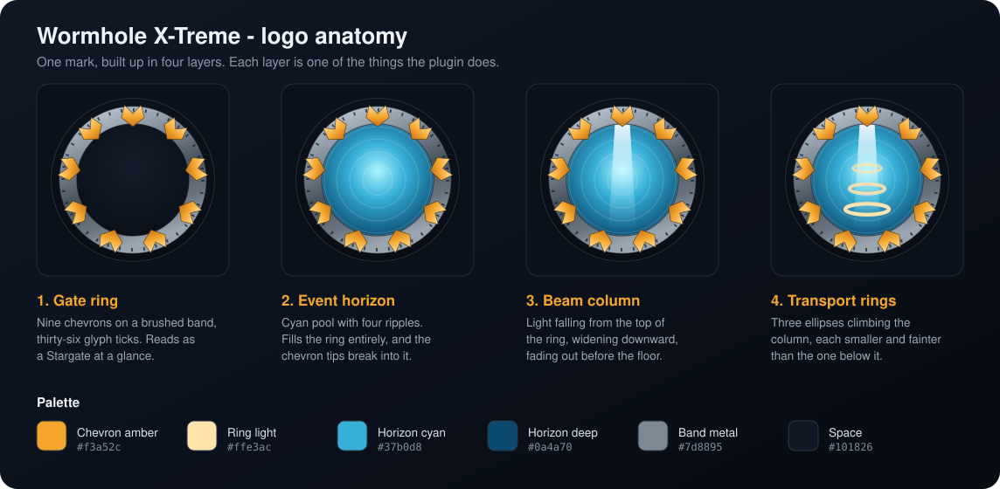

# Logo

The mark at the top of the README is a **reference, not a finished identity**. It was drawn by
hand in SVG so that a real graphic artist has something concrete to react to rather than a
paragraph of description. This file exists so the *meaning* survives a redraw -- an artist
should feel free to throw away every curve in it, as long as what comes back still says the
same three things.

Replacing it is tracked in
[issue #187](https://github.com/khanjal/Wormhole-X-Treme/issues/187), which also records the
current drawing's known weaknesses so nobody has to rediscover them.

## What the mark has to say

The plugin is three subsystems, and the mark carries one visual element for each. That mapping
is the part worth keeping.

| Element | Subsystem | Why it is in there |
|---|---|---|
| Chevron ring | **Gates** | The oldest and largest half of the plugin. A ring with chevrons reads as "stargate" instantly, which is the whole job of the mark. |
| Column of light | **Beams** | `/wormhole beam` sends a player up a column of light. See [BEAMS.md](BEAMS.md). |
| Stack of four rings | **Rings** | Transport rings rise around a traveller and settle as a stack. Four of them, identical, a block apart, in stone grey -- which is what the plugin actually draws. See [RINGS.md](RINGS.md). |

### The fourth one, which does not exist yet

There is no mirror in the mark, because there is no mirror in the plugin. But a **quantum
mirror** is a planned fourth way to travel -- [issue #22](https://github.com/khanjal/Wormhole-X-Treme/issues/22)
-- a clickable banner that sends somebody straight to its pair, with no dial, no command and no
structure to walk into.

That is worth knowing before redrawing anything, because it is the one change that could break
the composition. Three ideas already crowd one small circle. A fourth would have to either
displace one of them, or force the admission that the mark cannot carry a complete inventory of
features and should stop trying -- which is very likely the right answer, and is a decision better
made deliberately than discovered later.

The issue also notes that a mirror has to be *recognisable on sight*, the way a ring and chevrons
read as "stargate". Whatever visual language it ends up with is worth designing alongside the
logo rather than after it.

## The parts, as currently drawn

Geometry is given in the mark's own 512x512 coordinate space, centre `(256, 256)`. These are
the numbers an artist would need to match the existing proportions, or to know what they are
departing from.

**Backdrop disc** -- `r=240`, radial gradient `#141d2b` to `#070b12`, hairline `#2b3746` rim.
The mark carries its own dark ground instead of a transparent background, so one file reads
correctly on GitHub in both light and dark themes. That is a practical decision, not an
aesthetic one, and an artist may solve it differently (two files, or a mark that works
transparent).

**Gate ring band** -- circle `r=190` stroked at width 52, so the band spans `r=164` to `r=216`.
Brushed-metal gradient, light at the top left.

**Glyph ticks** -- 36 dashes on a circle at `r=205`, `stroke-dasharray="5 30.78"`. They stand in
for the glyph track without drawing actual glyphs. Deliberately faint; they are texture, not
content.

**Chevrons** -- nine, at 40 degree intervals starting at top centre. Each spans `r=156` at the
inner tip out to `r=220`, so they sit on the band and break slightly into the horizon. Amber
gradient `#ffdf9c` to `#c9741a`.

**Event horizon** -- `r=164`, filling the ring interior completely. Radial cyan `#a9f4ff` to
`#0a4a70`, off-centre toward the top. Four concentric ripples at 15% white.

**Beam column** -- a quadrilateral from `(234,92)` and `(278,92)` at the top down to `(216,400)`
and `(296,400)`, widening as it falls, fading to nothing before it reaches the bottom of the
horizon. Clipped to the horizon circle.

**Transport rings** -- four ellipses on the centre line at `cy` 232, 276, 320 and 364, all
`rx=58`, `ry=15`. Each is drawn twice: a darker `#6f7982` below and a lighter `#dde3ea` shifted
four units up, which gives the slab its thickness.

The count, the equal size and the colour are all taken from the code rather than chosen.
`RingAnimator.RING_COUNT` is 4 and the doc comment there explains why it is four rather than the
show's five. The rings settle one block apart centre to centre and are all the same seven-block
diameter, so nothing about them tapers. And `RING_DEFAULT_MATERIAL` is `SMOOTH_STONE_SLAB`, so
they are grey stone, not gold.

An earlier draft had three amber rings shrinking as they rose. That was prettier -- amber inside
the cyan pool carried further at small sizes than grey does -- but it was drawing something the
plugin does not do. If an artist wants the contrast back, the honest way to get it is the lights
on the ring pad, which really are a configurable material, not by recolouring the rings.

## Palette

| Swatch | Hex | Used for |
|---|---|---|
| Chevron amber | `#f3a52c` | Chevrons, and the "X-TREME" half of the wordmark |
| Ring stone | `#dde3ea` | Transport rings, lit edge |
| Horizon cyan | `#37b0d8` | Event horizon mid-tone |
| Horizon deep | `#0a4a70` | Event horizon edge |
| Band metal | `#7d8895` | Gate ring mid-tone |
| Space | `#101826` | Backdrop, banner ground |

Amber against cyan is the only strong colour contrast in the mark, and it is doing real work:
it separates the gate hardware from the energy inside it at small sizes. The rings are
deliberately not competing with it -- they are grey because the blocks are grey.

## Constraints

These come from where the mark actually gets used, so they hold regardless of how it is redrawn.

- **It must survive 32px.** The README badge row, a favicon, and a Spigot or Modrinth listing
  icon are all small. The current drawing holds together to about 32px and turns into a blue dot
  with a gold fringe at 16px, which is honestly its weakest point and a good thing for an artist
  to beat.
- **It must work on light and dark.** GitHub renders READMEs in both.
- **Do not reproduce the actual Stargate prop.** The franchise ring, its glyph set and its
  chevron design are somebody else's intellectual property. The mark should read as
  *stargate-like* from generic parts -- a ring, chevrons, a pool -- and must not copy the
  real design or its 39 glyphs. The tick marks in the current drawing are deliberately abstract
  for this reason.
- **The plugin ships no images.** The logo is documentation and listing art only; nothing in
  `src/` loads it, so file size and format are unconstrained by the build.

## Licensing, which needs a decision

Everything in this repository inherits GPL-3.0 unless it says otherwise, so as things stand
these SVGs are GPL-3.0 exactly like the code. That is almost certainly not what is wanted, and
it is worth deciding deliberately rather than inheriting by default.

The reason is specific to this project rather than general principle. **There is more than one
Wormhole X-Treme.** Saying which one this is, is a large part of what the mark is for. Under
GPL-3.0 anybody may redistribute and modify these files, including using them to present a fork
as this project -- which is the one outcome the mark exists to prevent.

Copyright licensing and trademark are separate regimes, and the GPL does not pretend otherwise:
**GPL-3.0 section 7(e)** expressly permits an additional term declining to grant rights under
trademark law. Keeping the code free while keeping the identity controlled is a normal,
well-trodden arrangement -- Rust, Python, Mozilla and the Linux kernel all do some version of it.

None of the following has been done. It is the shape of the decision, not a description of the
current state:

- **A statement covering the artwork only.** A short `docs/images/LICENSE` or a paragraph in the
  README saying that the files in `docs/images/` are not under GPL-3.0 and setting their terms.
  Two common choices: all rights reserved, or a permissive licence for unmodified use in
  reference to this project while reserving modified use.
- **A usage policy**, if it is worth the words: who may use the mark without asking (writing
  about the plugin, linking to it) and who may not (presenting a different build as this one).
- **Copyright assignment in the commission.** If a real logo is commissioned (see
  [issue #187](https://github.com/khanjal/Wormhole-X-Treme/issues/187)), the contract should
  assign copyright to the project rather than leaving it with the artist, or none of the above
  is yours to decide.

This is a note, not legal advice, and nothing here changes the licensing as it currently stands.
If the mark ever matters commercially, the question is worth a real answer from somebody
qualified to give one.

**Related, and unrelated to the logo:** the repository's own licence files were tidied in the
same pass. The full GPL-3.0 text was present all along as `gpl.txt`, a name GitHub's licence
detector does not recognise, while `LICENSE.txt` held only the sixteen-line copyright notice --
so GitHub reported the licence as `NOASSERTION` and the README's badge was hand-written. The
text is now `LICENSE` and the notice is `NOTICE.txt`.

## What is open

Everything below is a decision made to get *something* on the page, not a position worth
defending:

- Chevron count, shape and whether they protrude past the band. Nine is the franchise number;
  it is not load-bearing here.
- Whether the beam and the rings both belong in the mark, or whether one of them should live
  only in a larger banner version. Three ideas in one small circle is a lot.
- The wordmark. It is currently set in a system font stack (`Segoe UI`, falling back to Arial),
  which means it renders differently on different machines. A real typeface, or lettering drawn
  as paths, would fix that.
- Whether a flat single-colour variant is needed for places that cannot take a gradient.

## What would be useful back

- Master vector, in whatever tool the artist works in, plus a plain SVG export.
- Square mark as PNG at 512, 256, 128, 64 and 32.
- Banner or lockup, vector and PNG.
- A one-colour version, for a stamp or an embroidered patch or a monochrome context.
- A favicon-sized drawing that is *designed* at that size rather than scaled down to it.

## Current files

| File | What it is |
|---|---|
| [`images/logo.svg`](images/logo.svg) | The square mark, 512x512. |
| [`images/logo-banner.svg`](images/logo-banner.svg) | Mark plus wordmark and one-line description, 1040x340. Heads the README. |
| [`images/logo-anatomy.svg`](images/logo-anatomy.svg) | The build-up sheet at the top of this file. |

There are no PNG exports. Nothing on the machine these were drawn on could rasterise SVG, and
GitHub renders SVG in Markdown directly, so none were needed yet. A store listing will need
them.
