# Quantum Mirrors — Design

The decisions behind quantum mirrors, and the place they are argued about. The
[README](../README.md) says what they do; this says why. Gates have their own document,
[GATES.md](GATES.md), rings have [RINGS.md](RINGS.md), and beaming has [BEAMS.md](BEAMS.md).

A mirror is a banner you click to be somewhere else. That is the whole mechanism. It has no
structure to build, no pair to keep in step, no address, no network, and no state — which is
why a corridor lined with mirrors is practical in a way a corridor of gates is not.

| | Stargate | Ring | Mirror |
|---|---|---|---|
| What it is | A built structure | A pad in a floor | One banner |
| Activation | Dial, button, redstone | Walk into it | Right-click it |
| Direction | One way per dial | Both ends fire | One way, always |
| Range | Cross-world, config permitting | Same world, always | Cross-world by default |
| Appearance | Permanent structure | Invisible until it fires | A banner, and one you can stamp |

## Looking through it

The question this feature exists to answer: can a mirror show what is on the other side?

Not literally. A banner is a dyed base plus at most six flat patterns, in sixteen colours, and
nothing in Bukkit can render a view onto one. A live window needs a map in an item frame or a
display entity — a different block, a different feature, and a different kind of cost.

What a banner *can* do is carry an impression, and an impression turns out to be enough. When a
mirror is stamped it goes and looks at its own destination, and reduces what it finds to two
things:

- **Where it is.** The biome at the arrival point picks the preset — the base colour and the
  border and shapes that frame everything else. The Nether reads as black and rising flame; an
  ocean as white crests over blue.
- **What is actually there.** The blocks in a box around the arrival point are counted, mapped
  to the nearest dye colour, and the three commonest become coarse squares laid *under* the
  frame. A lava field comes back orange whatever biome it sits in. A field of wheat comes back
  yellow. The squares are the low-resolution part of the picture, and deliberately so: three
  blocks of colour in a frame read as things seen through a doorway.

### Indoors

A destination inside a building is the case that breaks the biome half, and it is a common one —
a mirror into a library, a vault, a mineshaft. The biome there describes the ground the roof
happens to stand on, which is not what anybody standing in the room would say about it.

So the sampler also reports whether the place is *enclosed* — better than half the sampled
blocks solid — and when it is, two things change. The frame comes from `indoors.mirror` rather
than from the biome, and the commonest block in the room becomes the cloth itself rather than a
square on it. A library comes back the brown of its shelves, with the grey of its walls beside
them. A room of copper comes back orange.

**Except where being enclosed is not news.** The Nether is solid rock with a ceiling on it; a
cave is a cave. The sampler reports those as enclosed for every mirror ever pointed at them, so
the rule as first written meant no mirror into the Nether could ever wear the Nether's look —
reported from real play as "the banner doesn't look right", and quite right too. A preset says
`Sheltered=true` to mean "this kind of place is enclosed anyway" and keeps its own look; the
shipped `nether` and `cavern` both do. What is left for the indoor rule is a room somewhere it
is *not* normal to be inside one, which is the library it was written for.

That flag was added to the choice of frame and to nothing else, which fixed a third of the
problem and left it looking fixed. Being enclosed drives three decisions — the frame, whether
the commonest block replaces the cloth colour, and whether that block also gets a square — and
a fourth in the sentence the command prints. A mirror onto the Nether went on losing its red to
whatever netherrack averaged to, and `mirror stamp` kept a *second copy* of the frame rule
without the flag, so stamping by hand dressed a Nether mirror as a room while a dynamic one
corrected itself on the next approach. One banner, two appearances, depending on which code
touched it last.

All four now ask `MirrorPreset.readsAsARoom(view)`, which is the one place that knows the
difference between somewhere enclosed and somewhere that is a room. If you add a preset for a
place that is enclosed by its nature, `Sheltered=true` is the whole of what you have to say.

The threshold is a judgement and nothing more. At 55% a cellar reads as indoors, which is
right, and a forest does not, which is also right.

### Static and dynamic

A **static** mirror is sampled once, when it is stamped, and never again. Two reasons, and the
second is the stronger one:

- Re-reading the far side on every click would mean loading a distant chunk on a click.
- A banner that changed on its own would be worse to build with. A look an operator chose
  should stay chosen.

Rebuild the far side and it still shows the old place until somebody stamps it again. That is
the same bargain `mirror link` already makes: a snapshot, not a subscription.

A **dynamic** mirror re-reads the far side, but only when somebody walks up to it and only
after `mirror-dynamic-resample-seconds` have passed since the last read. That is what makes it
affordable: sampling still loads a distant chunk, so a mirror nobody visits is never sampled at
all, and a player pacing in front of one gets the same answer until the interval is up.

This is independent of `display`, and genuinely so — for a while it was not, which is worth
recording because the mistake is an easy one to make again. The sweep visited only proximity
mirrors and gave up entirely on a server without per-player block updates, so `always` plus
`dynamic` never re-read anything and `dynamic` did nothing at all on 1.20. The two are separate
because their costs are separate: hiding needs a packet per player and therefore a server that
can send one, while re-reading writes to the banner everybody already sees and needs neither.

A dynamic mirror that has never been stamped will take its first look on the first approach.
Otherwise `mode dynamic` would describe something only `stamp` could start.

The re-read look is kept in memory and written to the banner, but not saved to `mirror.yml` on
every approach — a busy corridor would otherwise be a stream of file writes, and a dynamic
mirror re-reads on the next approach anyway. The worst a restart costs is one sample.

## Always and proximity

A corridor of lit banners is a corridor of lit banners. `mirror display <name> proximity` makes
one go dark until somebody comes within `mirror-proximity-radius` blocks of it.

### The banner in the world is never the blank one

This is the part worth being careful about, and the design follows from a single fact: **banner
patterns are vanilla data.** Disable this plugin, or remove it, and a stamped banner is still a
stamped banner. So the world's block keeps the look, always, whatever `display` says — and what
a proximity mirror actually does is send the *blank* to players who are too far away, and take
that illusion back when they come close.

The other way round would have been easier. Keeping the world's block blank and sending the
look to whoever is near would be self-healing: any chunk resend shows blank, which is what a
distant player should see anyway. It was rejected because it makes this plugin the only thing
standing between an operator and a corridor of plain white cloth.

Two consequences fall out of that choice, and the sweep carries both:

- Being far away is not a state that arranges itself. Everyone in the world is sent the blank
  once, after which only crossings are sent — a corridor with somebody standing still in it
  sends nothing at all.
- The illusion has to be handed back when the plugin stops. It is, on disable: otherwise
  whoever was standing far off keeps a blanked banner on their client until something makes the
  server resend that chunk, which looks exactly like the plugin having eaten their banners.

### The version boundary

`Player.sendBlockUpdate(Location, TileState)` is the whole mechanism, and it **does not exist
on plain 1.20** — present from 1.20.1 on, checked against the jars for all seven versions the
matrix builds. On that one version a proximity mirror simply stays visible, which is a cosmetic
loss on the oldest supported server rather than a mirror that never shows anything. Setting it
there is not wasted: the banner keeps its look either way, and the setting starts working when
the server is upgraded.

It is reached reflectively for the same reason `PatternType` is. Calling it directly would
compile against the 1.20.4 target and throw `NoSuchMethodError` on 1.20 — at the moment a
player walks down a corridor, which is not when that should be discovered.

### What the sweep is careful about

It runs on a timer for the life of the server, so the order of its checks is the design. Before
anything touches a block it has ruled out mirrors it has no reason to visit, worlds that are not
loaded, and chunks that are not loaded — the chunk check comes before `getBlockAt`, which would
load one.

There are two reasons to visit a mirror and both are narrow: hiding it, and keeping a dynamic
one current. So a server whose mirrors are all ordinary does no work here beyond walking the
list.

That was briefly untrue. When a mirror first learned to name itself it did so on approach, which
meant this sweep had to visit every ordinary mirror to work out who was near it — a distance
check per player per mirror. Moving the announcement to the player's own line of sight took the
third reason away again, and with it the cost.

## Saying what it is

A stamped banner looks like scenery, and a corridor of them looks like decoration. Nothing about
one said it was a door until somebody happened to right-click it, which is a thing players do to
signs and not to wall hangings.

So a mirror that goes somewhere names itself to whoever is looking at it, from about six blocks:

```
:: museum -- click to travel to nether.
```

Three decisions in that one line, none of them arbitrary.

**Above the hotbar, not in chat.** The same call the transport rings use. It replaces itself and
then goes, where chat would leave a line behind for every banner walked past — a corridor would
cost a player their whole chat window to walk down.

**Looking at, not standing near.** This began the other way: sent once, on crossing into the
proximity radius, which is how the rings announce themselves. For a ring that is right, because
walking in starts something. A mirror is not started by arriving at it — it is looked at,
considered, and then clicked — and an action bar line fades after about three seconds, so the
message had come and gone by the moment it was wanted. You were told there was a door while
walking towards it, and told nothing while stood in front of it deciding.

Re-sending to everyone in range is worse than it sounds: a corridor puts a player within eight
blocks of several mirrors at once, and they would take turns in the one action bar slot,
flickering once a sweep. Looking at one picks exactly one, because a player has a single target
block and there is nothing to arbitrate. The line is re-sent every sweep for as long as they
keep looking, which is what a steady line means when the bar fades on its own.

It also made the plugin cheaper. Asking every mirror who is near it is a distance check per
player per mirror; asking each player what they are looking at is one question regardless of how
many mirrors there are, and no question at all in a world that has none.

**Only a mirror with a destination.** An unpointed one is a banner somebody is halfway through
setting up, and announcing it would be the plugin telling whoever glanced at it about somebody
else's unfinished work. Clicking it already says what to do, to the one person who asked.

It carries the plugin's `::` header itself, unlike everything else a mirror says, because the
action-bar path does not go through the call that prefixes it. Without that, a line appearing
above the hotbar on a server running several plugins is a line the player cannot act on — they
have no idea what put it there.

## The preset files

Presets live in `shapes/mirror/*.mirror`, beside `shapes/gate/*.shape`, and are read the same
way: the shipped ones are written out on first run so there is something to copy, a missing one
comes back on the next startup, and an edited one is never overwritten. Anything an operator
adds beside them is loaded without touching the jar.

The format is four keys, and everything it does not understand is ignored:

```
# A mirror onto the Nether.
Name=nether
Base=RED
Biome=NETHER_WASTES,CRIMSON_FOREST,WARPED_FOREST,SOUL_SAND_VALLEY,BASALT_DELTAS
Layer=BLACK TRIANGLES_BOTTOM
Layer=ORANGE GRADIENT_UP
Layer=BLACK BORDER
```

| Key | What it is |
| --- | --- |
| `Name` | What `mirror stamp` calls it. Defaults to the file name. |
| `Base` | The banner's own colour, one of the sixteen `DyeColor` names. Required. |
| `Biome` | Biomes this preset answers for, comma-separated. May repeat. Optional. |
| `Layer` | `COLOUR PATTERN`, laid on in order. May repeat. Optional. |
| `Sheltered` | `true` if this kind of place is enclosed anyway, so the indoor look must not replace it. Optional, default false. |

**Leniency is the design, not an oversight.** A line it cannot read is skipped, a preset with
no layers still dyes the banner, and a file with no `Base` is skipped with a warning rather
than failing the folder. These files get hand-edited on live servers, and one operator's typo
costing them every preset is a failure this project has already had once, in the shape files.

Three layers is the working budget. A banner shows six patterns before clients start dropping
the extras, and three of those six are reserved for the sampled squares. A preset with more is
cut from the end rather than refused.

### The library at a glance

Eighty-eight looks is more than anybody wants to open one file at a time. The name beside each
one is what `mirror stamp <name> <look>` takes; the column beside that is the biome it answers
for, or what the look is for when it answers for none.

<!-- gallery:start -->

#### Grass and open country

| | Look | Answers for | Layers, in order |
|---|---|---|---|
|  | `plains` | `PLAINS` | `GREEN` base + `LIGHT_BLUE half_horizontal` + `YELLOW circle` + `GREEN border` |
|  | `sunflower_plains` | `SUNFLOWER_PLAINS` | `GREEN` base + `LIGHT_BLUE half_horizontal` + `YELLOW flower` + `GREEN border` |
| 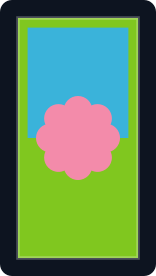 | `meadow` | `MEADOW` | `LIME` base + `LIGHT_BLUE half_horizontal` + `PINK flower` + `LIME border` |
| 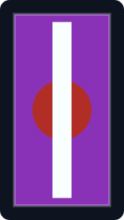 | `mushroom_fields` | `MUSHROOM_FIELDS` | `PURPLE` base + `RED circle` + `WHITE stripe_center` + `PURPLE border` |
| 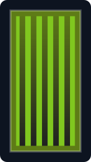 | `swamp` | `SWAMP` | `GREEN` base + `BLACK gradient_up` + `LIME small_stripes` + `GREEN border` |
| 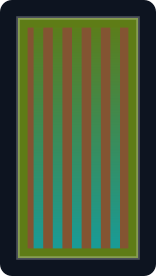 | `mangrove_swamp` | `MANGROVE_SWAMP` | `GREEN` base + `CYAN gradient_up` + `BROWN small_stripes` + `GREEN border` |
|  | `river` | `RIVER` | `GREEN` base + `BLUE stripe_center` + `BLUE border` |
| 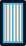 | `frozen_river` | `FROZEN_RIVER` | `LIGHT_GRAY` base + `LIGHT_BLUE stripe_center` + `WHITE small_stripes` + `LIGHT_BLUE border` |
|  | `beach` | `BEACH` | `YELLOW` base + `BLUE half_horizontal_bottom` + `WHITE triangles_bottom` + `YELLOW border` |
|  | `snowy_beach` | `SNOWY_BEACH` | `WHITE` base + `BLUE half_horizontal_bottom` + `LIGHT_BLUE triangles_bottom` + `WHITE border` |
| 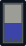 | `stony_shore` | `STONY_SHORE` | `LIGHT_GRAY` base + `BLUE half_horizontal_bottom` + `GRAY triangles_bottom` + `GRAY border` |

#### Woodland

| | Look | Answers for | Layers, in order |
|---|---|---|---|
| 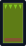 | `forest` | `FOREST` | `GREEN` base + `LIME triangles_top` + `BROWN stripe_bottom` + `GREEN border` |
|  | `birch_forest` | `BIRCH_FOREST` | `GREEN` base + `WHITE small_stripes` + `LIME triangles_top` + `GREEN border` |
| 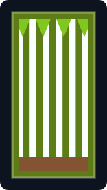 | `old_growth_birch_forest` | `OLD_GROWTH_BIRCH_FOREST` | `GREEN` base + `WHITE small_stripes` + `LIME triangles_top` + `BROWN stripe_bottom` + `GREEN border` |
| 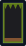 | `dark_forest` | `DARK_FOREST` | `BLACK` base + `GREEN triangles_top` + `BROWN stripe_bottom` + `GREEN border` |
| 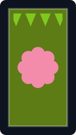 | `flower_forest` | `FLOWER_FOREST` | `GREEN` base + `PINK flower` + `LIME triangles_top` + `GREEN border` |
| 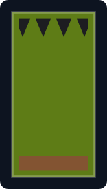 | `taiga` | `TAIGA` | `GREEN` base + `BLACK triangles_top` + `BROWN stripe_bottom` + `GREEN border` |
| 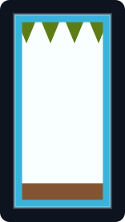 | `snowy_taiga` | `SNOWY_TAIGA` | `WHITE` base + `GREEN triangles_top` + `BROWN stripe_bottom` + `LIGHT_BLUE border` |
| 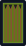 | `old_growth_pine_taiga` | `OLD_GROWTH_PINE_TAIGA` | `GREEN` base + `BROWN small_stripes` + `BLACK triangles_top` + `GREEN border` |
|  | `old_growth_spruce_taiga` | `OLD_GROWTH_SPRUCE_TAIGA` | `GREEN` base + `BLACK triangle_top` + `BROWN stripe_bottom` + `GREEN border` |
| 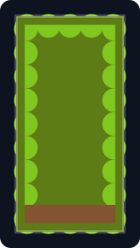 | `jungle` | `JUNGLE` | `GREEN` base + `LIME curly_border` + `BROWN stripe_bottom` + `GREEN border` |
| 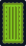 | `bamboo_jungle` | `BAMBOO_JUNGLE` | `GREEN` base + `LIME small_stripes` + `LIME curly_border` + `GREEN border` |
|  | `sparse_jungle` | `SPARSE_JUNGLE` | `LIME` base + `GREEN triangle_top` + `BROWN stripe_bottom` + `GREEN border` |
|  | `cherry_grove` | `CHERRY_GROVE` | `PINK` base + `MAGENTA curly_border` + `BROWN stripe_center` + `PINK border` |
|  | `pale_garden` | `PALE_GARDEN` | `LIGHT_GRAY` base + `GRAY gradient` + `WHITE stripe_center` + `GRAY border` |
|  | `windswept_forest` | `WINDSWEPT_FOREST` | `LIGHT_GRAY` base + `GREEN triangles_top` + `GRAY diagonal_up_right` + `GRAY border` |

#### Dry country

| | Look | Answers for | Layers, in order |
|---|---|---|---|
|  | `desert` | `DESERT` | `YELLOW` base + `ORANGE gradient` + `BROWN stripe_bottom` + `ORANGE border` |
| 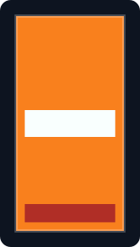 | `badlands` | `BADLANDS` | `ORANGE` base + `WHITE stripe_middle` + `RED stripe_bottom` + `ORANGE border` |
| 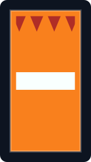 | `eroded_badlands` | `ERODED_BADLANDS` | `ORANGE` base + `RED triangles_top` + `WHITE stripe_middle` + `ORANGE border` |
| 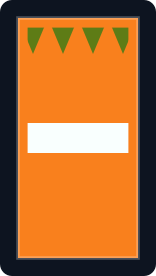 | `wooded_badlands` | `WOODED_BADLANDS` | `ORANGE` base + `GREEN triangles_top` + `WHITE stripe_middle` + `ORANGE border` |
| 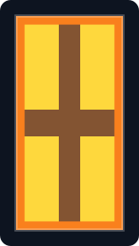 | `savanna` | `SAVANNA` | `YELLOW` base + `BROWN stripe_middle` + `BROWN stripe_center` + `ORANGE border` |
|  | `savanna_plateau` | `SAVANNA_PLATEAU` | `YELLOW` base + `BROWN stripe_middle` + `BROWN stripe_center` + `BROWN stripe_bottom` + `ORANGE border` |
|  | `windswept_savanna` | `WINDSWEPT_SAVANNA` | `YELLOW` base + `BROWN diagonal_up_right` + `BROWN stripe_center` + `ORANGE border` |

#### Cold and high

| | Look | Answers for | Layers, in order |
|---|---|---|---|
| 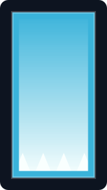 | `snowy_plains` | `SNOWY_PLAINS` | `WHITE` base + `LIGHT_BLUE gradient` + `WHITE triangles_bottom` + `LIGHT_BLUE border` |
|  | `ice_spikes` | `ICE_SPIKES` | `WHITE` base + `LIGHT_BLUE rhombus` + `LIGHT_BLUE triangles_bottom` + `LIGHT_BLUE border` |
|  | `snowy_slopes` | `SNOWY_SLOPES` | `WHITE` base + `LIGHT_GRAY diagonal_up_right` + `LIGHT_BLUE gradient` + `LIGHT_BLUE border` |
|  | `frozen_peaks` | `FROZEN_PEAKS` | `LIGHT_BLUE` base + `WHITE triangle_top` + `WHITE triangles_bottom` + `LIGHT_BLUE border` |
| 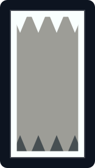 | `jagged_peaks` | `JAGGED_PEAKS` | `LIGHT_GRAY` base + `WHITE triangles_top` + `GRAY triangles_bottom` + `WHITE border` |
|  | `stony_peaks` | `STONY_PEAKS` | `GRAY` base + `LIGHT_GRAY triangle_top` + `GRAY triangles_bottom` + `LIGHT_GRAY border` |
| 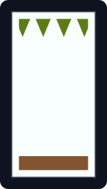 | `grove` | `GROVE` | `WHITE` base + `GREEN triangles_top` + `BROWN stripe_bottom` + `WHITE border` |
|  | `windswept_hills` | `WINDSWEPT_HILLS` | `LIGHT_GRAY` base + `GRAY triangle_top` + `GREEN stripe_bottom` + `GRAY border` |
| 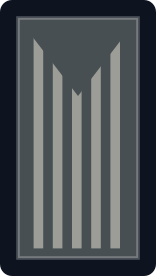 | `windswept_gravelly_hills` | `WINDSWEPT_GRAVELLY_HILLS` | `LIGHT_GRAY` base + `GRAY small_stripes` + `GRAY triangle_top` + `GRAY border` |

#### Water

| | Look | Answers for | Layers, in order |
|---|---|---|---|
|  | `ocean` | `OCEAN` | `BLUE` base + `CYAN gradient_up` + `WHITE triangles_top` + `BLUE border` |
|  | `deep_ocean` | `DEEP_OCEAN` | `BLUE` base + `BLACK gradient_up` + `WHITE triangles_top` + `BLUE border` |
| 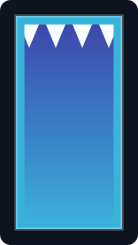 | `cold_ocean` | `COLD_OCEAN` | `BLUE` base + `LIGHT_BLUE gradient_up` + `WHITE triangles_top` + `LIGHT_BLUE border` |
| 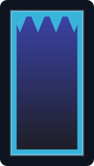 | `deep_cold_ocean` | `DEEP_COLD_OCEAN` | `BLUE` base + `BLACK gradient_up` + `LIGHT_BLUE triangles_top` + `LIGHT_BLUE border` |
|  | `lukewarm_ocean` | `LUKEWARM_OCEAN` | `CYAN` base + `BLUE gradient_up` + `WHITE triangles_top` + `CYAN border` |
|  | `deep_lukewarm_ocean` | `DEEP_LUKEWARM_OCEAN` | `CYAN` base + `BLACK gradient_up` + `WHITE triangles_top` + `CYAN border` |
|  | `warm_ocean` | `WARM_OCEAN` | `CYAN` base + `PINK circle` + `WHITE triangles_top` + `CYAN border` |
| 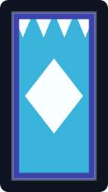 | `frozen_ocean` | `FROZEN_OCEAN` | `LIGHT_BLUE` base + `WHITE rhombus` + `WHITE triangles_top` + `BLUE border` |
| 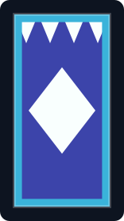 | `deep_frozen_ocean` | `DEEP_FROZEN_OCEAN` | `BLUE` base + `WHITE rhombus` + `WHITE triangles_top` + `LIGHT_BLUE border` |

#### Underground

| | Look | Answers for | Layers, in order |
|---|---|---|---|
| 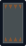 | `dripstone_caves` | `DRIPSTONE_CAVES` | `GRAY` base + `BROWN triangles_top` + `BROWN triangles_bottom` + `GRAY border` |
| 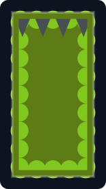 | `lush_caves` | `LUSH_CAVES` | `GREEN` base + `LIME curly_border` + `GRAY triangles_top` + `GREEN border` |
| 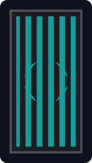 | `deep_dark` | `DEEP_DARK` | `BLACK` base + `CYAN circle` + `BLACK rhombus` + `CYAN small_stripes` + `BLACK border` |

#### The Nether

| | Look | Answers for | Layers, in order |
|---|---|---|---|
| 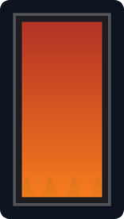 | `nether` | `NETHER_WASTES` | `RED` base + `BLACK triangles_bottom` + `ORANGE gradient_up` + `BLACK border` |
| 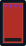 | `crimson_forest` | `CRIMSON_FOREST` | `RED` base + `PURPLE triangles_top` + `BLACK stripe_bottom` + `RED border` |
|  | `warped_forest` | `WARPED_FOREST` | `CYAN` base + `BLUE triangles_top` + `BLACK stripe_bottom` + `CYAN border` |
| 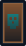 | `soul_sand_valley` | `SOUL_SAND_VALLEY` | `BROWN` base + `CYAN skull` + `BLACK gradient_up` + `BROWN border` |
| 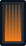 | `basalt_deltas` | `BASALT_DELTAS` | `GRAY` base + `BLACK small_stripes` + `ORANGE gradient_up` + `BLACK border` |

#### The End, and nowhere at all

| | Look | Answers for | Layers, in order |
|---|---|---|---|
|  | `end` | `THE_END` | `BLACK` base + `PURPLE curly_border` + `YELLOW globe` + `PURPLE border` |
| 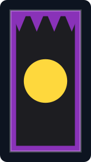 | `end_highlands` | `END_HIGHLANDS` | `BLACK` base + `PURPLE triangles_top` + `YELLOW circle` + `PURPLE border` |
| 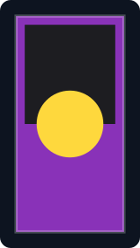 | `end_midlands` | `END_MIDLANDS` | `BLACK` base + `PURPLE half_horizontal_bottom` + `YELLOW circle` + `PURPLE border` |
| 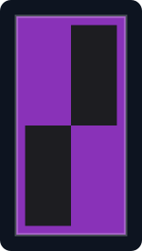 | `small_end_islands` | `SMALL_END_ISLANDS` | `BLACK` base + `PURPLE square_top_left` + `PURPLE square_bottom_right` + `PURPLE border` |
| 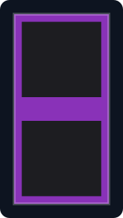 | `end_barrens` | `END_BARRENS` | `BLACK` base + `PURPLE stripe_middle` + `PURPLE border` |
| 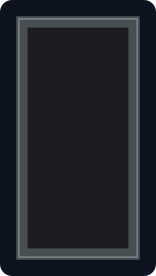 | `the_void` | `THE_VOID` | `BLACK` base + `GRAY border` |

#### Looks the plugin asks for by name

| | Look | For | Layers, in order |
|---|---|---|---|
| 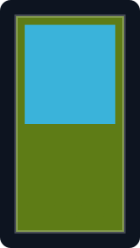 | `overworld` | fallback, for a biome nothing names | `GREEN` base + `LIGHT_BLUE half_horizontal` + `GREEN triangles_bottom` + `GREEN border` |
| 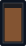 | `indoors` | a far side that turned out to be a room | `BROWN` base + `BLACK stripe_top` + `BLACK border` |
| 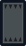 | `cavern` | generic underground | `GRAY` base + `BLACK triangles_top` + `BLACK triangles_bottom` + `GRAY border` |

#### Looks you stamp yourself

| | Look | For | Layers, in order |
|---|---|---|---|
|  | `plain` | a colour and a border, and nothing said | `WHITE` base + `LIGHT_GRAY border` |
| 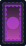 | `portal` | a lit ring on a dark field | `BLACK` base + `PURPLE circle` + `MAGENTA gradient_up` + `PURPLE curly_border` + `BLACK border` |
|  | `hub` | the middle of a network | `BLACK` base + `WHITE straight_cross` + `WHITE border` |
| 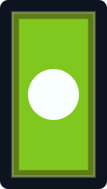 | `spawn` | where people arrive on the server | `LIME` base + `WHITE circle` + `GREEN border` |
| 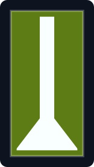 | `exit` | the way out | `GREEN` base + `WHITE stripe_center` + `WHITE triangle_bottom` + `GREEN border` |
|  | `arrival` | the other end of exit | `BLUE` base + `WHITE stripe_center` + `WHITE triangle_top` + `BLUE border` |
|  | `compass` | a direction rather than a destination | `WHITE` base + `RED triangle_top` + `BLACK triangle_bottom` + `BLACK border` |
|  | `port` | the mirror at the dock | `BLUE` base + `BROWN stripe_center` + `WHITE stripe_middle` + `BLUE border` |
| 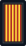 | `market` | a striped awning; reads as a shop from a distance | `YELLOW` base + `RED small_stripes` + `BLACK border` |
| 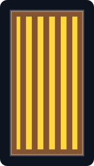 | `library` | spines on a shelf | `BROWN` base + `YELLOW small_stripes` + `BROWN border` |
| 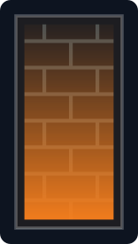 | `forge` | stonework with a fire under it | `BLACK` base + `GRAY bricks` + `ORANGE gradient_up` + `BLACK border` |
| 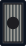 | `vault` | a door with a wheel in the middle | `GRAY` base + `LIGHT_GRAY small_stripes` + `BLACK circle` + `BLACK border` |
| 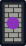 | `shrine` | worked stone with something lit in it | `LIGHT_GRAY` base + `BLACK bricks` + `PURPLE circle` + `BLACK border` |
|  | `staff` | runs the place, rather than used by everybody | `PURPLE` base + `YELLOW rhombus` + `YELLOW border` |
|  | `private` | not for general use | `GRAY` base + `RED stripe_downright` + `GRAY border` |
|  | `locked` | shut, by something other than this plugin | `BLACK` base + `LIGHT_GRAY rhombus` + `RED circle` + `BLACK border` |
|  | `warning` | leads somewhere worth thinking about first | `YELLOW` base + `BLACK cross` + `BLACK border` |
|  | `danger` | the charge everybody already reads correctly | `BLACK` base + `RED creeper` + `RED border` |
|  | `tomb` | a memorial, an old world, somewhere somebody died | `GRAY` base + `BLACK skull` + `BLACK border` |
|  | `arcane` |  | `PURPLE` base + `BLACK rhombus` + `MAGENTA flower` + `MAGENTA border` |

<!-- gallery:end -->

These are drawn by `scripts/render_mirror_sheets.py` from the preset files themselves, and so is
the table around them — re-run it after changing a preset. `MirrorGalleryTest` fails until
you do: every image carries a fingerprint of the preset it was drawn from, and the test
recomputes them.

**When comparing one of these against a banner in game, compare the layer list, not the
drawing.** The shapes here are approximations of the banner patterns rather than the game's own
textures -- the curly border is drawn as scallops, the charges are rough -- so a picture that
does not quite match is as likely to be this page's drawing as the plugin's stamp. The recipe
beside it is exact: it is the base colour and the layers, in the order they are applied, read
out of the same file the plugin reads. A banner that disagrees with *that* is a real
disagreement worth reporting.

### What ships

Eighty-eight files, in two groups, and the difference between them is the `Biome` line.

**Sixty-five places, one per biome.** Every biome in the game has a look of its own, down to the
nine oceans and the ten woods that used to share one between them. That is the point of the
change: a mirror onto a jagged peak and a mirror onto a frozen peak are different places, and a
banner that said "mountain" for both told you which family you were looking at rather than where
you were going.

The grammar is the same throughout, so sixty-five looks read as one library rather than as
sixty-five ideas. A base colour for the ground, one or two layers of what the place is made of,
and a border in the family's colour — green for growing things, blue for water, grey for stone,
black for the Nether and the End. What separates two biomes in the same family is usually one
layer: `taiga` and `snowy_taiga` are the same spruce over a different field.

`MirrorBiomeCoverageTest` holds the rule in both directions: no biome without a look, and no
biome claimed by two. The second matters more than it sounds, because `forBiome` returns the
first preset that answers and the order is load order — a biome named twice does not conflict,
it silently picks whichever file loaded first.

Some name biomes a given server has never heard of. `pale_garden` exists only from 1.21.4 on,
and a 1.20 server simply never matches it — the file loads, it just never wins.

**Twenty-three looks.** `plain`, `hub`, `warning`, `private`, `arcane`, `portal`, `spawn`,
`exit`, `arrival`, `locked`, `staff`, `market`, `shrine`, `danger`, `tomb`, `vault`, `forge`,
`library`, `port` and `compass` name no biome at all, so nothing picks them automatically and
`mirror stamp <name> <look>` is the only way to get one. They are for what an operator wants
said about a mirror when it is not where it goes: the middle of a network, the way out, one that
is not for general use, one that leads somewhere worth thinking about first.

`overworld`, `indoors` and `cavern` are the three the plugin asks for by name rather than the
operator — the fallback for a biome nothing names, the answer for a far side that turned out to
be a room, and a generic underground.

None of them carry any behaviour. `private` is a bar painted across a banner and not a
permission; whether anybody may use that mirror is a question for the permission nodes, and a
mirror wearing `warning` is exactly as dangerous as it was before it was stamped. `locked` says
a thing is shut; something else has to do the shutting.

### Which patterns are safe

**41 of the 43 pattern names** are available to a shipped preset, and the two that are not are
`FLOW` and `GUSTER` — artwork that arrived with the trial chambers and that 1.20 does not have
under any spelling.

It used to be 34. The other seven were not missing from any version: Mojang *renamed* them at
1.21, so `CIRCLE_MIDDLE` became `CIRCLE`, `STRIPE_SMALL` became `SMALL_STRIPES`, and the four
`_MIRROR` ones took new names. Every supported server has all seven — they just disagree about
what to call them, and a preset file can only spell a thing one way.

`PatternAliases` maps the fourteen spellings to each other, and the stamp asks for the other one
when the first misses. A preset may use whichever name its author knows, and keeps working when
the server is upgraded underneath it. The pairs were taken from vanilla's own identifiers rather
than from how alike the names look, which matters for exactly one of them: 1.20's
`DIAGONAL_LEFT_MIRROR` carries the id `lud`, which 1.21 spells `DIAGONAL_UP_LEFT` — while
`DIAGONAL_LEFT` (`ld`) is a different pattern sitting one letter away, waiting to be paired by
mistake.

What made this worth fixing rather than living with: `CIRCLE` and `RHOMBUS` are the only round
and diamond shapes in the game, and without them every look in the library was bands and
triangles. The `portal` look — a lit ring on a dark field — is the first one here that reads as
a thing seen through rather than as scenery, and it could not have been drawn before.

A layer naming something this server does not have is still skipped with a log line rather than
failing the banner, the same way an unrecognised sound name is skipped rather than silencing the
plugin. That leniency is right for an operator's own file and wrong for one of ours, because the
failure is so quiet — so the shipped files are held to the 41 by a test rather than by care.
That is also the reason a design lifted straight out of a banner gallery is still not safe to
ship: those galleries publish in Mojang's pattern ids on whatever version the site runs.

## Two version traps, both real

Worth writing down, because both compile cleanly and fail only on a server nobody tested on.

**`PatternType` changes kind at 1.21.** It is an enum through 1.20.6 and an interface from 1.21
on. `PatternType.valueOf(name)` compiled against this plugin's 1.20.4 target emits a
class-method reference that the JVM refuses against an interface, so it throws
`IncompatibleClassChangeError` on every server from 1.21 up. `Registry.BANNER_PATTERN` has the
opposite problem: it does not exist on 1.20. Reflection is the one route that works across the
whole range, and it is paid once per pattern name rather than once per stamp.

**`Biome` changes kind at 1.21.4**, the same way. Reading a biome's name through `name()`,
`getKey()` or even `toString()` is an `invokevirtual` that breaks for the same reason. The route
that survives is `Keyed`, which has been an interface the whole time — its key is the lower-case
of the old enum name, which is exactly what the preset files are written in.

A third, in the same family: **`Material.isAir()` stopped being a switch at 1.20.6** and now
goes through the live block registry. Harmless here, but it is the same mechanism that once made
`Material.isBlock()` throw when this plugin called it too early in startup, so the sampler
compares names instead — a few hundred times per stamp, and no registry needed to answer.

## Which banner you are looking at

`set` and `link` both have to turn "the banner in front of me" into a block, and one ray cast is
not enough to do it.

`getTargetBlockExact` traces against block shapes. A freestanding banner is a thin post, so from
close up the ray can pass it by. Against a wall that goes unnoticed — the wall behind is hit, the
command says "that is a stone", and the player aims again. On a post in the open there is nothing
behind it, the ray hits nothing, and the refusal reads "look at a banner within six blocks" to
somebody doing exactly that.

So the aimed-at block is tried first, and `getLineOfSight` is the fallback: it steps through the
blocks a ray crosses rather than their shapes, which is what makes a thin one findable. Order
matters — in a corridor of banners the one being pointed at wins over the nearest one crossed.

Even that is not enough on its own. A standing banner occupies one block and is drawn about two
blocks tall: the cloth hangs in the block *above*, where there is nothing to hit, so aiming at
the obvious part of it sends the ray straight through and out the other side. Aiming at the base
works and nothing else does. No amount of searching the blocks the ray crossed helps, because
the banner is not one of them — so the block under each is asked as a last pass.

Travelling has the same problem and cannot be fixed the same way. `set` runs once and can afford
a ray cast; the interact handler runs on every right-click of every block on the server, and the
block it is handed for a click at the cloth is whatever was behind the banner — which has no
cheap relationship to the banner itself. Recovering the aim there would mean a ray cast per
click, which is the cost `InteractLoggingCostTest` exists to prevent.

So a banner on a post is clicked at its base, and `set` and `link` say so at the moment one
becomes a mirror — the only moment available, since a click at the cloth reaches the plugin as
no event at all. Making the cloth genuinely clickable would mean giving it a hitbox: an
`interaction` entity above each standing mirror, which is a feature with an entity lifecycle
attached and belongs in its own issue.

That last pass is for standing banners only. A wall banner is drawn inside its own block, and a
"look one block down" rule applied to both families would let somebody name a wall banner by
aiming at the wall above it, binding a mirror they never pointed at.

## Arriving in the banner, and the bounce that cost

Arrival is the destination banner's own block, for the reason `MirrorArrival` gives: a banner is
passable, and it is the one spot in the room a builder deliberately left clear. The cost of that
choice only showed up on a linked pair.

A player lands inside or directly under the far banner, with it filling their view. A right-click
still being delivered when they get there — a held button, or the client resolving the
interaction again at the new position — lands on that banner and fires it. With both ends bound
to each other, that is a round trip in under a second, and what the player sees is a mirror that
returned them to where they started.

So `MirrorSettle` shuts mirrors for two seconds for the player one has just carried. Every
mirror, not only the banner they arrived at: the same click can be re-resolved against whatever
is now in front of them, which on a corridor of banners need not be the one they came out of. It
is armed on an accepted teleport only — a refused trip must not also cost a wait — and the
explanation is said once per arrival rather than once per repeat.

Moving the arrival back out in front of the banner would also have stopped it, and would have
brought back every reason it stopped being the block in front: one block of clearance the
builder did not choose is one block that can be a wall, a drop, a fence, or the far side of a
doorway.

## When another plugin refuses the trip

A cancelled `PlayerTeleportEvent` leaves the player exactly where they were, and on a mirror
that is the banner they just clicked. Silently, it reads as a mirror that opens onto itself —
which is how it was first reported, on a pair whose two ends `mirror list` showed bound
correctly to each other.

So the boolean `Player.teleport` returns is checked, and a refusal names the world and the two
kinds of plugin that usually do this: world access (Multiverse intercepts other plugins'
teleports by default and applies `enforce-access` — spelled `enforceaccess` before Multiverse 5
— wanting `multiverse.access.<world>`) and land
claims. Nothing here tries to overrule the cancel. The mechanic is a banner somebody clicks, not
a permission system, and a plugin whose whole job is deciding who may enter a world should win
that argument — the bug was never that it won, only that nobody said so.

## What was considered and not done

**A real window** — a map in an item frame, rendered from the far side. This is the only thing
that would genuinely be a window, and it is a different feature: a different block, a render
budget per viewer, and a question about how often it refreshes. Worth its own issue, not worth
bolting onto a banner.

**Sampling the exact blocks in front of the banner.** Tried on paper and dropped. A mirror's
destination is a point, not a facing, so "in front of" has no meaning there — and a 13×7×13 box
around the arrival point is what a player standing there would actually see anyway.

**Colour-averaging into a gradient.** Two colours blended are muddier than two colours side by
side, and the whole point is to be readable at a glance down a corridor.
