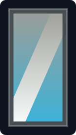

# Quantum Mirrors — Design

Why quantum mirrors are built the way they are. The [mirror guide](guide/MIRRORS.md) says what
they do. Gates have [GATES.md](GATES.md), rings have [RINGS.md](RINGS.md), beaming has
[BEAMS.md](BEAMS.md).

**In short.** A mirror is a banner on a wall, and every mirror is on one network. It shows its
own room until somebody right-clicks it; a right-click moves it on to the next mirror, and a
punch goes there. There is no structure to build, no pair to keep in step and no address to
dial — which is why a door in every world is practical in a way a gate in every world is not.

| | Stargate | Ring | Mirror |
|---|---|---|---|
| What it is | A built structure | A pad in a floor | One wall banner |
| Activation | Dial, button, redstone | Walk into it | Right-click to choose, punch to go |
| Direction | One way per dial | Both ends fire | Any mirror to any other |
| Range | Cross-world, config permitting | Same world, always | Cross-world, one mirror per world by default |
| Appearance | Permanent structure | Invisible until it fires | Its room, reflected, or the room of the mirror chosen |

## Contents

- [The network](#the-network)
- [The banner's look](#the-banners-look) · [A snapshot, not a subscription](#a-snapshot-not-a-subscription)
- [Always and proximity](#always-and-proximity)
- [Saying what it is](#saying-what-it-is)
- [The preset files](#the-preset-files) · [The library at a glance](#the-library-at-a-glance) · [What ships](#what-ships)
- [Version traps](#version-traps)
- [Which banner you are looking at](#which-banner-you-are-looking-at)
- [Arriving, and the bounce that cost](#arriving-and-the-bounce-that-cost)
- [When another plugin refuses the trip](#when-another-plugin-refuses-the-trip)
- [The far edge of the room](#the-far-edge-of-the-room) · [Built: the fat eye](#built-the-fat-eye) · [Built: streaming](#built-streaming) · [What is left to try](#what-is-left-to-try)
- [What was considered and not done](#what-was-considered-and-not-done)
## The network

**Nothing is pointed by hand.** Mirrors began as one-way points: `mirror link` joined two banners
by writing each one's arrival into the other, and named the second `<other>-return`. A linked pair
was two points that happened to face each other, so moving a banner stranded the far end, a mirror
showing another's room showed it through the name somebody had typed, and "the mirror name plus
-return just is weird". A mirror stores one point now — its own room — and which mirror it opens
onto is a choice made at it, in memory.

**Its own room** is the block in front of the banner, level with the bottom of the opening, facing
out: where anybody coming through it lands, and where its capture is taken from. One capture serves
both jobs. A mirror nobody has turned on shows it flipped across the wall — a step to the right
behind the wall shows a step to the right in front of it, and blocks are flipped with
`BlockData.mirror` rather than turned, so a staircase keeps its side — and every other mirror that
chooses it shows the same capture turned to face the viewer, the way a window would.

**A right-click walks a fixed list:** the mirror's start, if it has one, then every other mirror by
name, then round to the start again — never its own room, which is what it shows when nobody has
turned it on and what walking away turns it back to. The start exists for a mirror in an archived world, whose
first right-click should open onto the main world. A player alone at a mirror can click through the
list as fast as they like; with somebody else at it, a choice holds three seconds before it can
change, so nobody is swapped out from under a trip they were about to take. Only the main hand's
half of a click counts, or one press would skip a mirror, and the view is redrawn at once rather
than on the next sweep. When nobody is near a mirror any more it is off again, showing its own room.

**A punch goes through**, which is why a mirror cannot be broken: the banner and the wall round its
opening ignore a punch and survive an explosion, and `mirror remove` is how one comes down.

**A wall, a block out in every direction.** A mirror draws its room behind the wall it hangs on,
and only the wall hides that room from anywhere but the opening. A banner on a post showed the room
past its edges however the view was trimmed, so a mirror is a wall banner with solid wall a block
out on every side of its opening, and `create` refuses anything else by the block to fill. Two was
the rule while a drawn block at the edge held until half of it was past the opening; with the hold
at 15% one block hides what a trimmed view draws, so two is advice — `create` names the block short
of it — rather than a refusal. What a wall's width buys is tolerance for movement between redraws,
not depth: a stale drawn block's landing on the wall shifts by about as far as the eye moved,
whatever the block's depth, and only the inner half of a wall block with open air past it counts
as hiding anything. So the far part of a clipped room is judged for every eye within a cell half a
block narrower than the wall, up to four blocks, and again once the eye leaves it: half a block
behind a one-block wall, four behind a wall five wide. See [the far edge of the room](#the-far-edge-of-the-room).

**One to a world**, by default (`mirror-per-world-limit`): a mirror is the door into its world, and
the list a right-click walks stays short while each world has one.

**One banner wide, or two.** Two wall banners side by side, facing the same way, are one mirror —
for a doorway an even number of blocks across. The pair is held by its left banner looking at the
wall, and the second is found from the way the mirror faces, so the width is all that is saved. Its
room is a hair inside the left banner's column, between the two, since that column is the one its
view is measured from. A room is captured through a hole three wide: a mirror two wide sees one
column more than a room's own opening, on whichever side its view turns that column to — a turned
view and a reflection turn it opposite ways — so one capture serves either width, looking in either
way.

## The banner's look

Up close a mirror shows a room, drawn in real blocks behind its wall, and nothing on the banner
matters. From further than `mirror-proximity-distance`, from behind, and before a room is captured,
the banner is what shows — so a corridor of mirrors still reads as a row of doors.

A banner is a dyed base plus at most six flat patterns, in sixteen colours, and what it can carry
is an impression. A plain white banner made a mirror gets the `mirror` look. Stamped without a
named look, a mirror looks at its own room and reduces what it finds to two things:

- **Where it is.** The biome at the arrival point picks the preset — the base colour, and the
  border and shapes that frame everything else. The Nether reads as black and rising flame; an
  ocean as white crests over blue.
- **What is actually there.** The blocks in a box around the arrival point are counted, mapped
  to the nearest dye colour, and the three commonest become coarse squares laid *under* the
  frame. A lava field comes back orange whatever biome it sits in; a field of wheat comes back
  yellow. Three blocks of colour in a frame read as things seen through a doorway, and the
  low resolution is the point.

**Indoors is the case that breaks the biome half**, and a common one — a mirror into a library,
a vault, a mineshaft. The biome there describes the ground the roof happens to stand on. So the
sampler also reports whether a place is *enclosed* — more than half the sampled blocks solid —
and when it is, the frame comes from `indoors.mirror` and the commonest block in the room
becomes the cloth itself rather than a square on it. A library comes back the brown of its
shelves; a room of copper comes back orange. The 55% threshold is a judgement and nothing more:
a cellar reads as indoors, a forest does not, and both are right.

**Except where being enclosed is not news.** The Nether is solid rock with a ceiling on it; a
cave is a cave. Reported as enclosed for every mirror ever pointed at them, the rule as first
written meant no mirror onto the Nether could wear the Nether's look — reported from real play
as "the banner doesn't look right", and quite right too. A preset says `Sheltered=true` to mean
"this kind of place is enclosed anyway" and keeps its own look.

That flag was added to the choice of frame and to nothing else, which fixed a third of the
problem and left it looking fixed. Being enclosed drives three decisions — the frame, whether
the commonest block replaces the cloth colour, and whether that block also gets a square — and
a fourth in the sentence the command prints. A mirror onto the Nether went on losing its red to
whatever netherrack averaged to, and `mirror stamp` kept a *second copy* of the frame rule
without the flag, so stamping by hand dressed a Nether mirror as a room while the sweep's own
re-read (dynamic mode, since retired) corrected it on the next approach. One banner, two
appearances, depending on which code touched it last.

All four now ask `MirrorPreset.readsAsARoom(view)`, which is the one place that knows the
difference between somewhere enclosed and somewhere that is a room. If you add a preset for a
place that is enclosed by its nature, `Sheltered=true` is the whole of what you have to say.

### A snapshot, not a subscription

A mirror is sampled once, when it is stamped, and never again. Two reasons, and the second is
the stronger one:

A **dynamic** mirror re-reads, but only when somebody walks up to it and only after
`mirror-dynamic-resample-seconds` since the last read. That is what makes it affordable: a
mirror nobody visits is never sampled, and a player pacing in front of one gets the same answer
until the interval is up. One that has never been stamped takes its first look on the first
approach, or `mode dynamic` would describe something only `stamp` could start.

Rebuild the room and the banner still shows the old one until somebody stamps it again, and the
room people see through the opening is the capture as it was taken until somebody runs
`mirror set capture`. The same bargain twice, and each is its own command on purpose: `stamp`
used to retake the capture as a side effect, so a command about the banner changed the view.

There was a **dynamic** mode for a while, which re-read the far side when somebody walked up,
throttled by `mirror-dynamic-resample-seconds`, and wrote what it saw to the banner. It went
with the network: "we shouldn't update the banner automatically. It should be an understood
command." A `Mode` line in an older `mirror.yml` is read and ignored, and dropped on the next
save; the setting is gone from `config.yml`.

## Always and proximity

A corridor of lit banners is a corridor of lit banners. `mirror set <name> display proximity` makes
one go dark until somebody comes within `mirror-proximity-distance` blocks of it.

The design follows from a single fact: **banner patterns are vanilla data.** Disable this
plugin and a stamped banner is still a stamped banner. So the world's block keeps the look
always, whatever `display` says, and what a proximity mirror does is send the *blank* to players
who are too far away, taking that illusion back when they come close.

The other way round would have been easier — keep the world's block blank, send the look to
whoever is near, and any chunk resend self-heals to what a distant player should see anyway. It
was rejected because it makes this plugin the only thing standing between an operator and a
corridor of plain white cloth.

Two consequences fall out of that choice, and the sweep carries both:

- Being far away is not a state that arranges itself. Everyone in the world is sent the blank
  once, after which only crossings are sent — a corridor with somebody standing still in it
  sends nothing at all.
- The illusion has to be handed back when the plugin stops. It is, on disable: otherwise
  whoever was standing far off keeps a blanked banner on their client until something makes the
  server resend that chunk, which looks exactly like the plugin having eaten their banners.

### The version boundary

`Player.sendBlockUpdate(Location, TileState)` is the whole mechanism, and it **does not exist
on plain 1.20** — present from 1.20.1 on, checked against the jars for all seven versions the
matrix builds. On that one version a proximity mirror simply stays visible, which is a cosmetic
loss on the oldest supported server rather than a mirror that never shows anything. Setting it
there is not wasted: the banner keeps its look either way, and the setting starts working when
the server is upgraded.

It is reached reflectively for the same reason `PatternType` is. Calling it directly would
compile against the 1.20.4 target and throw `NoSuchMethodError` on 1.20 — at the moment a
player walks down a corridor, which is not when that should be discovered.

### What the sweep is careful about

It runs on a timer for the life of the server, so the order of its checks is the design. Before
anything touches a block it has ruled out mirrors it has no reason to visit, worlds that are not
loaded, and chunks that are not loaded — the chunk check comes before `getBlockAt`, which would
load one.

There is one reason to visit a mirror and it is narrow: hiding it. So a server whose mirrors
are all ordinary does no work here beyond walking the list.

That was briefly untrue. When a mirror first learned to name itself it did so on approach, which
meant this sweep had to visit every ordinary mirror to work out who was near it — a distance
check per player per mirror. Moving the announcement to the player's own line of sight took the
third reason away again, and with it the cost.

## Saying what it is

A stamped banner looks like scenery, and a corridor of them looks like decoration. Nothing about
one said it was a door until somebody happened to right-click it, which is a thing players do to
signs and not to wall hangings.

So a mirror names itself to whoever is looking at it, from about six blocks, and says what a click
will do:

```
:: museum -- right-click to choose a mirror.
:: museum -- punch to travel to hub, right-click for another.
```

**Above the hotbar, not in chat**, using the same call the rings use: it replaces itself and
then goes, where chat would leave a line behind for every banner walked past.

**Above the hotbar, not in chat.** The same call the transport rings use. It replaces itself and
then goes, where chat would leave a line behind for every banner walked past — a corridor would
cost a player their whole chat window to walk down.

**Looking at, not standing near.** This began the other way: sent once, on crossing into the
proximity distance, which is how the rings announce themselves. For a ring that is right, because
walking in starts something. A mirror is not started by arriving at it — it is looked at,
considered, and then clicked — and an action bar line fades after about three seconds, so the
message had come and gone by the moment it was wanted. You were told there was a door while
walking towards it, and told nothing while stood in front of it deciding.

Re-sending to everyone in range is worse than it sounds: a corridor puts a player within range
of several mirrors at once, and they would take turns in the one action bar slot,
flickering once a sweep. Looking at one picks exactly one, because a player has a single target
block and there is nothing to arbitrate. The line is re-sent every sweep for as long as they
keep looking, which is what a steady line means when the bar fades on its own.

It also made the plugin cheaper. Asking every mirror who is near it is a distance check per
player per mirror; asking each player what they are looking at is one question regardless of how
many mirrors there are, and no question at all in a world that has none.

**What a click will do, not just what it is.** A mirror showing its own room says to right-click
it; one that has been turned on says where a punch goes. A mirror with no room — one saved before
the network — says nothing, since clicking it already says what to do, to the one person who asked.

It carries the plugin's `::` header itself, unlike everything else a mirror says, because the
action-bar path does not go through the call that prefixes it. Without that, a line appearing
above the hotbar on a server running several plugins is a line the player cannot act on — they
have no idea what put it there.

## The preset files

Presets live in `shapes/mirror/*.mirror`, beside `shapes/gate/*.shape`, and are read the same
way: shipped ones written out on first run, a missing one back on the next startup, an edited
one never overwritten, anything added beside them loaded.

```
# A mirror onto the Nether.
Name=nether
Base=RED
Biome=NETHER_WASTES,CRIMSON_FOREST,WARPED_FOREST,SOUL_SAND_VALLEY,BASALT_DELTAS
Layer=BLACK TRIANGLES_BOTTOM
Layer=ORANGE GRADIENT_UP
Layer=BLACK BORDER
```

| Key | What it is |
| --- | --- |
| `Name` | What `mirror set stamp` calls it. Defaults to the file name. |
| `Base` | The banner's own colour, one of the sixteen `DyeColor` names. Required. |
| `Biome` | Biomes this preset answers for, comma-separated. May repeat. Optional. |
| `Layer` | `COLOUR PATTERN`, laid on in order. May repeat. Optional. |
| `Sheltered` | `true` if this kind of place is enclosed anyway, so the indoor look must not replace it. Optional, default false. |

**Leniency is the design, not an oversight.** A line it cannot read is skipped, a preset with no
layers still dyes the banner, and a file with no `Base` is skipped with a warning rather than
failing the folder. These files get hand-edited on live servers, and one operator's typo costing
them every preset is a failure this project has already had once, in the shape files.

Three layers is the working budget: a banner shows six patterns before clients start dropping
the extras, and three of those are reserved for the sampled squares. A preset with more is cut
from the end rather than refused.

### The library at a glance

Eighty-nine looks is more than anybody wants to open one file at a time. The name beside each
one is what `mirror set <name> stamp <look>` takes; the column beside that is the biome it answers
for, or what the look is for when it answers for none.

**Click a banner to see it large** — each drawing is six times the size it is shown at here, so
opening the file gives you something you can actually read a pattern off. Hovering gives you the
recipe as a tooltip, which is the same thing the last column says.

<!-- gallery:start -->

#### Grass and open country

| | Look | Answers for | Layers, in order |
|---|---|---|---|
| <a href="images/mirrors/plains.svg" title="GREEN base + LIGHT_BLUE half_horizontal + YELLOW circle + GREEN border"></a> | `plains` | `PLAINS` | `GREEN` base + `LIGHT_BLUE half_horizontal` + `YELLOW circle` + `GREEN border` |
| <a href="images/mirrors/sunflower_plains.svg" title="GREEN base + LIGHT_BLUE half_horizontal + YELLOW flower + GREEN border"></a> | `sunflower_plains` | `SUNFLOWER_PLAINS` | `GREEN` base + `LIGHT_BLUE half_horizontal` + `YELLOW flower` + `GREEN border` |
| <a href="images/mirrors/meadow.svg" title="LIME base + LIGHT_BLUE half_horizontal + PINK flower + LIME border"></a> | `meadow` | `MEADOW` | `LIME` base + `LIGHT_BLUE half_horizontal` + `PINK flower` + `LIME border` |
| <a href="images/mirrors/mushroom_fields.svg" title="PURPLE base + RED circle + WHITE stripe_center + PURPLE border"></a> | `mushroom_fields` | `MUSHROOM_FIELDS` | `PURPLE` base + `RED circle` + `WHITE stripe_center` + `PURPLE border` |
| <a href="images/mirrors/swamp.svg" title="GREEN base + BLACK gradient_up + LIME small_stripes + GREEN border"></a> | `swamp` | `SWAMP` | `GREEN` base + `BLACK gradient_up` + `LIME small_stripes` + `GREEN border` |
| <a href="images/mirrors/mangrove_swamp.svg" title="GREEN base + CYAN gradient_up + BROWN small_stripes + GREEN border"></a> | `mangrove_swamp` | `MANGROVE_SWAMP` | `GREEN` base + `CYAN gradient_up` + `BROWN small_stripes` + `GREEN border` |
| <a href="images/mirrors/river.svg" title="GREEN base + BLUE stripe_center + BLUE border"></a> | `river` | `RIVER` | `GREEN` base + `BLUE stripe_center` + `BLUE border` |
| <a href="images/mirrors/frozen_river.svg" title="LIGHT_GRAY base + LIGHT_BLUE stripe_center + WHITE small_stripes + LIGHT_BLUE border"></a> | `frozen_river` | `FROZEN_RIVER` | `LIGHT_GRAY` base + `LIGHT_BLUE stripe_center` + `WHITE small_stripes` + `LIGHT_BLUE border` |
| <a href="images/mirrors/beach.svg" title="YELLOW base + BLUE half_horizontal_bottom + WHITE triangles_bottom + YELLOW border"></a> | `beach` | `BEACH` | `YELLOW` base + `BLUE half_horizontal_bottom` + `WHITE triangles_bottom` + `YELLOW border` |
| <a href="images/mirrors/snowy_beach.svg" title="WHITE base + BLUE half_horizontal_bottom + LIGHT_BLUE triangles_bottom + WHITE border"></a> | `snowy_beach` | `SNOWY_BEACH` | `WHITE` base + `BLUE half_horizontal_bottom` + `LIGHT_BLUE triangles_bottom` + `WHITE border` |
| <a href="images/mirrors/stony_shore.svg" title="LIGHT_GRAY base + BLUE half_horizontal_bottom + GRAY triangles_bottom + GRAY border"></a> | `stony_shore` | `STONY_SHORE` | `LIGHT_GRAY` base + `BLUE half_horizontal_bottom` + `GRAY triangles_bottom` + `GRAY border` |

#### Woodland

| | Look | Answers for | Layers, in order |
|---|---|---|---|
| <a href="images/mirrors/forest.svg" title="GREEN base + LIME triangles_top + BROWN stripe_bottom + GREEN border"></a> | `forest` | `FOREST` | `GREEN` base + `LIME triangles_top` + `BROWN stripe_bottom` + `GREEN border` |
| <a href="images/mirrors/birch_forest.svg" title="GREEN base + WHITE small_stripes + LIME triangles_top + GREEN border"></a> | `birch_forest` | `BIRCH_FOREST` | `GREEN` base + `WHITE small_stripes` + `LIME triangles_top` + `GREEN border` |
| <a href="images/mirrors/old_growth_birch_forest.svg" title="GREEN base + WHITE small_stripes + LIME triangles_top + BROWN stripe_bottom + GREEN border"></a> | `old_growth_birch_forest` | `OLD_GROWTH_BIRCH_FOREST` | `GREEN` base + `WHITE small_stripes` + `LIME triangles_top` + `BROWN stripe_bottom` + `GREEN border` |
| <a href="images/mirrors/dark_forest.svg" title="BLACK base + GREEN triangles_top + BROWN stripe_bottom + GREEN border"></a> | `dark_forest` | `DARK_FOREST` | `BLACK` base + `GREEN triangles_top` + `BROWN stripe_bottom` + `GREEN border` |
| <a href="images/mirrors/flower_forest.svg" title="GREEN base + PINK flower + LIME triangles_top + GREEN border"></a> | `flower_forest` | `FLOWER_FOREST` | `GREEN` base + `PINK flower` + `LIME triangles_top` + `GREEN border` |
| <a href="images/mirrors/taiga.svg" title="GREEN base + BLACK triangles_top + BROWN stripe_bottom + GREEN border"></a> | `taiga` | `TAIGA` | `GREEN` base + `BLACK triangles_top` + `BROWN stripe_bottom` + `GREEN border` |
| <a href="images/mirrors/snowy_taiga.svg" title="WHITE base + GREEN triangles_top + BROWN stripe_bottom + LIGHT_BLUE border"></a> | `snowy_taiga` | `SNOWY_TAIGA` | `WHITE` base + `GREEN triangles_top` + `BROWN stripe_bottom` + `LIGHT_BLUE border` |
| <a href="images/mirrors/old_growth_pine_taiga.svg" title="GREEN base + BROWN small_stripes + BLACK triangles_top + GREEN border"></a> | `old_growth_pine_taiga` | `OLD_GROWTH_PINE_TAIGA` | `GREEN` base + `BROWN small_stripes` + `BLACK triangles_top` + `GREEN border` |
| <a href="images/mirrors/old_growth_spruce_taiga.svg" title="GREEN base + BLACK triangle_top + BROWN stripe_bottom + GREEN border"></a> | `old_growth_spruce_taiga` | `OLD_GROWTH_SPRUCE_TAIGA` | `GREEN` base + `BLACK triangle_top` + `BROWN stripe_bottom` + `GREEN border` |
| <a href="images/mirrors/jungle.svg" title="GREEN base + LIME curly_border + BROWN stripe_bottom + GREEN border"></a> | `jungle` | `JUNGLE` | `GREEN` base + `LIME curly_border` + `BROWN stripe_bottom` + `GREEN border` |
| <a href="images/mirrors/bamboo_jungle.svg" title="GREEN base + LIME small_stripes + LIME curly_border + GREEN border"></a> | `bamboo_jungle` | `BAMBOO_JUNGLE` | `GREEN` base + `LIME small_stripes` + `LIME curly_border` + `GREEN border` |
| <a href="images/mirrors/sparse_jungle.svg" title="LIME base + GREEN triangle_top + BROWN stripe_bottom + GREEN border"></a> | `sparse_jungle` | `SPARSE_JUNGLE` | `LIME` base + `GREEN triangle_top` + `BROWN stripe_bottom` + `GREEN border` |
| <a href="images/mirrors/cherry_grove.svg" title="PINK base + MAGENTA curly_border + BROWN stripe_center + PINK border"></a> | `cherry_grove` | `CHERRY_GROVE` | `PINK` base + `MAGENTA curly_border` + `BROWN stripe_center` + `PINK border` |
| <a href="images/mirrors/pale_garden.svg" title="LIGHT_GRAY base + GRAY gradient + WHITE stripe_center + GRAY border"></a> | `pale_garden` | `PALE_GARDEN` | `LIGHT_GRAY` base + `GRAY gradient` + `WHITE stripe_center` + `GRAY border` |
| <a href="images/mirrors/windswept_forest.svg" title="LIGHT_GRAY base + GREEN triangles_top + GRAY diagonal_up_right + GRAY border"></a> | `windswept_forest` | `WINDSWEPT_FOREST` | `LIGHT_GRAY` base + `GREEN triangles_top` + `GRAY diagonal_up_right` + `GRAY border` |

#### Dry country

| | Look | Answers for | Layers, in order |
|---|---|---|---|
| <a href="images/mirrors/desert.svg" title="YELLOW base + ORANGE gradient + BROWN stripe_bottom + ORANGE border"></a> | `desert` | `DESERT` | `YELLOW` base + `ORANGE gradient` + `BROWN stripe_bottom` + `ORANGE border` |
| <a href="images/mirrors/badlands.svg" title="ORANGE base + WHITE stripe_middle + RED stripe_bottom + ORANGE border"></a> | `badlands` | `BADLANDS` | `ORANGE` base + `WHITE stripe_middle` + `RED stripe_bottom` + `ORANGE border` |
| <a href="images/mirrors/eroded_badlands.svg" title="ORANGE base + RED triangles_top + WHITE stripe_middle + ORANGE border"></a> | `eroded_badlands` | `ERODED_BADLANDS` | `ORANGE` base + `RED triangles_top` + `WHITE stripe_middle` + `ORANGE border` |
| <a href="images/mirrors/wooded_badlands.svg" title="ORANGE base + GREEN triangles_top + WHITE stripe_middle + ORANGE border"></a> | `wooded_badlands` | `WOODED_BADLANDS` | `ORANGE` base + `GREEN triangles_top` + `WHITE stripe_middle` + `ORANGE border` |
| <a href="images/mirrors/savanna.svg" title="YELLOW base + BROWN stripe_middle + BROWN stripe_center + ORANGE border"></a> | `savanna` | `SAVANNA` | `YELLOW` base + `BROWN stripe_middle` + `BROWN stripe_center` + `ORANGE border` |
| <a href="images/mirrors/savanna_plateau.svg" title="YELLOW base + BROWN stripe_middle + BROWN stripe_center + BROWN stripe_bottom + ORANGE border"></a> | `savanna_plateau` | `SAVANNA_PLATEAU` | `YELLOW` base + `BROWN stripe_middle` + `BROWN stripe_center` + `BROWN stripe_bottom` + `ORANGE border` |
| <a href="images/mirrors/windswept_savanna.svg" title="YELLOW base + BROWN diagonal_up_right + BROWN stripe_center + ORANGE border"></a> | `windswept_savanna` | `WINDSWEPT_SAVANNA` | `YELLOW` base + `BROWN diagonal_up_right` + `BROWN stripe_center` + `ORANGE border` |

#### Cold and high

| | Look | Answers for | Layers, in order |
|---|---|---|---|
| <a href="images/mirrors/snowy_plains.svg" title="WHITE base + LIGHT_BLUE gradient + WHITE triangles_bottom + LIGHT_BLUE border"></a> | `snowy_plains` | `SNOWY_PLAINS` | `WHITE` base + `LIGHT_BLUE gradient` + `WHITE triangles_bottom` + `LIGHT_BLUE border` |
| <a href="images/mirrors/ice_spikes.svg" title="WHITE base + LIGHT_BLUE rhombus + LIGHT_BLUE triangles_bottom + LIGHT_BLUE border"></a> | `ice_spikes` | `ICE_SPIKES` | `WHITE` base + `LIGHT_BLUE rhombus` + `LIGHT_BLUE triangles_bottom` + `LIGHT_BLUE border` |
| <a href="images/mirrors/snowy_slopes.svg" title="WHITE base + LIGHT_GRAY diagonal_up_right + LIGHT_BLUE gradient + LIGHT_BLUE border"></a> | `snowy_slopes` | `SNOWY_SLOPES` | `WHITE` base + `LIGHT_GRAY diagonal_up_right` + `LIGHT_BLUE gradient` + `LIGHT_BLUE border` |
| <a href="images/mirrors/frozen_peaks.svg" title="LIGHT_BLUE base + WHITE triangle_top + WHITE triangles_bottom + LIGHT_BLUE border"></a> | `frozen_peaks` | `FROZEN_PEAKS` | `LIGHT_BLUE` base + `WHITE triangle_top` + `WHITE triangles_bottom` + `LIGHT_BLUE border` |
| <a href="images/mirrors/jagged_peaks.svg" title="LIGHT_GRAY base + WHITE triangles_top + GRAY triangles_bottom + WHITE border"></a> | `jagged_peaks` | `JAGGED_PEAKS` | `LIGHT_GRAY` base + `WHITE triangles_top` + `GRAY triangles_bottom` + `WHITE border` |
| <a href="images/mirrors/stony_peaks.svg" title="GRAY base + LIGHT_GRAY triangle_top + GRAY triangles_bottom + LIGHT_GRAY border"></a> | `stony_peaks` | `STONY_PEAKS` | `GRAY` base + `LIGHT_GRAY triangle_top` + `GRAY triangles_bottom` + `LIGHT_GRAY border` |
| <a href="images/mirrors/grove.svg" title="WHITE base + GREEN triangles_top + BROWN stripe_bottom + WHITE border"></a> | `grove` | `GROVE` | `WHITE` base + `GREEN triangles_top` + `BROWN stripe_bottom` + `WHITE border` |
| <a href="images/mirrors/windswept_hills.svg" title="LIGHT_GRAY base + GRAY triangle_top + GREEN stripe_bottom + GRAY border"></a> | `windswept_hills` | `WINDSWEPT_HILLS` | `LIGHT_GRAY` base + `GRAY triangle_top` + `GREEN stripe_bottom` + `GRAY border` |
| <a href="images/mirrors/windswept_gravelly_hills.svg" title="LIGHT_GRAY base + GRAY small_stripes + GRAY triangle_top + GRAY border"></a> | `windswept_gravelly_hills` | `WINDSWEPT_GRAVELLY_HILLS` | `LIGHT_GRAY` base + `GRAY small_stripes` + `GRAY triangle_top` + `GRAY border` |

#### Water

| | Look | Answers for | Layers, in order |
|---|---|---|---|
| <a href="images/mirrors/ocean.svg" title="BLUE base + CYAN gradient_up + WHITE triangles_top + BLUE border"></a> | `ocean` | `OCEAN` | `BLUE` base + `CYAN gradient_up` + `WHITE triangles_top` + `BLUE border` |
| <a href="images/mirrors/deep_ocean.svg" title="BLUE base + BLACK gradient_up + WHITE triangles_top + BLUE border"></a> | `deep_ocean` | `DEEP_OCEAN` | `BLUE` base + `BLACK gradient_up` + `WHITE triangles_top` + `BLUE border` |
| <a href="images/mirrors/cold_ocean.svg" title="BLUE base + LIGHT_BLUE gradient_up + WHITE triangles_top + LIGHT_BLUE border"></a> | `cold_ocean` | `COLD_OCEAN` | `BLUE` base + `LIGHT_BLUE gradient_up` + `WHITE triangles_top` + `LIGHT_BLUE border` |
| <a href="images/mirrors/deep_cold_ocean.svg" title="BLUE base + BLACK gradient_up + LIGHT_BLUE triangles_top + LIGHT_BLUE border"></a> | `deep_cold_ocean` | `DEEP_COLD_OCEAN` | `BLUE` base + `BLACK gradient_up` + `LIGHT_BLUE triangles_top` + `LIGHT_BLUE border` |
| <a href="images/mirrors/lukewarm_ocean.svg" title="CYAN base + BLUE gradient_up + WHITE triangles_top + CYAN border"></a> | `lukewarm_ocean` | `LUKEWARM_OCEAN` | `CYAN` base + `BLUE gradient_up` + `WHITE triangles_top` + `CYAN border` |
| <a href="images/mirrors/deep_lukewarm_ocean.svg" title="CYAN base + BLACK gradient_up + WHITE triangles_top + CYAN border"></a> | `deep_lukewarm_ocean` | `DEEP_LUKEWARM_OCEAN` | `CYAN` base + `BLACK gradient_up` + `WHITE triangles_top` + `CYAN border` |
| <a href="images/mirrors/warm_ocean.svg" title="CYAN base + PINK circle + WHITE triangles_top + CYAN border"></a> | `warm_ocean` | `WARM_OCEAN` | `CYAN` base + `PINK circle` + `WHITE triangles_top` + `CYAN border` |
| <a href="images/mirrors/frozen_ocean.svg" title="LIGHT_BLUE base + WHITE rhombus + WHITE triangles_top + BLUE border"></a> | `frozen_ocean` | `FROZEN_OCEAN` | `LIGHT_BLUE` base + `WHITE rhombus` + `WHITE triangles_top` + `BLUE border` |
| <a href="images/mirrors/deep_frozen_ocean.svg" title="BLUE base + WHITE rhombus + WHITE triangles_top + LIGHT_BLUE border"></a> | `deep_frozen_ocean` | `DEEP_FROZEN_OCEAN` | `BLUE` base + `WHITE rhombus` + `WHITE triangles_top` + `LIGHT_BLUE border` |

#### Underground

| | Look | Answers for | Layers, in order |
|---|---|---|---|
| <a href="images/mirrors/dripstone_caves.svg" title="GRAY base + BROWN triangles_top + BROWN triangles_bottom + GRAY border"></a> | `dripstone_caves` | `DRIPSTONE_CAVES` | `GRAY` base + `BROWN triangles_top` + `BROWN triangles_bottom` + `GRAY border` |
| <a href="images/mirrors/lush_caves.svg" title="GREEN base + LIME curly_border + GRAY triangles_top + GREEN border"></a> | `lush_caves` | `LUSH_CAVES` | `GREEN` base + `LIME curly_border` + `GRAY triangles_top` + `GREEN border` |
| <a href="images/mirrors/deep_dark.svg" title="BLACK base + CYAN circle + BLACK rhombus + CYAN small_stripes + BLACK border"></a> | `deep_dark` | `DEEP_DARK` | `BLACK` base + `CYAN circle` + `BLACK rhombus` + `CYAN small_stripes` + `BLACK border` |

#### The Nether

| | Look | Answers for | Layers, in order |
|---|---|---|---|
| <a href="images/mirrors/nether.svg" title="RED base + BLACK triangles_bottom + ORANGE gradient_up + BLACK border"></a> | `nether` | `NETHER_WASTES` | `RED` base + `BLACK triangles_bottom` + `ORANGE gradient_up` + `BLACK border` |
| <a href="images/mirrors/crimson_forest.svg" title="RED base + PURPLE triangles_top + BLACK stripe_bottom + RED border"></a> | `crimson_forest` | `CRIMSON_FOREST` | `RED` base + `PURPLE triangles_top` + `BLACK stripe_bottom` + `RED border` |
| <a href="images/mirrors/warped_forest.svg" title="CYAN base + BLUE triangles_top + BLACK stripe_bottom + CYAN border"></a> | `warped_forest` | `WARPED_FOREST` | `CYAN` base + `BLUE triangles_top` + `BLACK stripe_bottom` + `CYAN border` |
| <a href="images/mirrors/soul_sand_valley.svg" title="BROWN base + CYAN skull + BLACK gradient_up + BROWN border"></a> | `soul_sand_valley` | `SOUL_SAND_VALLEY` | `BROWN` base + `CYAN skull` + `BLACK gradient_up` + `BROWN border` |
| <a href="images/mirrors/basalt_deltas.svg" title="GRAY base + BLACK small_stripes + ORANGE gradient_up + BLACK border"></a> | `basalt_deltas` | `BASALT_DELTAS` | `GRAY` base + `BLACK small_stripes` + `ORANGE gradient_up` + `BLACK border` |

#### The End, and nowhere at all

| | Look | Answers for | Layers, in order |
|---|---|---|---|
| <a href="images/mirrors/end.svg" title="BLACK base + PURPLE curly_border + YELLOW globe + PURPLE border"></a> | `end` | `THE_END` | `BLACK` base + `PURPLE curly_border` + `YELLOW globe` + `PURPLE border` |
| <a href="images/mirrors/end_highlands.svg" title="BLACK base + PURPLE triangles_top + YELLOW circle + PURPLE border"></a> | `end_highlands` | `END_HIGHLANDS` | `BLACK` base + `PURPLE triangles_top` + `YELLOW circle` + `PURPLE border` |
| <a href="images/mirrors/end_midlands.svg" title="BLACK base + PURPLE half_horizontal_bottom + YELLOW circle + PURPLE border"></a> | `end_midlands` | `END_MIDLANDS` | `BLACK` base + `PURPLE half_horizontal_bottom` + `YELLOW circle` + `PURPLE border` |
| <a href="images/mirrors/small_end_islands.svg" title="BLACK base + PURPLE square_top_left + PURPLE square_bottom_right + PURPLE border"></a> | `small_end_islands` | `SMALL_END_ISLANDS` | `BLACK` base + `PURPLE square_top_left` + `PURPLE square_bottom_right` + `PURPLE border` |
| <a href="images/mirrors/end_barrens.svg" title="BLACK base + PURPLE stripe_middle + PURPLE border"></a> | `end_barrens` | `END_BARRENS` | `BLACK` base + `PURPLE stripe_middle` + `PURPLE border` |
| <a href="images/mirrors/the_void.svg" title="BLACK base + GRAY border"></a> | `the_void` | `THE_VOID` | `BLACK` base + `GRAY border` |

#### Looks the plugin asks for by name

| | Look | For | Layers, in order |
|---|---|---|---|
| <a href="images/mirrors/mirror.svg" title="LIGHT_BLUE base + WHITE stripe_downleft + LIGHT_GRAY gradient + GRAY border"></a> | `mirror` | what a plain white banner becomes when it is made a mirror | `LIGHT_BLUE` base + `WHITE stripe_downleft` + `LIGHT_GRAY gradient` + `GRAY border` |
| <a href="images/mirrors/overworld.svg" title="GREEN base + LIGHT_BLUE half_horizontal + GREEN triangles_bottom + GREEN border"></a> | `overworld` | fallback, for a biome nothing names | `GREEN` base + `LIGHT_BLUE half_horizontal` + `GREEN triangles_bottom` + `GREEN border` |
| <a href="images/mirrors/indoors.svg" title="BROWN base + BLACK stripe_top + BLACK border"></a> | `indoors` | a far side that turned out to be a room | `BROWN` base + `BLACK stripe_top` + `BLACK border` |
| <a href="images/mirrors/cavern.svg" title="GRAY base + BLACK triangles_top + BLACK triangles_bottom + GRAY border"></a> | `cavern` | generic underground | `GRAY` base + `BLACK triangles_top` + `BLACK triangles_bottom` + `GRAY border` |

#### Looks you stamp yourself

| | Look | For | Layers, in order |
|---|---|---|---|
| <a href="images/mirrors/plain.svg" title="WHITE base + LIGHT_GRAY border"></a> | `plain` | a colour and a border, and nothing said | `WHITE` base + `LIGHT_GRAY border` |
| <a href="images/mirrors/portal.svg" title="BLACK base + PURPLE circle + MAGENTA gradient_up + PURPLE curly_border + BLACK border"></a> | `portal` | a lit ring on a dark field | `BLACK` base + `PURPLE circle` + `MAGENTA gradient_up` + `PURPLE curly_border` + `BLACK border` |
| <a href="images/mirrors/hub.svg" title="BLACK base + WHITE straight_cross + WHITE border"></a> | `hub` | the middle of a network | `BLACK` base + `WHITE straight_cross` + `WHITE border` |
| <a href="images/mirrors/spawn.svg" title="LIME base + WHITE circle + GREEN border"></a> | `spawn` | where people arrive on the server | `LIME` base + `WHITE circle` + `GREEN border` |
| <a href="images/mirrors/exit.svg" title="GREEN base + WHITE stripe_center + WHITE triangle_bottom + GREEN border"></a> | `exit` | the way out | `GREEN` base + `WHITE stripe_center` + `WHITE triangle_bottom` + `GREEN border` |
| <a href="images/mirrors/arrival.svg" title="BLUE base + WHITE stripe_center + WHITE triangle_top + BLUE border"></a> | `arrival` | the other end of exit | `BLUE` base + `WHITE stripe_center` + `WHITE triangle_top` + `BLUE border` |
| <a href="images/mirrors/compass.svg" title="WHITE base + RED triangle_top + BLACK triangle_bottom + BLACK border"></a> | `compass` | a direction rather than a destination | `WHITE` base + `RED triangle_top` + `BLACK triangle_bottom` + `BLACK border` |
| <a href="images/mirrors/port.svg" title="BLUE base + BROWN stripe_center + WHITE stripe_middle + BLUE border"></a> | `port` | the mirror at the dock | `BLUE` base + `BROWN stripe_center` + `WHITE stripe_middle` + `BLUE border` |
| <a href="images/mirrors/market.svg" title="YELLOW base + RED small_stripes + BLACK border"></a> | `market` | a striped awning; reads as a shop from a distance | `YELLOW` base + `RED small_stripes` + `BLACK border` |
| <a href="images/mirrors/library.svg" title="BROWN base + YELLOW small_stripes + BROWN border"></a> | `library` | spines on a shelf | `BROWN` base + `YELLOW small_stripes` + `BROWN border` |
| <a href="images/mirrors/forge.svg" title="BLACK base + GRAY bricks + ORANGE gradient_up + BLACK border"></a> | `forge` | stonework with a fire under it | `BLACK` base + `GRAY bricks` + `ORANGE gradient_up` + `BLACK border` |
| <a href="images/mirrors/vault.svg" title="GRAY base + LIGHT_GRAY small_stripes + BLACK circle + BLACK border"></a> | `vault` | a door with a wheel in the middle | `GRAY` base + `LIGHT_GRAY small_stripes` + `BLACK circle` + `BLACK border` |
| <a href="images/mirrors/shrine.svg" title="LIGHT_GRAY base + BLACK bricks + PURPLE circle + BLACK border"></a> | `shrine` | worked stone with something lit in it | `LIGHT_GRAY` base + `BLACK bricks` + `PURPLE circle` + `BLACK border` |
| <a href="images/mirrors/staff.svg" title="PURPLE base + YELLOW rhombus + YELLOW border"></a> | `staff` | runs the place, rather than used by everybody | `PURPLE` base + `YELLOW rhombus` + `YELLOW border` |
| <a href="images/mirrors/private.svg" title="GRAY base + RED stripe_downright + GRAY border"></a> | `private` | not for general use | `GRAY` base + `RED stripe_downright` + `GRAY border` |
| <a href="images/mirrors/locked.svg" title="BLACK base + LIGHT_GRAY rhombus + RED circle + BLACK border"></a> | `locked` | shut, by something other than this plugin | `BLACK` base + `LIGHT_GRAY rhombus` + `RED circle` + `BLACK border` |
| <a href="images/mirrors/warning.svg" title="YELLOW base + BLACK cross + BLACK border"></a> | `warning` | leads somewhere worth thinking about first | `YELLOW` base + `BLACK cross` + `BLACK border` |
| <a href="images/mirrors/danger.svg" title="BLACK base + RED creeper + RED border"></a> | `danger` | the charge everybody already reads correctly | `BLACK` base + `RED creeper` + `RED border` |
| <a href="images/mirrors/tomb.svg" title="GRAY base + BLACK skull + BLACK border"></a> | `tomb` | a memorial, an old world, somewhere somebody died | `GRAY` base + `BLACK skull` + `BLACK border` |
| <a href="images/mirrors/arcane.svg" title="PURPLE base + BLACK rhombus + MAGENTA flower + MAGENTA border"></a> | `arcane` |  | `PURPLE` base + `BLACK rhombus` + `MAGENTA flower` + `MAGENTA border` |

<!-- gallery:end -->

These are drawn by `scripts/render_mirror_sheets.py` from the preset files themselves, and so is
the table around them — re-run it after changing a preset. `MirrorGalleryTest` fails until you
do: every image carries a fingerprint of the preset it was drawn from.

**Comparing one against a banner in game, compare the layer list, not the drawing.** The shapes
here are approximations — the curly border is scallops, the charges are rough — so a picture
that does not quite match is as likely to be this page's drawing as the plugin's stamp. The
recipe beside it is exact, read out of the same file the plugin reads. A banner that disagrees
with *that* is a real disagreement worth reporting.

### What ships

Eighty-nine files, in two groups, and the difference between them is the `Biome` line.

**Sixty-five places, one per biome.** Every biome has a look of its own, down to the nine oceans
and the ten woods that used to share one between them: a mirror onto a jagged peak and one onto
a frozen peak are different places, and a banner saying "mountain" for both told you which
family you were looking at rather than where you were going.

The grammar is the same throughout, so sixty-five looks read as one library rather than
sixty-five ideas — a base colour for the ground, one or two layers of what the place is made of,
and a border in the family's colour: green for growing things, blue for water, grey for stone,
black for the Nether and the End. What separates two biomes in the same family is usually one
layer.

`MirrorBiomeCoverageTest` holds the rule in both directions: no biome without a look, and no
biome claimed by two. The second matters more than it sounds, because `forBiome` returns the
first preset that answers and the order is load order — a biome named twice does not conflict,
it silently picks whichever file loaded first. Some name biomes a given server has never heard
of; `pale_garden` exists only from 1.21.4, and a 1.20 server simply never matches it.

Some name biomes a given server has never heard of. `pale_garden` exists only from 1.21.4 on,
and a 1.20 server simply never matches it — the file loads, it just never wins.

**Twenty-four looks.** `plain`, `hub`, `warning`, `private`, `arcane`, `portal`, `spawn`,
`exit`, `arrival`, `locked`, `staff`, `market`, `shrine`, `danger`, `tomb`, `vault`, `forge`,
`library`, `port` and `compass` name no biome at all, so nothing picks them automatically and
`mirror set <name> stamp <look>` is the only way to get one. They are for what an operator wants
said about a mirror when it is not where it goes: the middle of a network, the way out, one that
is not for general use, one that leads somewhere worth thinking about first.

`mirror`, `overworld`, `indoors` and `cavern` are the four the plugin asks for by name rather than
the operator — what a plain white banner becomes when it is made a mirror, the fallback for a
biome nothing names, the answer for a far side that turned out to be a room, and a generic
underground.

## Version traps

Four of them, all real, all compiling cleanly and failing only on a server nobody tested on.

**`PatternType` changes kind at 1.21** — an enum through 1.20.6, an interface from 1.21.
`PatternType.valueOf(name)` compiled against the 1.20.4 target emits a class-method reference
the JVM refuses against an interface, throwing `IncompatibleClassChangeError` on every server
from 1.21 up. `Registry.BANNER_PATTERN` has the opposite problem: it does not exist on 1.20.
Reflection is the one route that works across the range, paid once per pattern name rather than
once per stamp.

**`Biome` changes kind at 1.21.4**, the same way: `name()`, `getKey()` and even `toString()` are
`invokevirtual` calls that break for the same reason. The route that survives is `Keyed`, an
interface throughout — and its key is the lower-case of the old enum name, which is exactly what
the preset files are written in.

**`Material.isAir()` stopped being a switch at 1.20.6** and now goes through the live block
registry. Harmless here, but it is the same mechanism that once made `Material.isBlock()` throw
when this plugin called it too early in startup, so the sampler compares names instead — a few
hundred times per stamp, and no registry needed to answer.

**Seven patterns were renamed at 1.21**, which is why 41 of the 43 pattern names are available
to a shipped preset rather than the 34 it used to be. `CIRCLE_MIDDLE` became `CIRCLE`,
`STRIPE_SMALL` became `SMALL_STRIPES`, and the four `_MIRROR` ones took new names. Every
supported server has all seven; they disagree about what to call them, and a preset file can
only spell a thing one way. `PatternAliases` maps the fourteen spellings to each other and the
stamp asks for the other one when the first misses.

The pairs were taken from vanilla's own identifiers rather than from how alike the names look,
which matters for exactly one: 1.20's `DIAGONAL_LEFT_MIRROR` carries the id `lud`, which 1.21
spells `DIAGONAL_UP_LEFT`, while `DIAGONAL_LEFT` (`ld`) is a different pattern one letter away
waiting to be paired by mistake. The two genuinely missing are `FLOW` and `GUSTER`, trial-chamber
artwork 1.20 does not have under any spelling.

It was worth fixing rather than living with because `CIRCLE` and `RHOMBUS` are the only round
and diamond shapes in the game, and without them every look in the library was bands and
triangles. The `portal` look — a lit ring on a dark field — is the first that reads as a thing
seen *through* rather than as scenery.

A layer naming something this server lacks is skipped with a log line rather than failing the
banner. That leniency is right for an operator's own file and wrong for one of ours, because the
failure is so quiet, so the shipped files are held to the 41 by a test rather than by care. It
is also why a design lifted straight out of a banner gallery is not safe to ship: those
galleries publish in Mojang's pattern ids on whatever version the site runs.

## Which banner you are looking at

`create` has to turn "the banner in front of me" into a block, and one ray cast is not enough to
do it. `start`, `stamp`, `display`, `capture` and `remove` do too, when no name is given: the same
search, and then the block index answers which mirror it is.

Those take a name **or** the banner you are facing, because the mirror somebody wants to change is
usually the one they are standing in front of. `create` keeps its required name: it is naming a
thing that has no name yet.

Two words have to be told apart for that to work. `display proximity` is a setting with no name;
`display museum proximity` is both. Only the real setting words — `always`, `proximity` —
are read that way, so `display museum` is still a name with the setting
forgotten and still answers with the form, rather than complaining that `museum` is not a way to
show a mirror. `stamp` has the harder version of the same question, because `stamp cavern` could
be a mirror or a look: a mirror wins, since that is what the word meant before the name became
optional, and a server whose mirror and look share a name should not find the command changing
under it.

`getTargetBlockExact` traces against block shapes, and a banner is a thin one: from close up the
ray can pass it by and hit the wall behind, and the command would say "that is a stone" to
somebody aiming at a banner. So the aimed-at block is tried first, and `getLineOfSight` is the
fallback — it steps through the blocks a ray crosses rather than their shapes, which is what makes
a thin one findable. Order matters: in a corridor of banners the one being pointed at wins over the
nearest one crossed.

Banners on posts needed more — their cloth hangs in the block above, where there is nothing to hit
— and the search still looks one block down for one, but only so `create` can find it to refuse
it. A mirror hangs on a wall now, and a wall banner is drawn inside its own block and clicked
anywhere on it.

Clicks cannot afford a search at all. The interact handler runs on every click of every block on
the server, so it asks the block it is handed and nothing more — which is the cost
`InteractLoggingCostTest` exists to keep down. A click on a mirror's opening reaches it as a click
on the wall behind, and the handler answers that from the viewer's own drawing rather than a ray.

## Arriving, and the bounce that cost

A traveller lands in the chosen mirror's room: the banner's own column, in front of the wall,
level with the bottom of its opening and facing out into the room. That spot is the same one the
room's capture is taken from, so where you land is where the view you stepped through was looking
from. A mirror needs a wall two blocks deep all round, which is also what makes that spot one a
builder left clear; the safe-location search the gates and beams use corrects it all the same.

Landing there puts the far mirror right in front of the player. A punch still being delivered
when they get there — a held button, or the client resolving the click again at the new position
— lands on that mirror and sends them straight back, and what the player sees is a mirror that
returned them to where they started.

So `MirrorSettle` shuts mirrors for two seconds for the player one has just carried. Every
mirror, not only the one they arrived at: the same click can be re-resolved against whatever is
now in front of them. It is armed on an accepted teleport only — a refused trip must not also cost
a wait — and the explanation is said once per arrival rather than once per repeat, above the
hotbar.

## When another plugin refuses the trip

A cancelled `PlayerTeleportEvent` leaves the player exactly where they were, and on a mirror
that is the banner they just clicked. Silently, it reads as a mirror that opens onto itself —
which is how it was first reported, on a pair `mirror list` showed bound correctly.

So the boolean `Player.teleport` returns is checked, and a refusal names the world and the two
kinds of plugin that usually do this: world access (Multiverse intercepts other plugins'
teleports by default and applies `enforce-access` — spelled `enforceaccess` before Multiverse 5
— wanting `multiverse.access.<world>`) and land claims.

Nothing here tries to overrule the cancel. The mechanic is a banner somebody clicks, not a
permission system, and a plugin whose whole job is deciding who may enter a world should win
that argument. The bug was never that it won, only that nobody said so.

## The far edge of the room

The one problem this design keeps coming back to, and the record of every answer tried, so that
the next attempt starts from here rather than from the beginning.

### What a mirror is trying to do

Walk up to a wall banner and see the far room drawn in real blocks behind the wall, with depth and
parallax, out to a depth — and nothing of this world past it. Coming to the mirror, moving in front
of it and leaving should not stutter. That is the whole of it, and every part of it has been had
at some point; the trouble is having all of it at once.

### Three facts every attempt runs into

1. **A client draws every chunk it holds, in every direction.** Nothing in Bukkit stops it
   rendering past a distance one way. The one thing that does is Paper's per-player send view
   distance, which stops it in every direction at once, a ring of chunks at a time.
2. **A view is block changes sent to one player, and the client re-meshes every chunk section a
   batch touches.** The cost is per batch and per section, not per block: one large batch is a
   freeze, and many small ones are a stutter.
3. **Through a one-by-two opening, parallax is keyhole parallax.** From a block away, a step
   sideways swings the far end of the view by as many blocks as the room is deep. A view that is
   right for one eye is wrong for the next, and at 160 nearly all of a room's far part changes
   with every step. A wall's width does not change this: what a wider wall buys is tolerance for
   movement between redraws, since a stale block's landing on the wall shifts by about as far as
   the eye moved, whatever the block's depth. It never buys depth.

Two things follow. At 160 — ten chunks, as far as a server usually sends — nothing stands past
the room at all, so the only reason to lower the depth is the cost of the third fact. And a room
sent once, whole, has no cost per step, but it has to be hidden from everywhere but the opening,
which needs wall out to the proximity distance on every side of it and no other mirror within
twice the depth. A museum's row of alcoves qualifies for neither.

### Tried, and why not

In the order they were tried. The commit is where the reasoning is written out in full.

- **A barrier block in front of the opening**, to keep viewers a block back where the cone is
  narrower (`503ed45`). Awkward to walk up to, and it only moved the cut; it did not remove it.
- **A budget-limited cone walk**, the reach growing back by the cube root of the room while you
  stood still (`726835b`, `2e43167`). A view that was shallower up close and while walking, so
  "blocks came and went as a viewer walked". Retired with the cone walk itself (`afffee0`).
- **A painted shell past the radius**, each shell block painted with what its line of sight meets
  further on, or with sky (`9059fcc`). "I don't like the fake sky/ground in the distance." Unlit
  sky colour behind a dark wall read as water, and a glass wall painted as glass showed this
  world through it.
- **A fog shell**, one block thick, white by day and black by night (`4662cc3`). "You can see it
  being made like a circle, and it's distracting"; "let's not do that weird shell thing".
- **Nothing past the depth, with the depth at the render distance** (`db30c76`, `55f05a2`).
  Correct and clean: nothing of this world shows, because the client has nothing to show there.
  But a clipped room's far part changed thousands of blocks a step, and "it was real laggy" at
  160 and fine at 60. Softened since — the far part stands between small steps and a slow redraw
  earns a rest (`d594907`), rooms over 20,000 blocks were clipped rather than sent at once
  (`2bfd70a`, undone by streaming, below), and the far part is judged for a whole cell of eyes at
  once, as wide as the wall allows (the fat eye, below) — and a deep clipped mirror behind a thin wall still stutters on the
  move. This is where it stands.
- **The depth lowered, and a flat wall of the sky's colour a block past it** (`524cc24`). "It
  brings too much attention to the issue." Taken back in #282, with the box-shaped room that
  existed only so the wall could be flat.
- **Carving this world to air past the depth.** Never built: hundreds of thousands of blocks,
  which is the same re-meshing that made 160 laggy in the first place.
- **Blindness or darkness on the viewer.** Never built: both dim the whole screen, not the far
  end of a view.
- **Depth keyed to the wall's width.** No mechanism, by the third fact. What the idea did yield
  is the far part's cell: half a block behind a one-block wall, a block behind anything wider
  (#282), and then the fat eye (#283).
- **A capture radius setting** (`mirror-capture-radius`, retired in `f1675c5`). Lowering it only
  made the view stop at the capture's edge. A capture reaches the render limit on its own now,
  whatever the depth, and the depth draws part of it (#282).

### Built: the fat eye

A clipped room's far part is judged for every eye in a cell at once rather than for the one eye
that happens to be there (#283). The cell is half a block narrower than the wall, up to four
blocks; the far part is judged from the cell's middle, with each block's landing on the wall
widened by half the cell on every side, which is as far as it moves for any eye in the cell. A
block seen through the opening from anywhere in the cell is drawn, and lands from everywhere in
it where the wall hides it — the wall is at least the cell wide by construction, since only the
inner half of its outermost ring counts. Near and far are split from the same point, so a block
cannot change sides as the eye moves within the cell and go unjudged by both.

The same blocks are sent per block travelled, in a fraction of the batches, and the client
re-meshes each far chunk section a fraction as often: nothing gained behind a one-block wall,
where the cell is the same half block it was, and a quarter of the batches behind a wall five
wide. `mirror debug` says the cell and the wall for each clipped mirror. Not measured on a
server yet; the test surface is `MirrorWindowsTest`'s three `behindA...Wall` tests.

### Built: streaming

A redraw sends 2,500 blocks and books the rest a tick apart, nearest the eye first and within
that a chunk section at a time, so the client re-meshes each section once and no frame waits for
all of them. What a viewer is owed is worked out afresh on every redraw against what they were
actually sent, so a step mid-stream never leaves a stale block behind; a view lasts until the last
of the room has gone back. The 20,000-block cap on a room sent whole is gone with it, and a walled
mirror at 160 costs nothing per step.

Crossing into a new chunk sends again only what was drawn in the chunks the client is newly
handed — the shorter of the server's view distance and the client's, a chunk over for the edge —
where it used to send the whole view. A server that reports no reach falls back to all of it, and
the half-minute resend stands behind both. `mirror debug` says `still to send` while a stream is
going. Not measured on a server yet; the tests are `aRoomBiggerThanATickIsStreamedIn...`,
`aRoomIsTakenBackATickAtATime...` and `aChunkCrossingSendsAgainOnly...` in `MirrorWindowsTest`.

### Built: the far edge in the client's own fog

`mirror-fog-at-depth`, off by default and Paper only. A viewer being drawn a room has
`Player.setSendViewDistance` set to the room's depth in chunks and a chunk over for the edge, and
it is put back the moment they are no longer being drawn one. The far edge is then the client's
own fog rather than anything this plugin drew, which is what the sky wall was faking, and it
costs no blocks at all.

Off by default because it is a radius round the player and not a direction: it pulls the fog in
every way they look, not only through the opening. And it does nothing at the default depth, where
the room already reaches about as far as a server sends — the number asked for has to be lower
than what the client is being sent, or there is nothing to gain. Lower `mirror-view-depth` first,
then turn it on.

A view ends in four places — the eye moving to a world with no window in it, a redraw finding
nothing left to draw, and either half of the stream that takes a room back — so all four go
through one `endView`. Restoring only where a redraw finds nothing looked right and left a viewer
who walked away narrowed for the rest of their session; the test that catches it is
`aViewerDrawnARoomHasTheirFogPulledInAndPutBack`.

On Spigot `MirrorFog.available()` is false and nothing happens: this world shows past the room,
which is what it did before. The setting is read all the same, so a server that moves to Paper
gets it without editing anything.

What the jars say, read with `javap` from the API jars this plugin builds against — Spigot
1.20, 1.20.1, 1.20.4, 1.20.6, 1.21.1, 1.21.4 and 1.21.10, and Paper 1.20.4, the one Paper jar
cached here:

- `Player.setSendViewDistance(int)`, with `setViewDistance`, `setSimulationDistance` and
  `setNoTickViewDistance`, and the same four on `World`: Paper 1.20.4 has them all, and no
  Spigot jar in the range has any of them. Paper only, then, and Purpur's by inheritance.
  Whether an earlier Paper has them was not checked; 1.20.4 is the only Paper jar here.
- `World.getViewDistance()` and `getSimulationDistance()`, and the same on `Bukkit`: every
  Spigot jar from 1.20 on. A capture's reach is read from the first already.
- `Player.getClientViewDistance()`: every Spigot jar from 1.20 on. What the client asked for,
  which is not what the server sends.
- `Player.setWorldBorder(WorldBorder)` and `Bukkit.createWorldBorder()`: every Spigot jar
  from 1.20 on, not the late addition it was taken for. A border of the player's own, which
  the client draws as it draws the world's edge — a red wall, square, and a wall rather than a
  fog: another shell by other means, and not on the list for the same reason.
- `World.refreshChunk(int, int)`: every Spigot jar from 1.20 on. `getPlayersSeeingChunk(int,
  int)`: from 1.20.6, and absent on 1.20 through 1.20.4.

### What is left to try

Each of these is a real lever, and none is free. The first is the one to build next.

1. **Whole rooms for mirrors that share a wall.** A library's back wall is already solid across
   its whole plane; what stops each alcove's mirror being drawn whole is the neighbour rule (two
   whole rooms would fill the same space behind the wall) and the cap. But a viewer in one alcove
   cannot see the next alcove's opening past the divider, and a view already draws only the
   windows the eye has a clear line to. Judge the overlap against the windows a viewer can see
   rather than every mirror within twice the depth, stream the rooms in and out (built, above), and the
   museum's mirrors draw once each and cost nothing per step. The wall-plane rule still asks for
   wall to the proximity distance above and below, which a low hall does not have; the honest
   test there is whether the space behind the wall can be seen from anywhere a viewer can stand,
   which is the next item.
2. **Region-safe drawing.** Once per window, work out which room blocks are safe from every eye
   in the proximity zone — seen only through the opening, or hidden by real solid blocks anywhere
   along the line — and draw exactly those, whole, with no per-step work at all. Many eyes times
   many blocks, so off the main thread and once a minute at most. The most general answer, the
   most work, and unproven.

What is not on the list: another shell, wall or painting past the depth. Three have been tried
and each drew the eye to the very edge it was there to hide.

## What was considered and not done

**A map in an item frame**, rendered from the far side, was the first idea for a window. It was
overtaken by drawing the room in real blocks sent to each viewer, which has depth and costs what
its surfaces cost.

**Mirrors on posts.** A banner standing in the open showed its room past its edges however the
view was trimmed, and a thin frame round a wall banner did little better. A mirror needs a wall
now; the drawing code for standing banners is still there, and goes once its tests are moved onto
wall banners.

**Pairs and `-return` names.** Linking two banners wrote a point into each; moving either stranded
the other, and the second banner's name was one nobody chose. The network replaced it: one room per
mirror, and the choice of where to open made at the mirror.

**Seeing yourself in a reflection.** A reflection shows an empty room. Drawing the players in front
of it, flipped, would need a copy of each that moves with them — entities, sent per viewer — and is
its own piece of work, alongside showing the players and creatures in another mirror's room.

**Groups, hidden mirrors and a sign to choose with** — [#280](https://github.com/khanjal/Wormhole-X-Treme/issues/280).
**Mirrors on other servers** — [#257](https://github.com/khanjal/Wormhole-X-Treme/issues/257).

**Colour-averaging a banner into a gradient.** Two colours blended are muddier than two colours
side by side, and the whole point is to be readable at a glance down a corridor.
