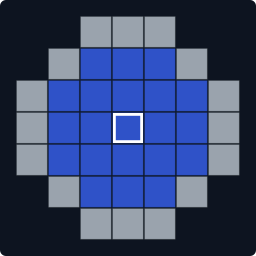
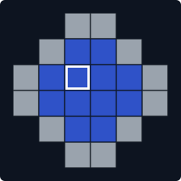
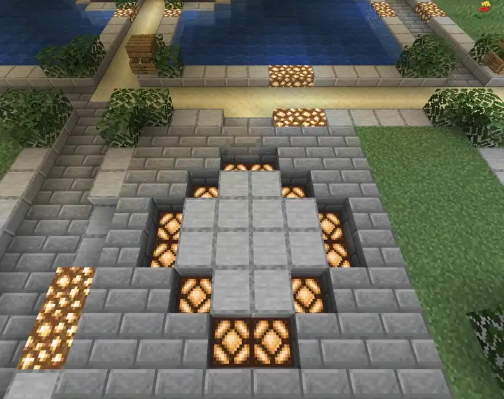
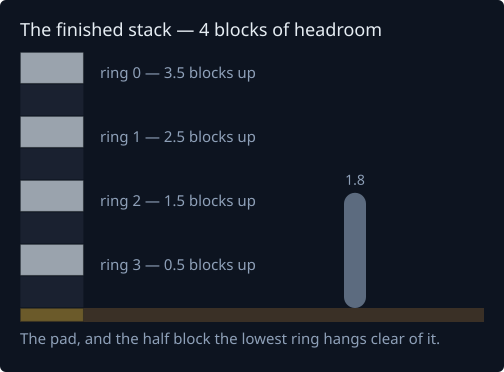
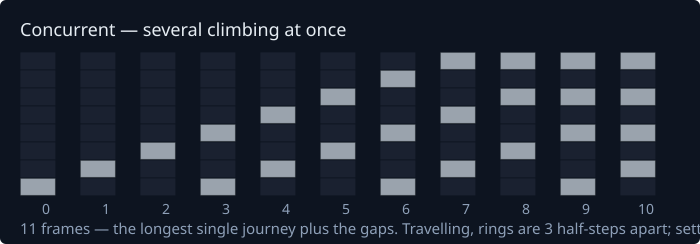
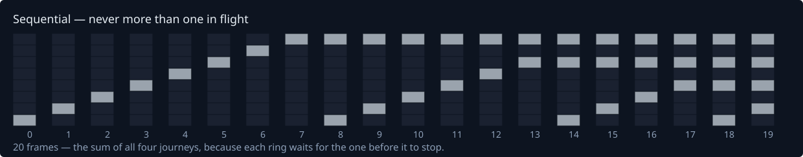
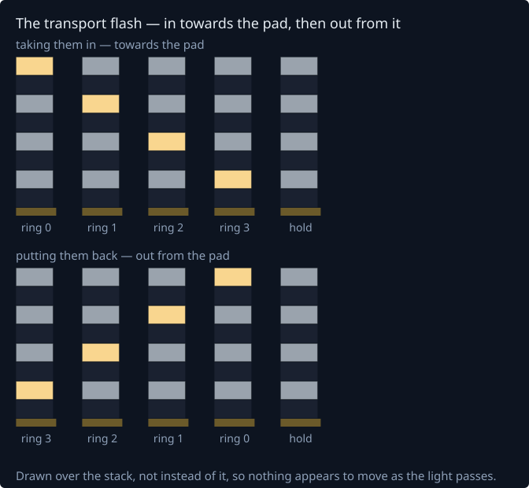

# Transport Rings — Design

Why transport rings are built the way they are. The [ring guide](guide/RINGS.md) says what they
do. Gates have [GATES.md](GATES.md), beaming has [BEAMS.md](BEAMS.md), mirrors have
[MIRRORS.md](MIRRORS.md).

**In short.** A ring pair is two invisible pads in the same world. You lay a circle of slabs,
run `create` at each end, and the slabs are consumed — nothing is left in the world at all.
Walking into either interior arms a countdown; four rings then rise, swap everything inside the
two volumes, and sink back. Three things shape almost every decision below: **nothing is ever
built** (the whole animation is drawn to clients), **the swap is one instant** (so occupancy is
read once, atomically), and **abort is confined to the countdown** (so the moving half of the
cycle can never be interrupted).

| | Stargate | Ring |
|---|---|---|
| What it is | A built structure | Two pads, invisible when idle |
| Unit | One gate, dialled to another | A permanent pair |
| Activation | Dial, button, redstone | Walking into either end |
| Direction | One way per dial | Both ends fire together |
| Range | Cross-world, config permitting | Same world, always |

## Contents

- [Patterns](#patterns) · [Building a pair](#building-a-pair) · [Storage](#storage)
- [The cycle](#the-cycle) · [Trigger and re-arm](#trigger-and-re-arm)
- [Teleport semantics](#teleport-semantics) · [Materials](#materials)
- [What a ring tells you](#what-a-ring-tells-you)
- [Names, removal and reset](#names-removal-and-reset) · [Sound](#sound) · [Access](#access)
- [Ceiling rings drop to the floor](#ceiling-rings-drop-to-the-floor)
- [Rings are drawn, not built](#rings-are-drawn-not-built)
- [Animation](#animation) · [What that looks like](#what-that-looks-like)
- [The transport flash](#the-transport-flash)
- [A ring that is no longer fit to arrive in](#a-ring-that-is-no-longer-fit-to-arrive-in)
- [Limits](#limits) · [Config](#config) · [Commands and permissions](#commands-and-permissions)
- [Events for other plugins](#events-for-other-plugins) · [Layout](#layout)
- [What is reused, and what is not](#what-is-reused-and-what-is-not)
- [Test priorities](#test-priorities)

## Patterns

There are exactly two, and they are hardcoded. A file format for two fixed arrays is dead
weight.

The odd pattern **is the Standard gate's ring** — the same profile, `3,5,7,7,7,5,3`, lying flat
instead of standing up. The even one is a size down, for rooms that cannot spare seven blocks in
both directions.

<!-- patterns:start -->

| Odd | Even |
|---|---|
| <a href="images/rings/pattern-odd.svg"></a> | <a href="images/rings/pattern-even.svg"></a> |
| 7 across — 16 perimeter, 21 interior, a true centre | 6 across — 12 perimeter, 12 interior, a 2x2 centre |

Grey is the perimeter, which is what the player lays in slabs and what animates. Blue is the
interior: the trigger volume, and the region that travels. The outlined cell is the anchor every
offset is measured from.

<!-- patterns:end -->

What makes them read as circles rather than squares with clipped corners is that each corner
turns through **two diagonal steps** rather than one, and that needs a diameter of at least six.
At five, two steps collapse the shape into a diamond with no standing room.

**Perimeter and interior never overlap** — a block cannot both animate and hold a passenger —
and **the player lays only the perimeter**, so whatever is already inside the circle stays.

Offsets are `(dx, dz)` pairs from an anchor. The odd pattern anchors on its centre, giving
`-3..+3`; the even one has no centre, so it anchors on the low-x/low-z block of the central 2x2,
giving the asymmetric `-2..+3`. Neither table is written out: each pattern is described by its
row widths alone, and which cells are perimeter is derived — a cell is on the outline when any
orthogonal neighbour is not part of the disc. Adding a third pattern is a one-line edit.

## Building a pair

Lay the perimeter in slabs on top of a floor or under a ceiling, stand inside it and run
`/wormhole ring create`; do the same somewhere else, and when the pair completes **both** sets
of slabs are consumed and both surfaces return to what they were. The slabs are a template, not
structure.

**They are taken when the pair completes, not at each half.** An unpaired ring does nothing, so
leaving its slabs costs nothing, while taking them at the first `create` meant a crash between
the two halves cost somebody a circle of slabs for a ring that never existed. Cancelling
therefore has nothing to give back. Running `create` again inside the first circle finds that
same ring, so it is refused rather than paired with itself.

**The template says more than its shape.** Detection reads four things out of it, and only the
first is obvious: *which pattern*, by matching one of the two; *where the anchor is*, since
nobody stands exactly on the centre block, so every interior square is tried as a candidate and
the anchor worked back; *what the ring is made of*, since the slab they chose becomes the ring's
material, so a ring laid in deepslate rises in deepslate with no command run; and *which surface
it is set into*, because a slab resting on a floor is a bottom slab and one hung under a ceiling
is a top slab — orientation stated by the template rather than guessed from what is above it.

Four things are refused, each with its own message: no circle at all, a circle of mixed slab
types, a circle whose slabs do not all face the same way, and a circle that has been filled in.
"No ring found", sent to someone looking at a ring they can plainly see, would send them hunting
the wrong problem. Only the ring's own slab counts as filling it — a carpet or a rail inside the
circle is nobody's business.

**Creation is two-step**, because a ring is meaningless without its partner, and the pending
endpoint is written to `rings/pending.yml` on every change rather than at shutdown — a server
that stops badly is exactly the case it exists for. It records its own world, so the second
`create` can refuse an endpoint in a different one rather than failing silently after twenty
slabs have been laid.

Detection is pure and reaches the world through a two-method probe, so all of it is testable
without a running server.

### The opening is a barrier, not air

The pad opens on the client only — the server's floor never moves. Drawing the surface as air
told the client the ground had gone while the server knew better: the client predicted a fall,
the server refused it, and the two argued for as long as somebody stood there. Walking across a
waking ring felt like being stuck or dragged back. A barrier is invisible to the same eye and
still solid to the client that was sent it.

The general rule, worth remembering for anything drawn client-side: **a drawing may only make
collision stronger than the block it covers, never weaker.** Portals get away with air because
their real block is air too.

## Storage

**Rings do not cross worlds**, by design rather than by config. Gates are the long-haul option;
rings are local transport. That removes a whole class of problem — no pair half-loaded, no
endpoint referencing a world that no longer exists — and makes `World` a property of the pair.

**The pair is the stored object, not the ring**, and every pair in a world lives in that world's
single file, `plugins/WormholeXTreme/data/rings/<world>.yml`:

```yaml
World: world
Pairs:
  7f3a1c2e:
    Owner: 069a79f4-44e9-4726-a5be-fca90e38aaf5
    OwnerName: Justin
    Created: 1756771200000
    Access: PRIVATE
    Allowed: [11111111-2222-3333-4444-555555555555]
    A: {X: 128, Y: 64, Z: -310, Orientation: FLOOR, Pattern: ODD, Ring: SMOOTH_STONE_SLAB, Built: SMOOTH_STONE_SLAB, Light: GLOWSTONE, Style: CONCURRENT, Name: Base}
    B: {X: 512, Y: 31, Z: 88, Orientation: CEILING, Pattern: EVEN, Ring: DEEPSLATE_TILE_SLAB, Light: SEA_LANTERN, Style: SEQUENTIAL, Name: Tower}
```

Storing the pair rather than two rings removes three problems at once: no dangling partner
references, no second resolution pass on load the way gate networks need, and no orphan ring
that exists but goes nowhere. **One file per world rather than one per pair** makes the layout
enforce the design rule, since there is nowhere to write a pair that spans worlds; answers the
only real cost in loading, which is the number of file reads; and makes world lifecycle trivial
— an unloaded world has its file skipped, and a deleted world takes its rings with one file.

The cost is that a bad write loses a world's rings rather than one pair's, handled the way gates
already handle it: temp file and `ATOMIC_MOVE`. Loading tolerates damage per entry. The `World`
field is authoritative, not the filename, because world names can contain characters a
filesystem will not take. Only the anchor, pattern and orientation are stored — the footprint is
a pure function of those three. A pair-level `Style` is what files from before it moved look
like, and is read as the fallback for both ends. Format is plain YAML from the start:
`GateSerializer` carries nine versions of legacy binary baggage and there is no reason to
inherit that.

**Pairs are keyed by id, not by coordinates**, and nothing looks a ring up by key at runtime
anyway — every world file is read once at startup into `RingIndex`, and from then on the move
path is a hash against an in-memory chunk bucket. A coordinate key would either encode both
endpoints and become unreadable, or encode one and quietly imply a ring is the unit of storage
after we decided it is not; and identity in commands and log lines would stop being stable the
moment anything moved. **Rings are not named** — the id is short random hex. Each *end* may be
named, which is what a listing reads back.

## The cycle

```
IDLE        a move event inside either interior arms the pair
COUNTDOWN   the pattern lights up, counting down out loud — ABORTS if both interiors empty
DEPLOY      rings rise — COMMITTED, no abort, runs to completion
HOLD        the finished stack stands still for a second
FLASH       light runs down through the stack, then the swap
            then back up through it, with the travellers already there
HOLD        rings stand a moment more
RETRACT     rings return nearest-first
LINGER      rings gone, pad still lit for a second
COOLDOWN    pair refuses all triggers

            the pad is lit from COUNTDOWN through to the end of LINGER
```

**Abort is confined to the countdown.** Once the rings start deploying the cycle runs to the end
regardless of who leaves. That is what keeps the animation tractable: the abortable phase is a
flat set of block replacements with one restore map, and the phase with all the moving parts
cannot be interrupted. Restore-on-abort and restore-on-retract are then the same code path,
exercised in one direction only. An empty committed cycle is legal and expected.

**Countdown length is a constraint, not a preference.** Getting clear of a ring is around four
blocks from the middle, close to a second at walking pace, and the abort window is only real
because the countdown comfortably exceeds that. `rings.countdown` defaults to 100 ticks and is
floored at 30; below that, rings begin taking people who were only walking past.

## Trigger and re-arm

A move crosses a block boundary and the gate lookup fails; `RingIndex` hashes the chunk key to
ask whether this block is in a ring interior; if the pair is `IDLE` and off cooldown, the
countdown starts. The ring check sits *after* the gate check so gates keep priority, and ring
creation refuses any footprint touching gate blocks, so the two can never contend.

**Re-arm is purely move-driven.** No scheduled occupancy re-check, no polling. A player who is
teleported and then stands perfectly still does not restart the cycle; one who is moving does,
once the cooldown has passed. Nothing in the ring subsystem runs unattended.

**No per-player arrival guard is needed.** Gates need `isPlayerRecentArrivalFrom` because they
would re-trigger within milliseconds of arrival. Rings do not: the cooldown is shared across
both ends, so the settle-move on landing is refused, and re-firing requires the player to still
be there and moving a full cooldown later.

## Teleport semantics

**Both interiors are snapshotted in the same tick, before anything moves.** Doing it any other
way lets A's arrivals leak into B's set and bounce straight back. The snapshot happens at the
flash, not at deploy-start: the rings are a volume that closes on whatever is inside it when it
closes, so walking out genuinely saves you and walking in late genuinely catches you.

Everything in the interior travels — players, mobs, dropped items, vehicles — from one
`getNearbyEntities` call per side. Rings need no equivalent of `GateEntityScanner`'s per-tick
sweep, because there is exactly one instant at which occupancy matters.

**A rider goes with its mount, not beside it.** Moving them one at a time leaves whichever went
first without the other for an instant, and the game breaks the seat rather than stretching it —
the player lands on the floor next to their camel. So anybody riding something that is *also*
travelling is dropped from the delivery list and carried by it, and the stack is put back
together a tick after landing.

**You have to be *within* the ring, and the perimeter is not within it.** Arming is
interior-only too: the perimeter is a threshold you cross rather than a place you stand. An
earlier design had the rings nudge you off the edge — worth recording as removed rather than
quietly dropped. When rings were real blocks, a perimeter column was about to fill with rising
slabs, so whoever stood there would be shoved or suffocated. Drawing the rings instead deleted
the problem rather than solving it: an illusion cannot push anybody.

**Where each layer sits** follows from the player laying the template *on top of* the floor, so
the slabs occupy the space above it:

| | Height | Why |
|---|---|---|
| Countdown lights | one block **into** the surface | the pattern belongs in the floor, not hanging above it |
| Ring plane (first frame of the rise) | the space the slabs were laid in | rings come up out of the lit pattern |
| Passenger volume | from the ring plane into the room | that is where a standing player's feet are |

A ceiling ring mirrors all of it. This is also the one place the animation may replace a solid
block: a light set into a floor has a floor block in the way by definition, so the air-only rule
protecting everything else would mean the pattern never appearing.

## Materials

| | Default | Constraint | Shown |
|---|---|---|---|
| Ring | the slab it was laid in | **Must be a slab** (`minecraft:slabs`) | The travelling rings, during deploy and retract |
| Light | `rings.default-light-material` | Any placeable block | The pad, from the countdown until the rings are home |
| Flash | `rings.default-flash-material` | Any placeable block | A ring, as the transport light passes through it |

**The pad light and the transport flash are separate** because they are separate moments. They
start matched, so an untouched ring reads as one effect rather than two, and setting them apart
is what makes the transport its own moment.

**The ring material is constrained and the light one is not.** The rise is built out of slab
halves, and that is the only way to move half a block per frame. A full block would silently
cost the animation its resolution, which is the entire visual effect, so a non-slab is refused
at the command rather than accepted and quietly disappointing. Whether something is a slab is
asked of the game's own `minecraft:slabs` tag, so a data pack that adds one gets a ring material
for free; where there is no registry to ask it falls back to the name, which is exact for every
slab the game ships. Lights have no equivalent tag — Minecraft has no light-emitting group — so
the suggestions are written out by hand, and that list only has to look right, since a drawn
ring emits nothing whatever it is made of.

**Both are stored per end, and the two ends are meant to differ.** A ring in a stone base and
its partner in a deepslate mine should each look like where they are. That is what shapes the
`edit` command: standing in a ring edits that ring, naming a pair by id edits both.

**These are not `MaterialGroup` palettes.** A gate's palette is identified by the material its
frame is built from, which works because a gate's frame is permanent. A ring is invisible when
idle and has no frame to read, so there is nothing to identify a group by.

## What a ring tells you

| When | Message |
|---|---|
| You walk in | *Transport rings engaging — travelling to Tower. Step clear to cancel.* |
| Each second | *Transport in 3 seconds…* |
| Everyone leaves | *Transport rings powering down.* |
| The rings commit | *Rings deploying. Hold still.* |
| You arrive | *Arrived at Tower.* |
| Too soon after a trip | *Rings recharging. Ready in 42 seconds.* |

**All of those go to the action bar, not chat.** A ring speaks once a second while counting down
and again when it fires, which in chat would be six lines per trip scrolling away whatever the
player was reading. Chat is kept for the one message a player has to act on and might otherwise
miss: being turned away from a pair that is not theirs.

**Messages are sent on entering a ring, never on every step taken inside one**, since the move
path runs on each block boundary crossed. Whether a step was an entry is decided by looking up
where they came *from* as well as where they are — no timers, no remembered state. Arming is
deliberately *not* filtered this way, which is what lets somebody who stayed put after a trip be
carried back once the cooldown passes. Getting that wrong is what made a blocked ring fill chat:
a blocked pair never leaves `IDLE`, so it stays willing to fire, and every step inside produced
the same news again — and deciding a ring is blocked means reading every block of both
interiors, so a blocked pair's answer is trusted for a second before the world is read again.

**A refused ring shows itself.** An idle ring is invisible, which is the point of it, and that
works against a player the moment one turns them away: they are told it is recharging while
standing on ground that looks like every other patch of ground. So a refusal briefly lights the
pattern for that one player, sent only to them and taken back after `rings.outline-ticks`.
Nothing is written to the world.

Shown for any refusal that leaves the pad dark — recharging, and an end that is built in or has
no floor, which needs it most since the thing to fix is inside a footprint the player cannot
see. **Not for a ring mid-cycle**: that pad is already lit, and drawing over it would put the
cycle's own lights out when the outline expired. Not hypothetical — it is what happened to
anybody who stepped out of a ring and back in while it was counting down, whose outline cleanup
landed two seconds later exactly as the rings deployed. Not shown for a private pair either.

## Names, removal and reset

Each end can be called something. **The name belongs to the end, not the pair**, because the
useful thing to say is where somebody is *going*, and that is a different answer depending on
which end they walked into. It also reads better in a listing: two end names give *Base to
Mine*, where a single pair label gave *Mine Line*, which only said somebody had named it. The
listing text is derived from the two names rather than stored, so it can never disagree with
them. Naming by id is refused rather than applied to both ends.

**`remove` lays both templates back out**, in the slab each ring was built from — the slabs
returned and a ready-made template in one, so a ring can be picked up and moved without
re-mining the circle. Done in the pair's own world rather than the player's, since a pair can be
removed by id from anywhere.

**`reset` goes back to the slab, not to a default.** Each end remembers the slab it was laid in
in a `Built` field kept apart from the material it is currently wearing. A configured default
would be the wrong answer: somebody who built a ring out of quartz and tried a colour they did
not like wants their quartz back, and since the ring material normally comes off the template, a
default is a value that ring never had. The lights and the deploy style are the opposite case —
nobody builds those, so there is no history to go back to and they do take the defaults.

## Sound

A ring drawn to clients and never built is otherwise a silent animation in somebody's floor. The
noise is most of what makes it read as machinery, so it is on by default.

Sounds are stored as **names** rather than resolved to a `Sound` constant: the sound type has
been moving toward a registry-backed one, and a registry cannot be asked about before the server
has started — the same trap that killed `Ring`'s class initialisation on 1.20.6.

**The pitch on the per-ring sound carries the animation.** Each ring leaves a step higher than
the one before, which is what makes four repeats of one sound read as a stack building rather
than four clicks. Two things fall out of pitching by *the order rings leave* rather than by where
they end up: the retract needs no special case, since the last ring out is the first one home and
replaying the same pitches in return order makes the sequence fall on its own; and a pair stays
in tune with itself, since both ends send their first ring first whichever direction it travels.
Pitching by height would have run the sound up at one end and down at the other — exactly the bug
the transport flash had before it started counting from the top.

**The transport sound plays twice.** The departure flash sounds at both ends the instant the swap
begins, at a raised pitch, but that only says a swap is happening before anyone has moved. The
arrival sweep plays the same sound again, settled, at the moment travellers are already standing
at their destination. Without it the visual departure-then-landing pair had one beat of sound for
two beats of light. A refusal is heard by the player it concerns and nobody else.

## Access

A pair is `PRIVATE` or `PUBLIC`, plus a list of players named by the owner.

**Access belongs to the pair, not to an end**, and that is not filing convenience. Both ends fire
together and everything swaps in the same instant, so there is no way to authorise half of it — a
pair whose ends disagreed would be one you could leave by and not return to, which is not a state
the swap can express. Exactly the opposite of materials, and for a reason worth keeping straight:
a material is cosmetic and local, so each end can look like the room it is in; access is
functional and about the link.

`mayUse` governs two things: **arming a cycle and being carried by one**. A private ring is not a
free ride for whoever happens to be standing in it when the owner uses it — everyone in the
volume is checked at the moment of the swap, and anyone not allowed stays put while the rings
close and open around them. Only players are subject to any of this: mobs, items and vehicles
travel as cargo, which costs nothing to allow, because they cannot arm a ring in the first place.

**Private is the default**, the opposite of how gates behave and a fit for what rings are.
**Access fails closed everywhere it can**: a stored pair with no access field — which is what
every pair written before this existed looks like — loads as private, and so does one whose
access field is unreadable. Reading either as public would silently publish somebody's private
link on upgrade, and that is the one mistake here that cannot be undone once people have started
using it. Revoking the owner does nothing, because their access comes from ownership rather than
from the list, so there is no sequence of commands that leaves a pair nobody can use or change.

## Ceiling rings drop to the floor

A ceiling ring's rings fall all the way down and stack up from the ground, exactly as a floor
ring's rise from it. The finished stack is identical: the same four heights above the same floor,
with the traveller standing inside it.

Hanging the stack from the plane instead would leave somebody in a tall room standing
*underneath* the rings rather than in them — which is what an earlier version did, and because
the arrival was pinned a fixed distance below the plane, a ceiling ring in anything taller than a
four-block room delivered people into mid-air and then refused to fire at all once the ground
check arrived. So everything is measured in half-steps above the **stack base**: the plane for a
floor ring, the floor itself for a ceiling one.

**The first ring out always travels furthest from its plane** — the top of the stack for a floor
ring, the bottom for a ceiling one. Not symmetry for its own sake: if a ceiling ring's first one
stopped highest, every ring after it would descend through where it had already settled.

The drop is measured when a cycle engages, not when the ring is built, because floors change. Two
limits come with it: **at least four blocks** from ceiling to floor, derived rather than chosen,
since the plane has to be at least level with the top of the finished stack; and **at most
`rings.max-ceiling-drop`**, ten by default, past which the ring is over a shaft rather than a
room.

## Rings are drawn, not built

**Nothing in a cycle changes the world.** The lights and the travelling rings are sent to nearby
clients as block changes and the server's own blocks are never touched, the same way a gate draws
its portal.

Making them real looked simpler and was worse in three ways. A server stopped mid-cycle would
keep the rings for good, since nothing would be left running to take them down. Block-logging
plugins would record a floor being replaced on every trip. And for the few seconds a ring stood
there its glowstone and slabs were ordinary breakable blocks — mine one and you got a free
glowstone, and the restore then skipped it and left a permanent hole in the floor.

Drawing also makes putting things back trivial rather than delicate: since the real blocks were
never touched, undoing a drawing is showing the client what was always there. Nothing to
remember, nothing to restore in the right order, and no need to check whether somebody changed a
block underneath. It also means a ring can be drawn straight over whatever is in its way and
still look like a complete ring.

It costs what a gate's portal costs: the drawing only exists for those it was sent to, and
anything handing a client a fresh copy of the chunk erases it. Rings are also not solid, so
nobody can stand on a rising ring or be shoved by one.

## Animation



One take of the whole cycle, slowed to five quarters of real time, with the countdown trimmed.
What follows is the arithmetic behind what the clip shows.

Four rings end up **half a block of clear air apart** — one block centre to centre, since a slab
is half a block thick — with the lowest hanging half a block clear of the floor. They settle at
0.5, 1.5, 2.5 and 3.5 blocks up, so the whole thing needs four blocks of headroom.

**Four rather than the show's five**, because Minecraft's proportions are not the show's. The
count is unavoidably the height, and a ring here has to be seven blocks across to read as round
on a block grid — five put a five-block tower around somebody 1.8 blocks tall. Three was tried
and fits a cramped room better, but with three there is barely a sequence to watch: the first has
arrived before the last has left.

**They travel further apart than they land.** On the way up there is a full block of clear air
between rings; the finished stack has half a block. Nothing compresses them — the leader reaches
its place and stops while the ones behind are still climbing, so the gaps close from the top down
as each ring arrives. Writing that as a compression step would have been a second motion to keep
in step with the first, for an effect that falls out of rings stopping when they get there. And
because they stop where they land, the finished stack is the highest anything ever gets: four
blocks of headroom is the whole requirement, and the survey enforces exactly that.

**There are two ways they get there**, both of which the show uses. **Concurrent** (type `fast`)
has several climbing at once, a ring leaving the plane as soon as the one in front is a clear
block above it — quicker, and the commoner look. **Sequential** (`slow`) has never more than one
in flight: the first out flies all the way to the furthest position and stops, and only then does
the next emerge.

The **stored** value stays `CONCURRENT` or `SEQUENTIAL`, because that names what the setting
actually does — how many rings are in the air at once — and stays true whatever the tick rate is.
Naming it by speed would claim the same ground as `rings.deploy-ticks`: `slow` with
`deploy-ticks: 1` is not slow. The two differ *only* in when a ring leaves the plane, so this is
one number rather than two animations, and style belongs to the **end** like the materials, since
nobody watches both at once.

**The finished stack stands still for a second before anybody moves, and again after.** Taking
people the instant the last ring stops reads as the teleport interrupting the rings; letting them
arrive, hold, and only then flash reads as the rings doing it. Those two pauses are most of what
makes the effect read as a transport rather than as blocks moving.

Retract is the reversal, so the stack loosens back out as it comes down, the **nearest ring going
home first**. That needs no code of its own — a sequence that went out furthest-first returns
nearest-first when played backwards — and writing it as a reversal means the two can never
disagree and strand a slab.

Half-block resolution comes from slab type rather than position: a `BOTTOM` slab fills the lower
half of its block and a `TOP` slab the upper half, so a travelling ring steps `(y,BOTTOM)`,
`(y,TOP)`, `(y+1,BOTTOM)`. Each frame restores the previous positions before placing the next.
Any position that is not air is skipped rather than overwritten: the animation must never eat a
player's build, and must never restore a block someone changed underneath it.

**The pad stays lit** through all of it — the rings rising, the transport, the rings coming home
— and goes out a second *after* the last one has sunk back. Putting the lights out when the rings
start rising would have the pad go dark at exactly the moment it does the thing it was lit for;
putting them out on the same tick the last ring lands reads as being switched off, where a beat
later reads as powering down. Mechanically this is why the drawing is kept in two sets: the rings
are replaced wholesale every frame, the lights are drawn once and outlast all of it, and they
never overlap.

### What that looks like

<!-- stack:start -->







Each column is one frame and each slot one half-step. The two strips end in the same stack and
differ only in when a ring leaves the plane, which is what makes this one number rather than two
animations.

<!-- stack:end -->

## The transport flash

The flash is the second half of [the clip above](#animation) — this section is the reading behind
it. It is deliberately not embedded twice: the sweep is a fast, bright, repeating flicker, and one
looping copy of it on a page is enough.

With the stack up and still, the light runs through it one ring at a time — **twice, once each
side of the transport.** Then the rings stand a beat and come home.

**The light always runs towards the pad**, and both sweeps run the same way: down through a floor
ring's stack, up through a ceiling ring's. That is what the show does, and the reading that makes
sense of the machine — the pad is where travellers are taken from and put back. This was briefly
two things, a configured departure direction and an arrival running its opposite; both are gone,
because against the show they were wrong and they were arithmetic that could be got backwards, as
the flash once was.

What is left needs no orientation, direction or sense of which sweep is running. The lit ring is
the ring's own number: ring zero is the first one out and travels furthest from its pad, so it is
the far end of the stack whichever way that stack was built, and counting up from it runs towards
the pad at both ends.

**Each sweep plays only at the ends it belongs to.** The first takes travellers in, so it runs
where somebody is standing; the second puts them out, so it runs where somebody has landed. A
cycle carrying nobody shows no transport light at all. The lit ring is drawn **over** the stack
rather than instead of it, so nothing appears to move while the light passes.

<!-- flash:start -->



A filmstrip rather than a loop, deliberately: three ticks a ring through four rings is a fast
bright flicker, and an animation on a page autoplays forever with no way to pause it.

<!-- flash:end -->

## A ring that is no longer fit to arrive in

Building inside a ring long after it was made, or digging its floor out, leaves an end that still
fires and cannot honestly receive anybody. **The rings refuse to engage, and say why** — checked
when somebody walks in, before the countdown starts, so nothing happens at all. A cycle that
deploys, flashes and quietly carries nobody looks broken, where being told the far end is blocked
points at the thing that needs fixing.

The standard is strict on purpose, and it is the whole interior rather than a search for one
clear square:

- **Nothing built inside it.** Every interior column clear at the arrival layer and the one
  above. A single block dropped in is enough to stop it.
- **Room for the stack, not just for the person.** Every interior column clear for the four
  layers the finished stack fills. A separate question, and it used to go unasked: a traveller is
  two blocks tall and the stack is four, so a three-block room had space for somebody and none at
  all for the rings, and the ring fired anyway, drawing its top half inside the ceiling. The two
  are told apart in the message, because "somebody built in your ring" and "your ceiling is too
  low" send a player to different places.
- **Ground under all of it.** A solid block *directly* beneath every interior column — a floor
  three blocks further down is still a gap to fall through. Water and lava count as no ground.

A ceiling ring's own plane is exempt from the headroom rule at its shallowest, where the top ring
settles level with the ceiling it was cut into: refusing that would turn the ordinary way of
building one into an error.

**Somewhere to stand is not the same as somewhere fit to arrive.** One block dropped into a
seven-wide ring still leaves twenty free columns, and delivering people to whichever corner
happened to be empty is not what a transport ring should do. The arrival is always the middle.
**Only the inside counts** — what anybody has built around a ring is their business.

It is checked again at the flash, because the few seconds a cycle runs are long enough for
somebody to fill the far end in. The two directions are judged separately: somebody standing in a
blocked end can still leave it.

**A trip that never happened owes no cooldown.** A cycle that carried nobody leaves the pair
ready immediately: the cooldown exists so an arrival cannot re-fire the ring it just landed in,
and with no arrival there is nothing to guard against.

## Limits

Three knobs solving three different problems. The count is the least important.

**Footprint overlap is the real hazard, not density.** Dozens of rings in a small area cost
nothing to look up — the index is chunk-bucketed, so it is one hash hit per block crossing
regardless. What breaks is two footprints touching: a player between them is inside two trigger
volumes, and two animations write the same blocks and restore each other's originals. So overlap
of footprint *or* interior is refused outright at create, with `rings.min-separation` on top.

**Distance is not a technical cost; unloaded chunks are.** A 20,000-block teleport costs the same
as a 20-block one. The actual failure is the far end sitting in an unloaded chunk when the cycle
fires, so the partner's chunks are force-loaded for the duration of the transit, matched by a
removal on retract so nothing outlives the cycle that requested it.

**The reach limit is a design choice, not a technical one**, and it is two numbers because the
two axes are different questions. `rings.max-link-distance` is 256 blocks on the ground —
comfortably a whole base and nowhere near town to town — which stops rings becoming the answer to
everything. `rings.max-link-height` is 384, the full height of the world, because going straight
down is exactly what rings are *for*. Either set to `0` lifts that limit. **Quota** is
`rings.max-pairs-per-player`, bypassed by `wormhole.ring.unlimited`.

## Config

```yaml
rings:
  countdown: 100             # ticks; floored at 30, see the countdown section
  cycle-cooldown: 600        # ticks, per pair
  deploy-ticks: 2            # ticks between animation frames
  settle-ticks: 20           # stack stands still this long before the teleport
  hold-ticks: 20             # and this long after the light finishes, before retracting
  flash-ticks: 3             # how long each ring stays lit as the light passes

  outline-on-refusal: true   # light the pattern for somebody a ring turns away
  outline-ticks: 40          # and for how long
  lights-linger-ticks: 20    # pad stays lit this long after the last ring is home

  sounds-enabled: true       # whether rings make any noise at all
  sound-volume: 1.0          # also the audible range: 1.0 carries about sixteen blocks
  sound-open: block.beacon.activate
  sound-ring: block.piston.extend
  sound-flash: block.beacon.power_select
  sound-close: block.beacon.deactivate
  sound-refused: block.note_block.bass

  max-pairs-per-player: 10
  min-separation: 8          # blocks, centre to centre
  max-link-distance: 256     # on the ground; 16 chunks. 0 = unlimited
  max-link-height: 384       # in height; the full world. 0 = unlimited
  max-ceiling-drop: 10       # how far a ceiling ring will look for its floor
  reach: 4                   # block layers of passenger volume, from the ring plane

  default-ring-material: SMOOTH_STONE_SLAB   # fallback only; not what reset goes back to
  default-light-material: REDSTONE_LAMP
  default-flash-material: REDSTONE_LAMP      # set it apart to make the transport its own moment
  default-access: PRIVATE    # what a newly built pair starts as
  default-style: CONCURRENT  # or SEQUENTIAL; how the stack comes out
```

## Commands and permissions

```
/wormhole ring create                     build the pad you are standing in; twice to pair
/wormhole ring cancel                     discard a pending first endpoint
/wormhole ring list                       your pairs, by name where set
/wormhole ring remove [id]                remove both ends
/wormhole ring edit <field> <value>       edit the ring you are standing in
/wormhole ring edit <id> <field> <value>  edit both ends of that pair
/wormhole ring allow <player> [id]        let somebody use it
/wormhole ring deny <player> [id]         stop them
/wormhole ring owner <player> [id]        hand the pair to somebody else

  fields:  ring <material>    the travelling slabs; must be a slab           per end
           light <material>   the countdown lights                           per end
           built <material>   the slab `reset` restores to; must be a slab   per end
           name <text>        what this end is called                        per end
           access public|private                                             per pair
           style fast|slow                                                   per end
```

**Everything adjustable lives under one `edit` verb** rather than a subcommand per field. Gates
grew a separate top-level command for each, which is four registry entries, four usage strings
and four completers saying the same thing four ways; `edit` stays one entry however many fields
rings end up with. (Gates have since caught up: see [GATES.md](GATES.md#commands).)

**Whether an id is given selects the scope**, and it reads the way people work: you are usually
standing in the ring you want to change, so the id is omitted and only that end changes. Naming a
pair by id means you are somewhere else and thinking about the pair as a whole. `name` is the
exception, refused with an id. **Every field completes its own values**, because nobody remembers
how `polished_deepslate_brick_slab` is spelled — but pair ids are deliberately not completed,
since a tab completer is not told who is asking, so the choice was between listing every pair on
the server and listing none.

**`built` exists for the one case `reset` cannot fix on its own.** Editing the stored YAML's
`Built:` value does not work, because the plugin resaves every ring from memory on shutdown, so
an on-disk edit is overwritten before it is ever read back.

```
wormhole.ring.build       create and pair rings                  default: op
wormhole.ring.use         travel by a ring you are allowed on    default: true
wormhole.ring.admin       use and manage any pair                default: op
wormhole.ring.unlimited   bypass the per-player quota            default: op
```

Checked by `RingPermissions`, not by `WXPermissions`: the gate class is built around gates — its
checks take a `Stargate`, consult its network, and fall through owner and network rules that mean
nothing here. Being named on a private pair's allow list lets somebody **travel** by it, not
recolour, rename, give away or delete it.

**Handing a pair over** with `/wormhole ring owner` checks the quota **against the recipient**,
because a transfer that skipped it would let anyone past their limit by having a friend build the
ring and hand it over. The previous owner is not quietly kept on the allow list — staff who built
a ring for somebody should not be left with standing access — while the allow list itself belongs
to the pair rather than to its owner, so people already using a ring do not lose access because
it changed hands.

## Events for other plugins

`RingTravelEvent` fires once per travelling player and is cancellable. See
[API.md](API.md#rings) for the listener's view; the design points are these.

**The timing is what matters.** It fires after both ends have been read and before either has
been written, so a listener always sees the trip as it was before any of it happened, never a
half-finished one. Cancelling takes that player out of the trip and leaves everyone else in it;
there is no way to cancel a whole cycle, because by that point the rings are up and coming down
again regardless. It fires only for players.

The event is reached through the same `Surroundings` seam as everything else rather than fired
from the cycle directly, which keeps the cycle free of Bukkit and lets the rule that a refusal
*drops a passenger* rather than *cancelling the trip* be tested without a server.

## Layout

```
model/ring/RingPattern.java        the two offset tables, generated from row widths
model/ring/Ring.java               one endpoint: anchor, orientation, pattern, materials
model/ring/RingOrientation.java    floor or ceiling, and what that flips
model/ring/RingPair.java           the persisted unit: id, owner, access, style, two ends
model/ring/RingAccess.java         public or private
model/ring/RingStyle.java          concurrent or sequential deploy
model/ring/RingPhase.java          where a pair is in its cycle
model/ring/RingTemplate.java       reading a ring out of laid slabs
model/ring/RingManager.java        registry, pending endpoints, placement rules
model/ring/RingIndex.java          block lookup for the move path
model/ring/RingSurvey.java         whether an end is fit to arrive in
model/ring/RingBlockage.java       which of the two problems it has
model/ring/RingAnimator.java       where every travelling ring is on every frame
model/ring/RingCycle.java          one run: phases, the swap, block restore
model/ring/RingPassenger.java      what the swap needs to know about a traveller
model/ring/RingPermissions.java    the four nodes
model/ring/RingMessages.java       what a ring tells the people standing in it
model/ring/RingSounds.java         what a ring sounds like
model/ring/RingOutline.java        showing a refused player where the ring is
events/RingTravelEvent.java        cancellable, once per travelling player
model/ring/RingTransit.java        driving a cycle on the server clock
model/ring/RingYamlManager.java    load and save world files
model/ring/BukkitRingWorld.java    the one point of contact with a real world
model/ring/BukkitRingPassenger.java
model/ring/BukkitBlockProbe.java
command/handlers/RingCommand.java
```

The split that matters is the last few. Everything above `RingTransit` is pure or reaches the
world through a two-method interface, so the ordering of the swap, the frame arithmetic, the
restore bookkeeping and the placement rules are all testable with no server running.
`RingTransit` and `BukkitRingWorld` are what is left, and they are deliberately dull.

## What is reused, and what is not

Reused: the chunk-bucketing of `GateSpatialIndex`, because ring detection is on the move path and
must be a hash lookup rather than a scan; `StargateAnimator`'s save-original/restore discipline;
and the `SubCommands` registry, the `GateEvents` fire pattern, `findSafePlayerLocation` and
`StargateYamlManager` as a persistence template.

Not reused: `Stargate` itself, being two thousand lines of DHD, sign, iris, redstone, network and
woosh state that a ring has approximately none of; `WXPermissions`, for the reason under
[Access](#access); `GateSerializer`, for the legacy-versions reason under [Storage](#storage);
the `.shape` format, for the two-fixed-patterns reason under [Patterns](#patterns); and
`GateEntityScanner`'s per-tick sweep, replaced by one call at the flash.

## Test priorities

In rough order of how much they would hurt to get wrong.

1. **The swap is atomic** — entities from A never appear in B's snapshot — and a cancelled
   `RingTravelEvent` drops that passenger while carrying everyone else, asked only after both
   ends have been read.
2. **Abort during countdown restores every block at both ends**; deploy cannot be aborted, and an
   empty committed cycle completes cleanly.
3. **A full cycle changes no real block** and leaves nothing drawn behind.
4. **Both styles build the same stack**, run to their own length, and return nearest-first; rings
   climb a clear block apart and finish half a block apart, and nothing ever rises above where
   the top ring settles.
5. **The flash touches every ring exactly once** and always runs towards the pad, on both sweeps.
6. **The pad stays lit** from the countdown until after the rings are home, and the rings can be
   taken down without taking the lights with them.
7. **Cooldown is shared per pair**, and the landing settle-move does not re-fire it.
8. **A pair round-trips through YAML** with its footprint re-derived, into the file for its
   world; a damaged entry is skipped with a log line and the rest still loads; a packed block
   position survives at every height, including the negative ones.
9. **A stored pair with a missing or unreadable access field loads private, never public**, and a
   private pair refuses a stranger while leaving an unpermitted player standing.
10. **Overlapping footprints are refused at create**, including against gate blocks, and pairing
    refuses a second endpoint in a different world.
11. **Pattern matching picks the right one of the two** and rejects a near-miss circle.
12. **A ring with one block built in it, or one missing from its floor, refuses to engage** and
    says which of the two it is.
13. **`edit` without an id changes only the end the player is standing in**; with an id it
    changes both, and a non-slab ring material is refused either way.
14. **The drawings above are the geometry the plugin actually runs**, frame for frame
    (`RingGalleryTest`).
