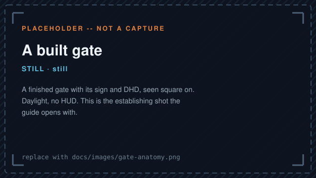
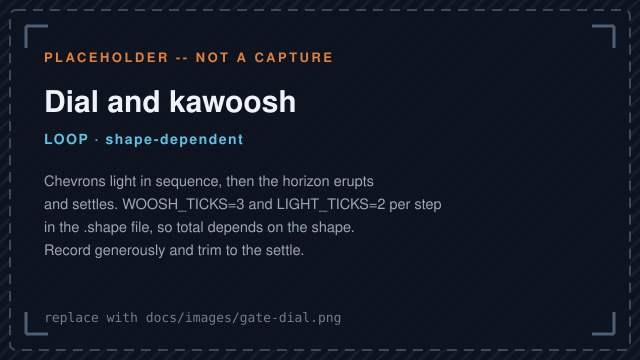
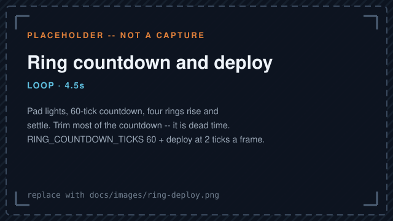

# User Guide

This guide provides quick-start instructions and examples for server operators and players.

## Quick install
1. Copy the built plugin JAR to your server's `plugins/` directory.
2. Start or reload the Paper server (target: Paper 1.20+).

## Quick commands
- Admin command namespace: `/wormhole` (alias `/wx`).
- Gates are stored as one YAML file each under `plugins/WormholeXTreme/data/gates/`.
  There is no database backend to configure or migrate.

## Common user actions
- Teleport to a gate (requires permission): `/wormhole go <gateName>`
- List gates: `/wormhole list` (or use `/wx` aliases)

## What it looks like

The slots below are waiting on real captures from a server. Each placeholder names the shot it
is holding open, how long it should run and what the finished file is called;
[CAPTURES.md](CAPTURES.md) has the shot list, the tick arithmetic behind each length, and the
ffmpeg commands.

**A finished gate.** Its sign, its DHD, and the shape of the thing.

**Dialling.** Chevrons light in sequence, then the horizon erupts and settles.

**Transport rings.** The pad lights, counts down, and four rings rise around whoever is standing
on it.

## Troubleshooting
- For vehicle/boat teleport reattachment issues, run recent builds of Paper 1.20+ and use the vehicle-first teleport flow.

## Feedback and contributions
- If you want to contribute to the guide (images, examples), add files under `docs/images/` and edit this file with descriptive captions.

