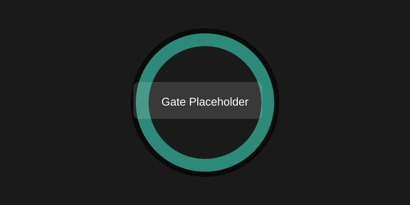

# User Guide

This guide provides quick-start instructions and examples for server operators and players.

## Quick install
1. Copy the built plugin JAR to your server's `plugins/` directory.
2. Start or reload the Paper server (target: Paper 1.20+).

## Quick commands
- Admin command namespace: `/wormhole` (alias `/wx`).
- Gates are stored as one YAML file each under `plugins/WormholeXTreme/WormholeXTremeDB/gates/`.
  There is no database backend to configure or migrate.

## Common user actions
- Teleport to a gate (requires permission): `/wormhole go <gateName>`
- List gates: `/wormhole list` (or use `/wx` aliases)

## Visual gate examples
I will add pictures/examples here to illustrate gate shapes and placements.
Place images under `docs/images/` and reference them here, for example:

- `docs/images/gate-example-1.png`
- `docs/images/gate-example-ring.png`

Current placeholder (you can replace this with a PNG/JPG):



Example insertion (Markdown):

```markdown

```

## Troubleshooting
- For vehicle/boat teleport reattachment issues, run recent builds of Paper 1.20+ and use the vehicle-first teleport flow.

## Feedback and contributions
- If you want to contribute to the guide (images, examples), add files under `docs/images/` and edit this file with descriptive captions.

