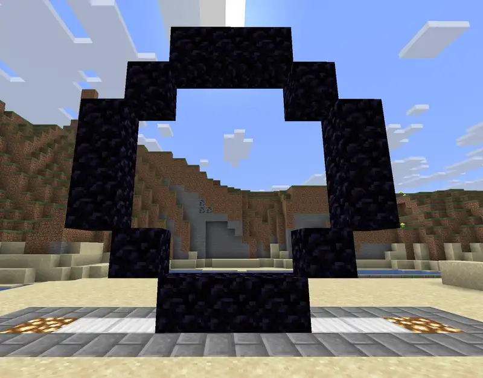
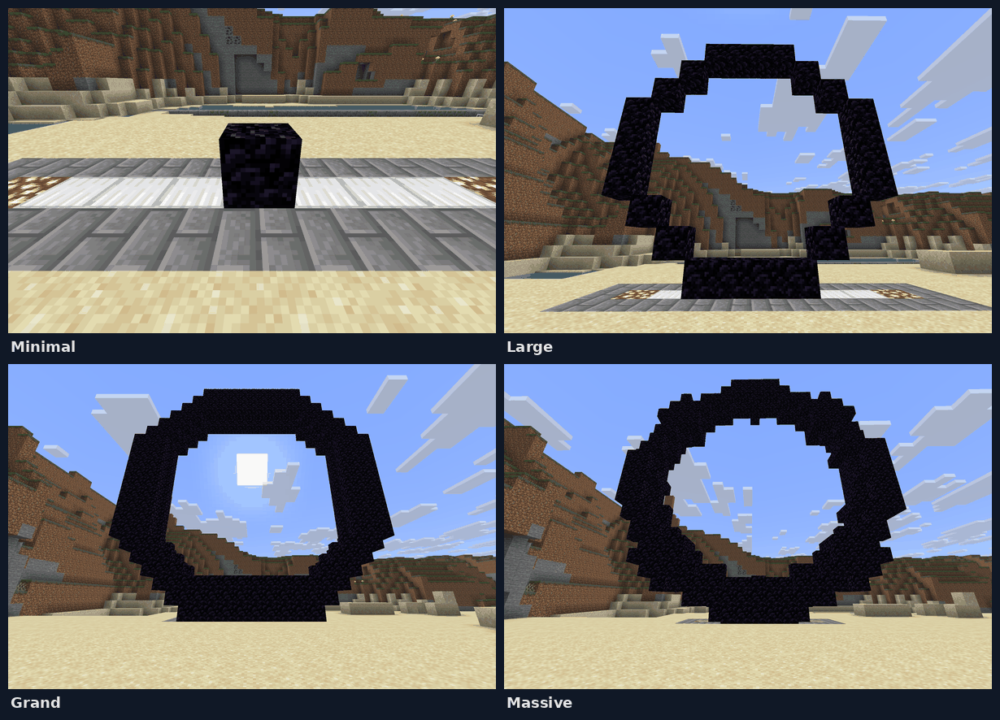
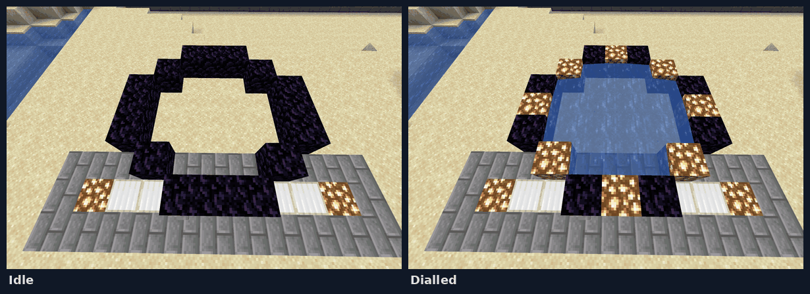
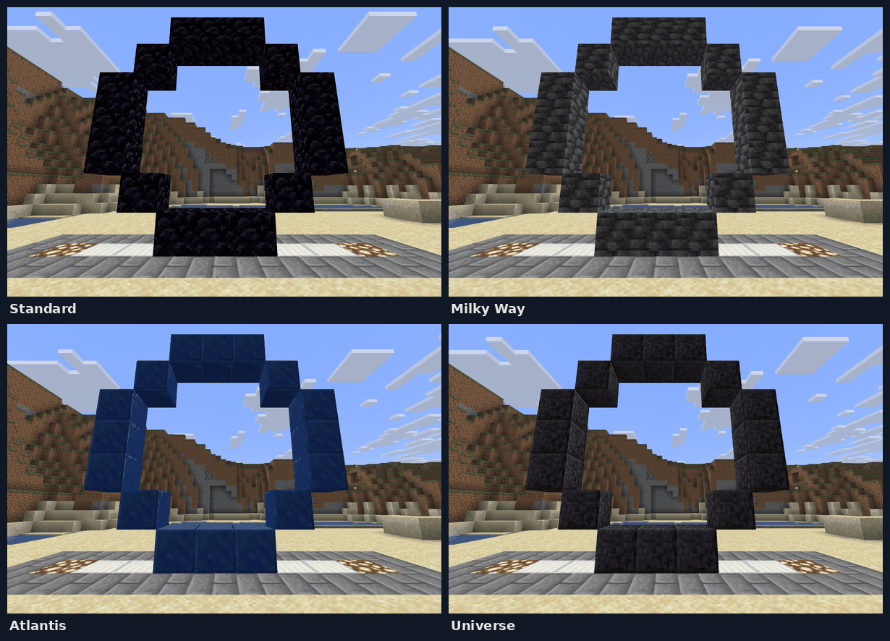
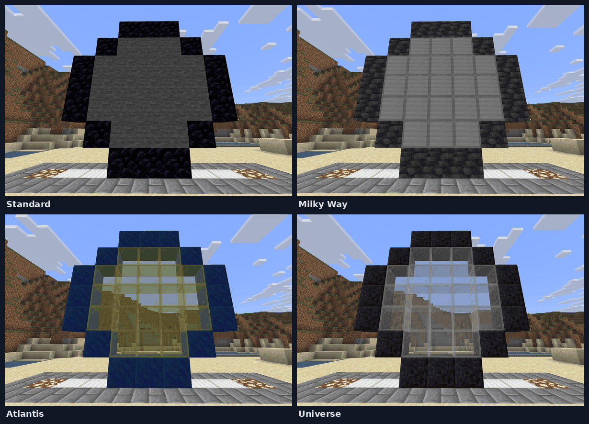
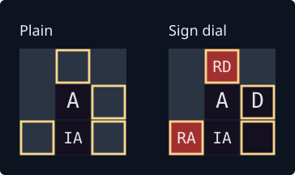

# Stargates

Building, dialling and wiring gates. Why they work the way they do is in the design notes,
[docs/GATES.md](../GATES.md).

## Contents

- [Building a gate](#building-a-gate)
- [Dialling](#dialling)
- [Shapes](#shapes)
- [Material groups](#material-groups)
- [Signs](#signs)
- [The iris](#the-iris)
- [Redstone](#redstone)
- [What travels through a gate](#what-travels-through-a-gate)
- [Commands](#commands)
- [Sounds](#sounds)

## Building a gate

1. `/wormhole gate build <shape> [group]` — pick a [shape](#shapes), and optionally a
   [material group](#material-groups).
2. Lay the frame and put a button or lever on the DHD position, then click it.
3. `/wormhole gate complete <name> [idc=CODE] [net=NETWORK]` — name it. The plugin places the
   name sign and levers, and saves the gate.

The frame material decides the gate's look: build `Standard` in obsidian for a Standard gate,
in lapis for an Atlantis one. See [Material groups](#material-groups).

### Previews

With `wormhole.build.preview`, step 1 also stands the shape up full size in front of you: its
DHD in the block in front of you with the button facing you, its bottom row level with your feet, in the
group's materials (the first group in `config.yml` if you name none). Only you see it, and it is
not made of blocks, so you can walk through it and build into it. Build where it stands and press
its button.

- **Several at once.** Each `gate build` adds one where you are looking, so every shape, or one
  shape in every group, can stand side by side.
- **`gate preview clear`** takes away the preview you are looking at; **`gate preview clear -all`**
  takes every one of yours.
- **They go on their own** when you log out or change world, when a gate is found where one
  stood, and after `gate-preview-minutes` (default 10) without a `gate build` or `gate preview` command.
- **`gate-preview-max-blocks`** (default 5000) caps the blocks every preview on the server shows
  between them, its opening included. Each block is a display entity, except the open wormhole,
  which is sent to the owner as fake blocks. `0` turns previews off.

Look at a preview and `/wormhole gate preview <action>` changes it, for you alone:

| Action | What it does |
|---|---|
| `activate` | Lights the chevrons in order, sends the kawoosh out and back, and leaves the wormhole open; again shuts it down. **Right-clicking the preview's button** does the same. |
| `iris` | Closes an iris over the opening, in the group's iris material; again opens it. It sweeps in from the rim and back out from the middle, at the same pace a real gate's does — see [How it arrives](#how-it-arrives). Over an open wormhole it stacks from whichever side you stand, as a gate's does |
| `material <group>` | Redresses it in another material group |
| `material -<role> <block>` | Changes one material: `-frame`, `-chevron`, `-light`, `-portal`, `-iris` or `-sign`. The dash is what tells a role from a group's name, since both go in the same slot; the bare word still works |
| `chevrons` | Shows or hides a group's chevron blocks. The Standard palette starts with them hidden, drawn as frame the classic way; other groups start with them shown. Lit, a hidden chevron shows the light material |
| `dhd` | Hides the DHD and its button, for a picture of the ring; again shows them |
| `needs` | Lists what it takes to build, material by material, with how many of each are still to place and how many blocks are in its opening. Was `materials` in 1.7.0, which still works |
| `guide` | Builds by it: a block still to place is drawn small, a wrong block is outlined in red, a placed block disappears, and a block in the opening is marked in red glass. Again shows the whole gate. |
| `layer [<n>\|-next\|-all]` | Shows the layers up to a number, counting from the back. `-next`, or nothing, shows one more each time and all of them after the last; `-all` shows every layer. For a gate as deep as `Grand` or `Massive`. |
| `share [<player>\|-all]` | Shows it to a player, or with `-all` to everyone in its world, including anyone who arrives later; again stops. With `wormhole.build.preview.share`. They see it change, dial and guide as you do, and hear it, but only you can change it or press its button. Alone, `-share` says who sees it. |
| `place` | Builds it for real, with `wormhole.build.preview.place`: frame, chevrons, DHD and a button, in the materials it shows. Then name it with `/wormhole gate complete`, as if you had pressed the button. A button or lever already hung on the DHD facing you is kept. Nothing is placed if a block is in the way (the first five are named), part of it belongs to another gate or ring, is unloaded or past the world border, or no material group uses its frame block. A dial sign is left for you to write. With `wormhole.config`, a preview laid over one gate already standing fills in only the blocks that gate is missing, never replacing one, and then regenerates it, keeping its name, owner, network and IDC. |

**Picking a build back up.** Look at the button or lever on a DHD you have already placed and run
`gate build <shape> [group]`: the preview stands on that DHD, where the gate will be found, rather
than in front of you.

With `guide` on you are told once every block is in place; press the button to check the gate.
A block is judged the way the gate is found: a chevron may be the frame or the group's chevron
block, and the DHD takes any button or a lever. The dial sign of a `SignDial` shape is optional.
Once a real button stands on the preview's, clicking it presses the real one.

Sounds play to you alone. The wormhole and its kawoosh are sent to you as blocks, the way a real
gate draws them, since a display cannot show water; walk into one and your client treats it as
water. `dhd` hides only what stands apart from the ring: on a gate
whose DHD is part of the ring's edge, as `Horizontal`'s is, just the button goes.

The DHD takes any button — every wood, stone and Nether variant — or a lever. A button is swapped
for a lever when the gate activates, so it can be held open.

Gates work in the Nether and the End.

## Dialling

| How | What happens |
|---|---|
| Click the DHD of a **sign gate** | Dials whatever the dial sign shows |
| Click the DHD of a gate **without a sign** | Lights every chevron and waits for `/dial <gate> [idc]`, which dials them in order |
| Redstone on a **sign gate** | Dials whatever the dial sign shows. See [Redstone](#redstone). |

`/dial` finishes a dial the button started; it cannot start one on its own.

**The inner ring turns while a gate dials.** Before each chevron locks, a light runs round the
ring, and the chevron locks when it has finished. Only the gate dialling out turns; the gate
being dialled lights its chevrons in order without it. A sign dial opens at once, so it has no
ring turn. A build preview's test dial turns the same way. `gate-dial-spin` picks the pattern:

| Pattern | Before each chevron locks |
|---|---|
| `top` *(default)* | Half the ring to the top chevron, turning the other way each glyph. The light rests on the top as the chevron locks, for half a second, before the ring turns again |
| `chevron` | The light runs half the ring and lands on the chevron, turning the other way each glyph |
| `lap` | A whole turn clockwise, landing on the chevron: round and round |
| `fill` | As `chevron`, lighting the ring behind it as it goes |
| `pegasus` | As an Atlantis gate dials: from the top anticlockwise to the first chevron, then from each locked chevron to the next, turning the other way each time, a glyph's width at a time over the frame; a chevron lights only as it locks |
| `chase` | A whole turn anticlockwise from chevron 1 back to it, then from each locked chevron to the next, clockwise to chevron 2 and turning the other way each time |
| `universe` | As Destiny's gate dials: the whole ring turns about a full turn for each glyph, the other way each time. The top chevron's light rides round from the start, and each chevron lights at the top as it locks and rides round too, rather than lighting in its own place. When the top chevron locks, every one is back in its place. On a dial to another world, the eighth then turns a full turn and locks in its own place |
| `overshoot` | As `chevron`, running a little past the chevron and backing onto it |
| `none` | No ring light |

A gate can have its own pattern: `/wormhole gate edit <gate> spin <pattern>`, or `default` to
go back. A material group can set one for its gates with `dial-spin:` (below). A gate uses its
own pattern, then its group's, then `gate-dial-spin`; a build preview uses its group's, then
`gate-dial-spin`.

The light takes the chevron's own time for every pattern but two. `top` rests half a second
after each chevron but the last. `universe` turns at its own steady pace, a twelfth of the ring
a tick, where the chevron's time would rush it: about five seconds of turning, a second more
than the others on a Standard gate and no more on Grand or Massive. The last chevron holds two
seconds before the wormhole forms, whatever the pattern.



A dial is refused when the target's iris is closed, the target is already active, or another
gate already points at it. `/wormhole gate force <gate>` dials past those.

**A wormhole runs one way.** The destination end is an exit: nothing travels back up an open
wormhole, and a player walking into the destination ring is pushed out. A gate dialled out of
your base is not a door mobs can wander in through — though a creeper in *your* gate room will
be sent along with you.

## Shapes

```
plugins/WormholeXTreme/shapes/gate/      the shapes gates are built from
plugins/WormholeXTreme/shapes/mirror/    the looks a mirror's banner can wear
```

Nine shape files ship, but they are six gates. `Minimal`, `Standard`, `Large`, `Grand`,
`Massive` and `Horizontal` are the rings; the three `SignDial` files are three of those
rings again with a dial sign on the DHD instead of a plain button.



`Horizontal` lies flat and is dropped into rather than walked through:



All six are drawn, idle and dialled, in
[the shape gallery](../GATES.md#the-shapes-that-ship) — worth a look before laying out a gate
the size of `Grand` — and [what a sign dial adds](../GATES.md#what-a-sign-dial-adds) is drawn
beside them.

**Build `SignDial` shapes if you want a sign, but expect them to go.** Sign-dialling is being
made a property of the DHD rather than of the ring
([#46](https://github.com/khanjal/Wormhole-X-Treme/issues/46)), which is what will let `Large`,
`Grand` and `Massive` have a sign too. Gates already standing are unaffected: they store their
own blocks rather than re-reading the shape.

Shipped files are written out on first run and never overwrite yours. A deleted one comes back on
the next startup, an edited one is left alone, and anything you add is loaded. Older
`GateShapes/` folders are moved here on startup, and nothing is deleted.

**To make your own**, copy an existing `.shape` file, edit the grid, give it a unique name, and
put it in `shapes/gate/`. Try it without restarting with `/wormhole gate shapes reload <name>`.

### Shape material parameters

Shapes describe geometry; appearance comes from the [material group](#material-groups), so the
shipped shapes name no materials. A shape that must look a particular way whatever palette it is
built in can still pin one — an explicit value outranks the group.

| Key | Default | What it sets |
|---|---|---|
| `STARGATE_MATERIAL=` | `OBSIDIAN` | The frame (`[S]` cells) |
| `PORTAL_MATERIAL=` | `WATER` | The open portal (`[P]` cells) |
| `IRIS_MATERIAL=` | `STONE` | The closed iris |
| `ACTIVE_MATERIAL=` | `GLOWSTONE` | Lit chevrons (`:L` markers) |
| `CHEVRON_MATERIAL=` | *(none)* | What an unlit chevron may be built from. See [Unlit chevrons](#unlit-chevrons). |
| `SIGN_MATERIAL=` | `OAK_WALL_SIGN` | The name sign. Any `*_WALL_SIGN`. |

`MATERIAL_GROUPS=Standard,Atlantis` restricts which palettes a shape accepts; without it, every
group is accepted.

`SOUND_SCALE=2.5` sets how big the gate sounds, `Standard` being 1.0; without it, the shape's width
over `Standard`'s 7. See [Sounds](#sounds).

## Material groups

A gate's **shape** is its geometry; its **material group** is what that geometry is built from.
The same `Standard` gate in the four groups that ship:



Groups live in `config.yml`, and the first is the default. A `config.yml` with no
`gate-material-groups` section is given the four example groups (Standard, Atlantis, Universe
and MilkyWay) at startup; a section you have written is left as it is:

```yaml
gate-material-groups:
  Standard:
    structure: OBSIDIAN
    portal: WATER
    iris: STONE
    light: GLOWSTONE
    chevron: REDSTONE_LAMP
  Atlantis:
    structure: LAPIS_BLOCK
    portal: WATER
    iris: YELLOW_STAINED_GLASS
    light: SEA_LANTERN
    sign: WARPED_WALL_SIGN
    dial-spin: pegasus
```

A gate's group is identified by its **frame** material, so every group needs a different
`structure`; one that reuses another's is rejected at load. `sign` sets the name sign's type.
Missing keys fall back to built-ins, except `chevron`, which changes what a player has to build.
`dial-spin` is optional: the [ring pattern](#dialling) the group's gates dial with. Atlantis ships
on `pegasus` and Universe on `universe`; leave it out and the gates follow `gate-dial-spin`.

Materials resolve in this order:

1. A per-gate override (`/wormhole gate edit <gate> portal|iris|light`).
2. A material named in the shape file.
3. The gate's material group.
4. The built-in defaults.

Groups cost nothing at detection time, so offer as many as you like —
[why](../GATES.md#palettes-are-separate-from-shapes).

### Unlit chevrons

By default a chevron is an ordinary frame block, so you cannot see where the chevrons are until
the gate dials. Give a group a `chevron` material and those positions may be built from it:

```yaml
    chevron: REDSTONE_LAMP
```

**Either block is accepted there**, so existing gates are unaffected and you can convert one
chevron at a time. A chevron with an on state (`REDSTONE_LAMP`, or `COPPER_BULB` on 1.21+) lights
up as itself; anything else lights as the group's `light` material.

A shape can *require* the chevron block with a `[C]` cell. No shipped shape does, since it would
make every obsidian Standard gate undetectable.

`[S:C]` is the middle ground: the cell is a chevron -- it draws, lights and is protected as one --
but the frame material is accepted there as well. That is what a shape needs when it **gains** a
chevron position. Mark a cell `[C]` where a shape has plain frame today and every gate already
built to it has the wrong block there, so it stops matching its own shape and needs regenerating;
`[S:C]` lets the position be added without touching anything already standing.

### Shapes whose materials are in no group

A shape framed in a material no group declares still works, using the materials in its own file.
When its palette is unambiguous the plugin adds a group for it to `config.yml`, taking effect
immediately:

```yaml
  # Added automatically from a gate shape using this frame material.
  Diamond:
    structure: DIAMOND_BLOCK
    portal: WATER
    iris: GLASS
    light: GOLD_BLOCK
```

When shapes sharing a frame material disagree — the stock obsidian shapes ask for three different
irises — nothing is added and the log says why. Set `gate-material-groups-autodiscover: false` to
curate the list by hand; a group you delete then stays deleted.

### Clearing snapshotted overrides

Older versions of `/wormhole custom <gate> true` copied the shape's materials onto the gate, which
stops it following its group. `/wormhole custom -clean` lists affected gates, and
`/wormhole custom -clean -confirm` clears them. Only a gate whose four overrides *all* match the
built-in defaults is touched, so deliberate choices are left alone.

## Signs

A gate has up to two signs.

- The **name sign** is placed by the plugin on the shape's `:N` block: name, network, owner.
- The **dial sign** is placed by *you* on the `[D]` block, and makes it a sign gate. Write the
  gate's name on it when you build. Right-click steps through destinations, left-click back.

```
      NAME SIGN                    DIAL SIGN

      -Helios-                     -Helios-
      N:Public                     Abydos          <- previous
      O:Justin                   » Chulak «        <- selected, and what a dial will use
                                   Dakara          <- next
```

The selection is coloured *and* wrapped in `»` `«`, so it still reads for a colourblind player.

| Setting | Default | What it does |
|---|---|---|
| `sign-color-gate-name` | `DARK_AQUA` | The gate's name, on both signs |
| `sign-color-network` | `GRAY` | The network line |
| `sign-color-owner` | `GRAY` | The owner line |
| `sign-color-selected` | `DARK_GREEN` | The destination a dial will use |
| `sign-color-neighbour` | `GRAY` | The destinations either side |
| `sign-glowing-text` | `false` | Glowing text — reads worse except in a very dark room |
| `sign-dial-match-material` | `true` | Convert a player's dial sign to the gate's sign material, keeping its text |

Colours are Bukkit names such as `AQUA` or `GOLD`; an unrecognised one falls back to the default.
Signs repaint when next written — a dial sign on the next click, a name sign on
`/wormhole gate regen <gate>`.

## The iris

An iris closes over a gate to block travel. Anyone walking into a gate whose far end has its iris
closed is bounced back with "Remote Iris is locked!", and walking into a gate whose own iris is
closed gets you nowhere at all, dialled or idle.



- Build from a shape with an `:IA` marker (most have one). The plugin places the iris lever there.
- Set an iris deactivation code so callers can open it remotely:
  - `gate complete <name> idc=<code>` when building, or
  - `gate edit <gate> idc <code>` later, and `gate edit <gate> idc -clear` to remove it.

### How it arrives

An iris sweeps shut a ring at a time from the rim inwards, and draws back from the middle out.

| Setting | Default | What it does |
|---|---|---|
| `gate-iris-animation` | `sweep` | Which way it crosses, below, or `instant` for no animation |
| `gate-iris-step-ticks` | `2` | Ticks between one step and the next, 1 to 20 |
| `gate-iris-sweep-max-ticks` | `20` | The longest a whole crossing may take, 0 to 200; `0` for no limit |

The two settings together decide the longest crossing: the limit divided by the pace is how
many steps there may be. A limit too short for two steps at the pace you have set still gets
two, so a very short limit against a slow pace runs longer than the limit says. An opening with
only one ring -- `Minimal` -- is one step whatever either says.

| Style | How it crosses |
|---|---|
| `sweep` | Rings, in from the rim and out from the middle |
| `spiral` | A wedge turning round the middle and working outwards |
| `rows` | Rows, in from the top and bottom at once |
| `columns` | Columns, in from both sides at once |
| `instant` | No animation; the iris is simply there |

Each takes as many steps as it has pieces to cross, so at the same `gate-iris-step-ticks` a
`rows` iris is quicker than a `sweep` one -- a gate has fewer rows than rings. Raise the ticks
for the style you settle on rather than expecting them to match, and raise
`gate-iris-sweep-max-ticks` with them: past the limit a slower pace merges steps instead of
lengthening the crossing. A name the plugin does not know falls back to `sweep`, so a typo
costs you the style and not the iris.

A wider gate has more rings than a small one, so at a fixed pace it would take proportionally
longer to cross: `Standard` has five rings and `Grand` sixty-one, which at the default pace is
half a second against six. `gate-iris-sweep-max-ticks` is what stops that. A gate with more
rings than fit inside it covers several of them per step rather than taking longer, so nothing
on the server crosses in more than the limit -- about a second, at the defaults, where `Grand`
took six. It is a ceiling and not a pace, so a small gate is still the quicker one. Gates
already inside the limit are untouched by it: at the default pace that is every shape this
plugin ships but `Massive` and `Grand`, and at a slower pace it is fewer of them.

Set it to `0` for a step per ring however big the gate, which is what versions before 1.8 did.
A server that had raised `gate-iris-step-ticks` is the one most likely to want that, since a
slower pace reaches the limit on smaller gates.

**A closed iris does not take the wormhole away.** An opening is one block thick, so a closed
iris and the event horizon cannot both fit in it. On an upright gate each of them is drawn
where it belongs for whoever is looking:

| Standing | In the ring | One block further off |
|---|---|---|
| In front | the iris | the horizon, which a glass iris (`Atlantis`, `Universe`) lets through as a look-alike |
| Behind | the horizon | the iris |
| Round the side, in front | the iris | nothing |
| Round the side, behind | the horizon | nothing |

Whatever belongs in the plane is drawn first, and the second layer follows when there is
somewhere to put it. Walk round the gate and the two swap as you pass its plane. The second
layer only holds while the gate is between you and it: from far enough round the side you would
see it standing clear of the ring, so from there the gate drops to one layer and picks the
other back up as you come round to face it. From behind that leaves the wormhole with no iris
drawn over it -- which is a picture, not a way through. A shut iris refuses travellers on the
gate's state, never on what is drawn.

**Behind a see-through iris the horizon is a look-alike.** The game will not draw water behind
stained glass, tinted glass, ice, slime or honey, so a wormhole sitting right behind an iris of
one of those would simply not be there. Behind such an iris it is drawn in ice instead -- blue
and packed ice in a checkerboard, swapping places twice a second so the surface moves the way
water would. `gate-iris-horizon-ticks` sets that pace, and `0` leaves it still. From behind the
gate, where the wormhole is in the ring with air in front of it, it is the real thing as always.
Plain glass never had the problem and is left alone.

Nothing is drawn where you have built -- you see what you built -- and a gate with something
built right in front of it shows the wormhole alone from behind. A horizontal gate's iris is
real blocks, so it stays in the ring and the horizon is shown underneath.

**The sweep is only the picture.** The iris is settled in one go, and the sweep is drawn on
clients the same way the portal is. So a gate is never partly shut: closing, the barrier is
there before it looks it; opening, it outlasts the picture of it. Nothing can walk through an
iris that appears to still be arriving.

### What an iris is made of

**An upright gate's iris is drawn, not built.** The server keeps the opening empty and sends
every nearby client the iris to look at, the same way the event horizon has always worked. So
a server that dies with an iris shut leaves nothing standing in the gate, and a block somebody
left in the opening can still be broken out while the iris is closed.

It still holds. Walking into one is refused, a minecart is pushed back out, and an arrow or a
dropped item that reaches a shut iris — at either end of a wormhole — is destroyed rather than
carried through. Nobody builds in an opening a shut iris covers, operators included.

**A horizontal gate's iris is real blocks**, because it is a floor and a floor has to be there
to stand on. Everything above about it being drawn applies to upright gates only.

Gates saved with an iris shut by an earlier version have those blocks taken out of the world
the first time the gate loads, or the first time somebody walks up to it. There is nothing to
do about it.

## Redstone

A redstone gate is a **sign gate with a redstone input**. Redstone does not choose a destination —
the dial sign does. Redstone just presses the button. A gate without a dial sign cannot be dialled
by redstone at all.

All three `SignDial` shapes mark two cells:

- **`[RD]`, the dial trigger** — run redstone to it. A pulse dials whatever the sign shows. The
  plugin places dust here for you.
- **`[RA]`, the gate-is-open output** — put a lever here. The plugin switches it on when the gate
  opens, to drive doors or lamps. It never counts as a trigger, so a gate cannot re-dial itself.

A signal counts on the marked block or on **any redstone component touching it**. The same is true
of the block the DHD button is mounted on, including directly beneath it.

`gate edit <gate> redstone true|false` switches redstone per gate. When the signal drops, a gate
with `shutdown_timeout: 0` shuts down.

### What counts as a trigger

The gate listens for a redstone **change**. A redstone block or a lit torch beside the marker
never changes, so it never triggers anything. What works is something that *switches*:

- a lever, button or pressure plate
- a detector rail a cart rolls over
- dust, a repeater or a comparator carrying such a change along

One circuit is one trigger: the gate acts once, then ignores triggers for a quarter of a second.

The wiring is yours — dust and levers on the marker cells can be broken and replaced freely. Only
the frame refuses a pickaxe.

### Where the markers are

The DHD corner of `Standard` beside `StandardSignDial`, seen face-on:



`A` is the activation block the button goes on and `IA`, under it, carries the iris lever on its
face toward the player. The sign dial adds `D`, the block the dial sign hangs on, and the two
redstone cells: `RD` two blocks up, where the dust goes, and `RA` on the ground row, where the
lever goes. Both sheets are drawn by `scripts/render_gate_sheets.py` from the shape files.

- **`MinimalSignDial`** — `[RD]` on top of the activation block; `[RA]` on the ground row at the
  foot of the pillar.
- **`HorizontalSignDial`** — lies flat. `[RD]` above the activation block, `[RA]` above the iris
  block.

### A gate sunk into the ground

Gates are often built one block low so the entrance is flush. Measured from the surrounding
ground:

| Shape | Button | `[RD]` — run the dust here | `[RA]` |
|---|---|---|---|
| `HorizontalSignDial` | ground level | **ground level** | ground level |
| `StandardSignDial` | ground level | **one block up** | below ground |
| `MinimalSignDial` | one block up | **two blocks up** | below ground |

An underground `[RA]` can be left unused, or dug out and given a lever in the pocket. Wiring to
the block under the DHD button is often easier than reaching `[RD]`.

### Driving a gate with a minecart

Put a **detector rail** in the line and wire it to `[RD]`. A cart rolling over it dials the sign's
destination and rides straight through. A powered rail will not work: it is already energised, so
a passing cart changes nothing.

A trigger on an open gate pushes its shutdown back, so steady traffic keeps it open — up to
`max-open-seconds` from when it first opened. `redstone-extend-open-time: false` turns that off.
A trigger on a gate that is lit but never dialled deactivates it.

### An older gate that ignores redstone

A gate records its marker positions when built. One built before its shape gained `[RD]` has none,
and no wiring will fire it. `/wormhole gate regen <gate>` re-reads the shape and adds them.

### `[RS]` — sign cycling, custom shapes only

An `[RS]` cell advances the dial sign on each pulse. No shipped shape has one —
[why](../GATES.md#why-no-shipped-shape-carries-an-rs). Keep it more than a block from `[RD]`; the
plugin drops an `[RS]` that lands adjacent to it.

## What travels through a gate

| | How it travels |
|---|---|
| Players | Their own move event |
| Minecarts, boats | With passengers re-seated on arrival |
| Ridden horses, camels, pigs, donkeys, llamas, striders | With the rider, re-seated |
| A player's tamed wolves, cats and parrots within 12 blocks, not sitting | With their owner, landing beside them (`pets-follow-owner`) |
| Arrows, tridents, snowballs, eggs, ender pearls, potions, fireballs | Followed from launch, crossing the tick they reach the portal |
| Mobs, dropped items, XP orbs, armour stands | A sweep of open gates every `entity-scan-interval-ticks` (default once a second) |
| Item frames, paintings | Never |

A fast mob or item can cross the portal between two sweeps and carry on without travelling; lower
the interval to catch more, at the cost of more scanning.

A projectile is re-fired out of the far gate with the same speed, shooter, damage and effects, so a
kill through a gate is credited correctly. **An ender pearl thrown through a gate teleports its
owner across**, skipping the permission and cooldown checks a player walking through would face.

## Commands

**Building**

| Command | What it does |
|---|---|
| `gate build <shape> [group]` | Start building; with `wormhole.build.preview`, [show it in front of you](#previews) |
| `gate preview <action>` | Change the preview you look at: `activate`, `iris`, `material`, `guide`, `share`, `place` and the rest, all [under Previews](#previews) |
| `gate preview clear [-all]` | Take away the preview you look at, or all of yours |
| `gate complete <name> [idc=] [net=]` | Name and register what you built (`gate create` also works) |

**Using gates**

| Command | What it does |
|---|---|
| `gate list [network]` | Gates you can see |
| `gate go <gate>` | Teleport to it |
| `gate force <gate>` | Dial past the usual refusals |

**Looking after gates**

| Command | What it does |
|---|---|
| `gate edit <gate> <field> [value]` | Change a gate — fields below |
| `gate remove <gate> [-destroy]` | Take it down; `-destroy` takes its frame down too |
| `gate regen <gate> [-shape <shape>] [-fill] [-water]` \| `[-water]` \| `-all` | Detect the gate afresh, then recompute markers, light order and arrival point. With no gate named, click its DHD; that form takes only `-water`. |
| `gate validate <gate\|-all>` | Check it is still standing |
| `gate refresh` | Your next DHD click re-detects that gate from scratch |

**Shapes and imports**

| Command | What it does |
|---|---|
| `gate shapes reload [name]` | Reload shape files without a restart |
| `gate shapes validate <name>` | Check a shape file |
| `gate import` | [Bring gates from another fork](SERVER.md#coming-from-another-wormhole-x-treme) |

**`gate edit` fields:** `portal`, `iris` and `light` (materials), `group` (a whole material group),
`woosh` (how far the woosh pushes out), `redstone` and `custom` (`true`/`false`), `idc` (a code, or
`-clear`), `owner`, `spin` (a [ring pattern](#dialling), or `default`).

`group` changes what the gate *draws* — portal, lights, iris — not the frame blocks somebody built.
The choice is saved with the gate; `group default` gives it back to whatever its frame is built from.

**`gate regen <gate>`** first detects the whole gate afresh from its frame, whatever shape and facing it
turns out to be, keeping its name, owner, iris code, network and every `gate edit` setting, as `/wormhole refresh` used to
(that command still works, and does the same). With no gate named, it waits for you to click the
gate's DHD. Then it re-reads the gate's shape file and moves its redstone hookup, iris
lever and signs to match, then recomputes where travellers arrive. Use it for a gate that lands
people at its side. Markers are only added or moved, never removed. A gate recorded under a shape
its frame does not match takes the shape it does match, and says so; one that matches no shape is
left alone, with the reason. It cannot fix a gate facing the wrong way — rebuild that.
**`-shape <shape>`**, for one named gate rather than `-all`, names the shape for a gate that matches none, such as one recorded under the
wrong shape and missing a block or two. It takes the shape if at least 90% of its frame is
standing, and lists what is missing or wrong either way. The shape is laid where
the gate's own recorded frame is: near where the DHD puts it, up to six blocks along the facing
and three up, down or across, or facing the other way. So a gate whose DHD is a block or two off,
or which was recorded facing backwards, still lines up. The light order is laid the same way.
**`-fill`**, for one named gate, places the frame blocks a gate is missing, from its own frame and chevron materials, and
names each one. It places at most three, or one in a hundred on a big gate, and only into air, water
or lava: more missing than that, or a solid block where the frame should be, and it places nothing
and says why. Without it, regenerate places nothing.
**`-water`** clears real water or lava standing in a closed gate's opening or woosh, left by older
versions that built the portal from blocks when a dial glitched. Without it, regenerate only says
how many stand there, since a gate built underwater has ordinary water in its opening.
It also relights the chevrons in the order the shape gives now, unless the gate is dialling or
open, or the shape lights blocks its frame does not have. **`-all`** recomputes arrival points
and the light order, and reports how many changed.

**`gate validate`** finds gates taken apart by WorldEdit, which fires nothing the plugin can see.
It reports missing frame blocks and a dial sign that is no longer a sign. A gate in an unloaded
chunk reads as fine; this never loads a chunk to check.

**`gate shapes validate`** catches mistakes that do not throw: a short row, a skipped layer, a
duplicate marker, a material this Minecraft version lacks, redstone landing on the frame.
**`reload`** runs the same checks and only replaces the loaded shape if they pass.

## Sounds

General rules — naming, volume, `none` — are in [Sounds](SERVER.md#sounds).

**A gate sounds its size.** Every gate sound is deeper and louder on a bigger gate, and lighter on
a smaller one, scaled from the shape's width against `Standard`'s 7, or its `SOUND_SCALE`.
`Standard` plays each sound exactly as configured below.

| Shape | Pitch | Volume, and so range |
|---|---|---|
| `Minimal` | 1.15x (the limit) | 0.85x (the limit) |
| `Standard`, `Horizontal` | 1x | 1x |
| `Large` | 0.90x | 1.24x |
| `Grand`, `Massive` | 0.75x (the limit) | 2x (the limit) |

| Setting | Default | When it plays |
|---|---|---|
| `gate-sounds-enabled` | `true` | Everything below is ignored when off |
| `gate-sound-volume` | 1.5 | Louder than rings — a gate is a landmark |
| `gate-sound-activate` | `block.conduit.activate` | As the gate begins to dial |
| `gate-sound-chevron` | `block.iron_trapdoor.close` | Each chevron, pitch climbing |
| `gate-sound-lock` | `block.beacon.power_select` | With the last chevron, as it locks in, at pitch 0.8 |
| `gate-sound-kawoosh` | `entity.player.splash.high_speed` | As the wormhole forms, at pitch 0.7 |
| `gate-sound-ambient` | `ambient.underwater.loop` | On repeat while open, at 40% volume |
| `gate-sound-ambient-ticks` | 70 | How often it repeats; shorter layers it |
| `gate-sound-close` | `block.conduit.deactivate` | As the wormhole closes |
| `gate-sound-iris-close` | `block.iron_door.close` | As the iris seals |
| `gate-sound-iris-open` | `block.iron_door.open` | As the iris opens |
| `gate-arrival-splash-ticks` | 20 | How long a traveller sees water on arrival. `0` turns it off. |
| `gate-dial-spin` | `top` | How the inner ring's light moves before each chevron locks, on gates and build previews alike. `top`: half the ring to the top chevron, alternating direction, resting there as each chevron locks. `chevron`: half the ring, landing on the chevron about to lock, alternating. `lap`: a whole turn clockwise every glyph. `fill`: as `chevron`, lighting everything behind it. `pegasus`: as an Atlantis gate dials, from the top anticlockwise to chevron 1, then from each locked chevron to the next, alternating, a glyph's width at a time. `chase`: a whole turn anticlockwise to chevron 1, then from each locked chevron to the next, alternating. `universe`: as Destiny's gate dials, about a full turn each glyph, each locked chevron riding round with the ring until the last puts them all back in place. `overshoot`: as `chevron`, running past and backing onto it. `none`: no ring light. `top` dials slower by resting half a second on the top after each lock, and `universe` a little, by turning about a full turn for each glyph at its own pace; `true` and `false` from older configs mean `top` and `none`. A gate's own `spin`, or its group's `dial-spin`, comes first. |

If a long trip shows no arrival splash, raise `gate-arrival-splash-ticks`: the chunk load can wipe
it. Not far, though — the client believes it is swimming for as long as the water shows, and that
is felt as a stumble on landing.
