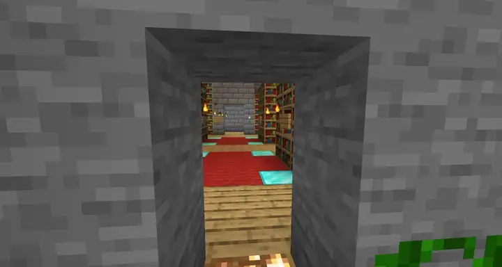
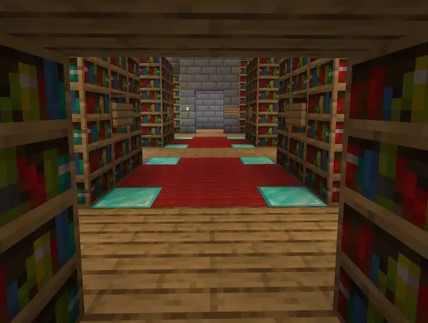

# Quantum mirrors

A **quantum mirror** is a banner on a wall. Walk up to it and it shows its own room, as a mirror
does; right-click it to choose another mirror, and punch it to go through. Nothing is built: no
frame, no pad, no partner. Why it works the way it does — the look library, what was tried and
dropped — is in the design notes, [docs/MIRRORS.md](../MIRRORS.md).

- **Every mirror is on the network.** Nothing is pointed by hand. A right-click walks the other
  mirrors, and a punch goes to the one showing.
- **One to a world** by default (`mirror-per-world-limit`, `0` for no limit), so the list a
  right-click walks is the worlds you can reach.
- **On a wall, and it stays there.** A mirror needs solid wall a block out on every side of its
  opening, and neither the banner nor that wall can be broken while it is a mirror.

## Contents

- [Setting one up](#setting-one-up)
- [Commands](#commands)
- [What you see in one](#what-you-see-in-one)
- [Its look](#its-look)
- [Saying what it is](#saying-what-it-is)
- [Settings](#settings)

## Setting one up

Hang a banner on a wall, look at it, and:

```
/wormhole mirror create library
```

That is the whole job. A plain white banner gets the `mirror` look; one you patterned first keeps
its patterns. Make a mirror in another world the same way, and the two find each other.

- **Right-click** a mirror to move it on to the next of the other mirrors, by name, round and
  round. Its own room is never in the round: that is what it shows before anybody clicks, and
  what it goes back to once nobody is near. Alone at a mirror, click through as fast as you like;
  with somebody else there, what it shows stays up three seconds.
- **Punch** it to go to the mirror it is showing. You land in front of that mirror's banner,
  facing out into its room.
- **Give it a start** to put one mirror first in its list: `/wormhole mirror set archive -start hub`
  makes the first right-click on `archive` open onto `hub`, and the next go on through the rest by
  name. `-start -none` takes the start away.

**The wall.** A mirror needs solid wall a block out on every side of its opening; `create` refuses
a gap and names the block to fill. Two blocks out hides the room's edges better from an angle,
so `create` also says which block is short of two. A banner on a post cannot be a mirror.
`mirror remove` takes one down; nothing else can.

**Two banners wide.** Hang two wall banners side by side, facing the same way, and `create` on
either: the pair is one mirror, two wide and two tall. Either banner answers a click, and a
traveller lands between them. The wall must then be solid four across and four tall — one block
either side of the banners, and from one above them to one below the opening. A mirror already
made one wide stays one wide: `remove` it, hang the second banner, and `create` again.

## Commands

| Command | What it does |
| --- | --- |
| `mirror create <name>` | Makes the banner you are looking at a mirror, or renames the one already there |
| `mirror set [name] -start <mirror\|-none>` | The mirror a right-click opens onto first; `-none` takes it away |
| `mirror set [name] -stamp [look]` | Makes the banner look like where it goes. See [Its look](#its-look) |
| `mirror set [name] -capture` | Takes the room's capture again |
| `mirror remove [name]` | Makes it an ordinary banner again |
| `mirror list` | Every mirror, and what each is showing |
| `mirror debug [name] [-all\|-full\|-on\|-off]` | Why a mirror draws what it draws. See [below](#what-you-see-in-one) |

All of them need `wormhole.config`: a mirror moves players between worlds.

**Leave the name out** to mean the banner you are looking at: `mirror set -start hub`,
`mirror set -stamp cavern`, `mirror remove`. What `set` changes always starts with a dash, and
no mirror's name may, which is how it tells the two apart. Where a word could still be either —
`set -stamp cavern` with a mirror *and* a look called `cavern` — the mirror wins.

**Rename** by running `create` again while looking at a banner that is already a mirror. It keeps
its start and its look; only the name changes. `create` with a name it already knows moves that
mirror to the banner you are looking at instead. The one thing it refuses to guess is a name that
belongs to a mirror elsewhere *and* a banner that is already a different mirror; it says so and
changes nothing.

## What you see in one



Come within `mirror-proximity-distance` blocks on the banner's side and the banner gives way to
an opening its own size, showing a room in real blocks: its own, flipped as a mirror would show
it, or the room of the mirror chosen at it. Real blocks, so the view has depth and shifts as you
move past. Nothing in the world changes; only the players looking in are sent the view. From
behind, a mirror is its banner. (On plain 1.20 the banner stays in front of the view.)

**What it shows is a capture** — a photograph of the room, taken from where a traveller lands,
reaching as far as that world sends and kept in `data/mirror/captures/`. A new mirror's is taken
within a second of `create`; another mirror's room is captured the first time somebody chooses
it. After that its world need not be loaded, so a mirror in an archived world still shows.
Nothing retakes a capture on its own: when the room has changed, run `mirror set -capture`.

**How far it reaches** is `mirror-view-depth`, 160 blocks by default — ten chunks, about as far
as a server sends — and nothing is drawn past it. Lower it for a mirror onto somewhere small; a
shallower view is also a smoother one, since the client has less to redraw as you come and go.

**A mirror in a solid wall shows the whole room** — solid for the proximity distance on every
side of the opening, with no other mirror within twice the depth, which `create` warns about.
Any other mirror shows only what you could actually see through the opening, and the far part of
that view follows you a step late, redrawn when you cross into another block rather than on every
step. A redraw that took long rests before the next, so a deep mirror cannot take more than a
quarter of the server's time however close you stand.

**Past the room, this world shows.** The client goes on drawing the hills behind the wall past
the far edge of the view. On a **Paper** server, `mirror-fog-at-depth` pulls your own fog in to
the room's depth while you look through a mirror, so the far edge is fog instead. It is off by
default, does nothing on Spigot, and does nothing at the default depth of 160: lower
`mirror-view-depth` first, then turn it on. It pulls the fog in every way you look, not only
through the mirror, which is the price.

**Blocks only.** No players or creatures from the room shown; your own world's creatures inside
the view are hidden while you look. The room is lit by this world, so a room behind a wall is
dark except for what makes its own light. Lava hides what is behind it and water is seen through
for about thirty blocks, as in the game.

**Checking a mirror.** `/wormhole mirror debug <name>` says what its capture is and how your view
of it is drawn; `-all` lists every fact, green where it is drawn whole and red for whatever trims
or stops it — a gap in the wall, another mirror too near, a missing capture file. `-full` draws
the whole capture for you alone, wherever you stand. `mirror debug -off` turns views off for you,
so you see the world as it is, and `-on` puts them back. `debug` is not in the usage line, but
tab-completes for anyone who may run it.

## Its look



The look is what the banner shows from further than `mirror-proximity-distance`, from behind, and
before a room is captured — so a corridor of mirrors still reads as a row of doors from the far
end. A plain white banner made a mirror gets the `mirror` look: pale glass, a glint and a frame.
A banner you patterned first keeps its patterns.

```
/wormhole mirror set museum -stamp cavern   # a named look
/wormhole mirror set museum -stamp          # read the mirror's room and paint the banner from that
```

Read from the room, the biome picks the frame — rising flame for the Nether, white crests over
blue for an ocean — and the blocks around it become coarse squares in their dominant colours.
Indoors, the room's own blocks decide instead, so a library comes back the brown of its shelves.

Ninety looks ship: one for every biome in the game, and the rest say something about the mirror
instead — `mirror`, `hub`, `exit`, `market`, `warning`, `private`, `plain` and more. None change
what a mirror does: `private` is paint, not a permission. They are `.mirror` text files in
`shapes/mirror/`; edit one and it stays edited, delete one and it comes back, add your own and
`-stamp` offers it. Every look is drawn, with its recipe, in
[the library](../MIRRORS.md#the-library-at-a-glance).

A look never changes on its own: stamp it again when the room has changed. `-stamp` is about the
banner and leaves the capture alone; `-capture` is the reverse.

## Saying what it is

Look at a mirror from about six blocks and it says what a click will do, above the hotbar:

```
:: museum -- right-click to choose a mirror.
:: museum -- punch to travel to hub, right-click for another.
```

It stays while you keep looking, and only the mirror under your crosshair speaks.
`mirror-approach-message: false` turns it off.

## Settings

| Setting | Default | What it does |
|---|---|---|
| `mirror-per-world-limit` | 1 | How many mirrors one world may hold. `0` for no limit. |
| `mirror-proximity-distance` | 16 | How close a player must be for the banner to give way to the room, and how near they must stay. |
| `mirror-proximity-ticks` | 20 | How often the proximity sweep runs. Mirrors whose world or chunk is not loaded are skipped. |
| `mirror-view-depth` | 160 | How far from the opening the room is drawn, 4 to 160. |
| `mirror-fog-at-depth` | `false` | Pull a viewer's fog in to where the room ends. Paper only. |
| `mirror-approach-message` | `true` | Whether a mirror names itself above the hotbar to whoever looks at it. |
